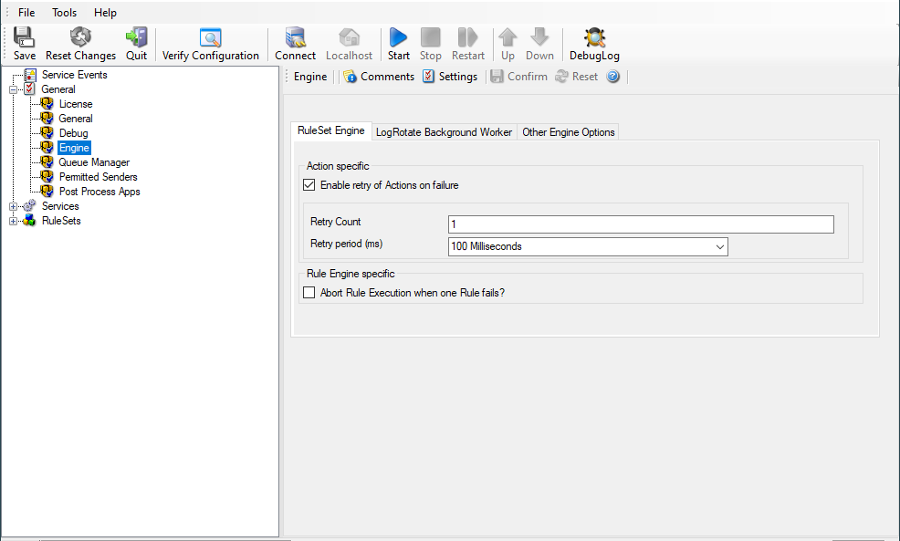
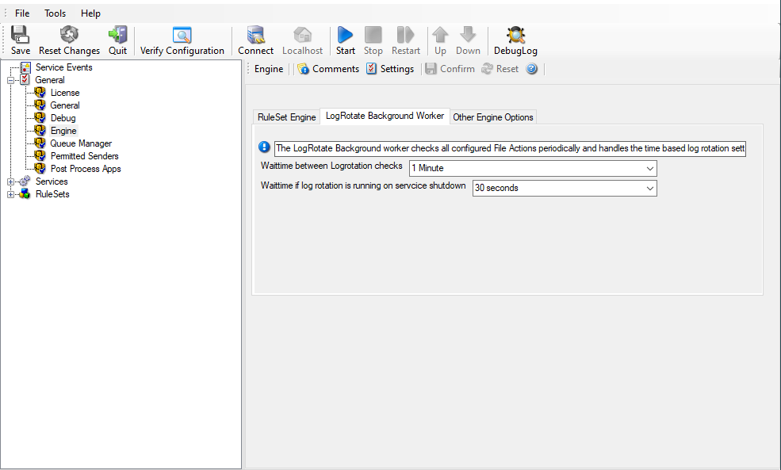
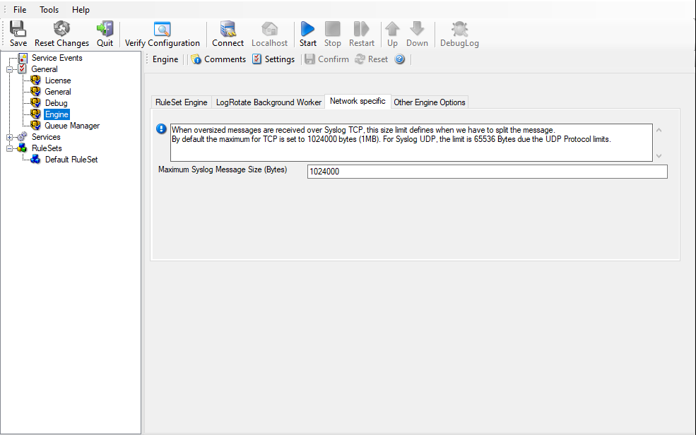
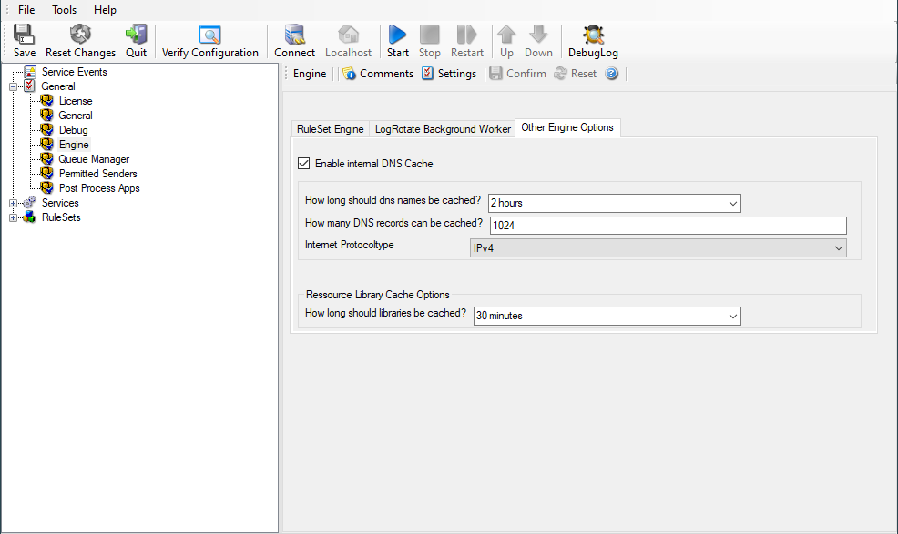

Engine
======

The Engine specific Options are explained below:

* RuleSet Engine Tab*

Action specific
---------------

Enable retry of Actions on failure
^^^^^^^^^^^^^^^^^^^^^^^^^^^^^^^^^^

**File Configuration field:**
    nEnableRetry
**Description**
    If enabled, the Agent retries Actions on failure (until the retry counter
    is reached). Note that the Event error 114 will only be written if the last
    retry failed, previous error's will only be logged in the debug log (with
    the error facility). Note that you can customize the Retry Count and the
    Retry Period in ms as well.

Rule Engine specific
--------------------

Abort Rule Execution when one Rule fails?
^^^^^^^^^^^^^^^^^^^^^^^^^^^^^^^^^^^^^^^^^

**File Configuration field:**
    bAbortRuleOnFailure

**Description**
    If checked, and an action fails, the execution will be aborted. If
    unchecked, and an action fails, simply the next action in this rule will be
    executed.

LogRotate Background Worker
---------------------------

The LogRotate Background worker checks all configured File Actions periodically
and handles the time based log rotation settings, if enabled.

* LogRotate Background Worker Tab*

Wait time between Logrotation checks
^^^^^^^^^^^^^^^^^^^^^^^^^^^^^^^^^^^^

**File Configuration field:**
   nLogRotateWorkerSleepTime

**Description**
   Defines how often the logrotate background worker thread checks all
   configured actions to see if any logfiles need to be rotated based on time
   related rotate conditions.

Wait time if log rotation is running on service shutdown
^^^^^^^^^^^^^^^^^^^^^^^^^^^^^^^^^^^^^^^^^^^^^^^^^^^^^^^^

**File Configuration field:**
   nLogRotateWorkerStopWaitTimeout

**Description**
   When service is being shutdown, this defines how much time the logrotate
   background worker thread has left to finish its log rotations before a
   forceful termination.

Network specific Options
------------------------

* Network specific Options Tab*

Maximum Syslog Message Size (Bytes)
^^^^^^^^^^^^^^^^^^^^^^^^^^^^^^^^^^^

**File Configuration field:**
  nSyslogMaxMessageSize

**Description:**
  Configurable message size limit for Syslog TCP messages. The default is 1MB
  which is far more as defined in Syslog RFC's. If a syslog message exceeds the
  size limit, it will be split into multiple messages.

Other Engine Options
--------------------

* Other Engine Options Tab*

Enable internal DNS Cache
^^^^^^^^^^^^^^^^^^^^^^^^^

**File Configuration field:**
    nEnableDNSCache

**Description**
    The DNS cache is used for reverse DNS lookups. A reverse lookup is used to
    translate an IP address into a computer name. This can be done via the
    resolve hostname action. For each lookup, DNS needs to be queried. This
    operation is somewhat costly (in terms of performance). Thus, lookup
    results are cached. Whenever a lookup needs to be performed, the system
    first checks if the result is already in the local cache. Only if not, the
    actual DNS query is performed and the result then stored to the cache. This
    greatly speeds up reverse host name lookups.

    However, computer names and IP addresses can change. If they do, the owner
    updates DNS to reflect the change. If we would cache entries forever, the
    new name would never be known (because the entry would be in the cache and
    thus no DNS lookup would be done). To reduce this problem, cache records
    expire. Once expired, the record is considered to be non-existing in the
    cache and thus a new lookup is done.

    Also, cache records take up system memory. If you have a very large number
    of senders who you need to resolve, more memory than you would like could
    be allocated to the cache. To solve this issue, a limit on the maximum
    number of cache records can be set. If that limit is hit, no new cache
    record is allocated. Instead, the least recently used record is
    overwritten with the newly requested one.

How long should DNS names be cached?
^^^^^^^^^^^^^^^^^^^^^^^^^^^^^^^^^^^^

**File Configuration field:**
    nDNSCacheTime

**Description**
    This specifies the expiration time for cache records. Do not set it too
    high, as that could cause problems with changing names. A too low-limit
    results in more frequent DNS lookups. As a rule of thumb, the more static
    your IP-to-hostname configuration is, the higher the expiration timeout can
    be. We suggest, though, not to use a timeout of more than 24 to 48 hours.

How many DNS records can be cached?
^^^^^^^^^^^^^^^^^^^^^^^^^^^^^^^^^^^

**File Configuration field:**
    nDNSCacheLimit

**Description**
    This is the maximum number of DNS records that can be cached. The system
    allocates only as many memory, as there are records required. So if you
    have a high limit but only few sending host names to resolve, the cache
    will remain small. However, if you have a very large number of host names
    to resolve, it might be useful to place an upper limit on the cache size.
    But this comes at the cost of more frequent DNS queries. You can calculate
    about 1 to 2 KBytes per cache record.

Internet Protocoltype
^^^^^^^^^^^^^^^^^^^^^

**File Configuration field:**
    nDNSInetProtocol

**Description**
    Select if you wish to prefer IPv4 or IPv6 addresses for name resolution.
    Note that this only has an effect on names which return both, IPv4 and IPv6
    addresses.

.. _Resource Library Cache Options:

Resource Library Cache Options
------------------------------

How long should libraries be cached?
^^^^^^^^^^^^^^^^^^^^^^^^^^^^^^^^^^^^

**File Configuration field:**
    nLibCacheTimeOut

**Description**
    This feature will be mainly useful for EventLog Monitor. For events with
    the same recurring event sources, this will be a great performance
    enhancement. The cache will also work for remote system libraries (requires
    administrative default shares). All libraries will be cached for 30 minutes
    by default.
