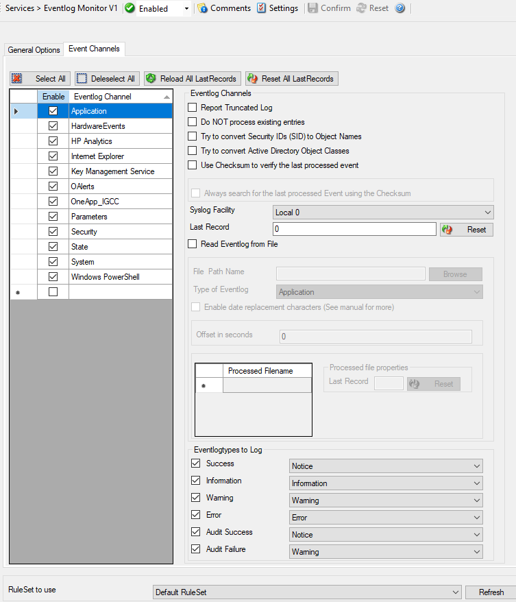

Event Log Monitor V1
====================

This dialog configures the Windows Event Log Monitor service.

This service was initially introduced by :doc:`Adiscon's EventReporter <../glossaryofterms/eventreporter>` product.
To allow previous EventReporter customers seamless upgrades, there are a number
of compatibility settings to support older message formats.

Newer Windows versions come with a considerably changed event logging system.
In theory, the Event Log Monitor works with them, too. However, we know of some
incompatibilities.
For best results, we recommend using the :doc:`event log monitor v2 <../mwagentspecific/eventlogmonitorv2>`
service, which was specifically written for Windows Vista and newer.
The Event Log Monitor described here is applicable for legacy Windows systems,
and XP (where the new event logging system is not available). The Client will
automatically detect and load available Event Log types during the first
startup of the Event Log Monitor.

**Event Log Monitor V1**

* Windows XP
* Windows 2003

**Event Log Monitor V2**

* all modern Windows versions (Windows 10, 11, Server 2016, 2019, 2022, and newer).

.. image:: ../images/eventlogmonitorv1-general.png
   :width: 100%

* Service - Event Log Monitor V1*

General Options Tab
^^^^^^^^^^^^^^^^^^^

Sleep Time(ms)
^^^^^^^^^^^^^^

**File Configuration field:**
  nSleepTime

**Description:**
  The Event Log Monitor periodically checks for new event log entries. The
  "Sleep Time" parameter specifies how often this happens. This value is in
  milliseconds.

  We suggest a value of 60,000 milliseconds for the "Sleep Time". With that
  setting, the Event Log Monitor checks for new events every 60 seconds. Larger
  periods can be specified for occasionally connected systems or if email
  delivery with few emails per day is intended.

  Very security-aware environments might use a shorter interval. The event log
  monitor service is specifically designed to limit the burden on the monitored
  system. As such, resource usage is typically low, even with frequently run
  event log checks. However, we recommend not running the Event Log Monitor
  more often than once a second.

Overrun Prevention Delay (ms)
^^^^^^^^^^^^^^^^^^^^^^^^^^^^^

**File Configuration field:**
  nPreventOverrunDelay

**Description:**
  This property allows configuring a delay after generating an event. The time
  is the delay in :doc:`milliseconds <../glossaryofterms/millisecond>`.

  If run at a value of zero, the Event Log Monitor service generates events as
  fast as the machine permits. We have seen scenarios where routers and
  receivers are not able to keep up with this rate, resulting in packet loss.
  In addition, the CPU of the reporting machine is run at 100% - which is not a
  problem because the service runs at a low priority. However, with even a
  1-millisecond delay, there is no noticeable CPU activity even when large
  bursts of events are forwarded. At one millisecond, the service can still
  generate 1000 events per second.

  The default setting is an overrun protection of five millisecond, which
  allows roughly 200 events per second. This should be sufficient for even very
  busy servers.

Preferred language
^^^^^^^^^^^^^^^^^^

**File Configuration field:**
  nLanguageLCID

**Description:**
  You can select a preferred language and the Eventlog Monitor will send the
  message in this language. It will only work if these languages are installed
  and message libs are available with the preferred language. If this fails, it
  will automatically fall back to the system default language.

Enable remote Event Log monitoring
^^^^^^^^^^^^^^^^^^^^^^^^^^^^^^^^^^

**File Configuration field:**
  nEnabledRemote

**Description:**
  If enabled, the Event Log Monitor will read and process the EventLog from a
  remote machine. Use the verify button to make sure that the network
  connection is working correctly.

  Please make sure that the machine, which you are going to monitor, does have
  File and Print Services enabled, and is accessible by this machine.

  This is important as the Event Log Service will read the message libraries on
  the remote machine by using the default administrative shares. For this
  reason, the Service must be configured to run with a user who has
  administrative privileges/permissions on the local and remote machine. If
  File and Print services remain disabled, the local message libraries will
  used automatically instead. Note that you may experience a lot of missing
  message libraries in this case.

  Additionally you have an option to read the Event Log Sources from the local
  machine. If enabled, the local message libraries will be used instead of the
  remote machines ones. Sometimes local Event Sources are more reliable or are
  required for third-party EventLog implementations.

Compress Spaces and Remove Control Characters
^^^^^^^^^^^^^^^^^^^^^^^^^^^^^^^^^^^^^^^^^^^^^

**File Configuration field:**
  nCompressControlChars

**Description:**
  This option allows you to control the control character removal and space
  compression. If checked, control characters (e.g. CR, LF, TAB - non printable
  characters in general) are removed. Also multiple spaces are compressed to a
  single one. By default this is checked. We recommend keeping it checked for
  most cases as it provides better display.

  **Please note that it should be unchecked if events should be forwarded via email. And it MUST be turned off if double-byte character sets are being
  processed (e.g. Japanese).**

Do NOT process existing entries when Event Log corruption occurs
^^^^^^^^^^^^^^^^^^^^^^^^^^^^^^^^^^^^^^^^^^^^^^^^^^^^^^^^^^^^^^^^

**File Configuration field:**
  nDoNotProcessLastRecord

**Description:**
  When this option is checked, it prevents from reprocessing of the whole
  Windows Event Log when it is `corrupted or truncated
  <https://www.mwagent.com/faq/general-questions/what-does-event-id-1011-mean/>`_ .
  So EventReporter / MonitorWare Agent do not process all entries again.

Do NOT process existing entries on Service Startup
^^^^^^^^^^^^^^^^^^^^^^^^^^^^^^^^^^^^^^^^^^^^^^^^^^

**File Configuration field:**
  szSyslogTagValue

**Description:**
  When this option is checked, it prevents from reprocessing of the whole
  Windows Event Log when the EventReporter / MonitorWare Agent service is
  restarted.

Remove Control Characters from String Parameters
^^^^^^^^^^^^^^^^^^^^^^^^^^^^^^^^^^^^^^^^^^^^^^^^

**File Configuration field:**
  nRemoveControlCharsFromParams

**Description:**
  Enable this option to remove control characters like carriage return or line
  feeds from parameter strings and category names in Windows Events.

Default Buffersize
^^^^^^^^^^^^^^^^^^

**File Configuration field:**
  nDefaultBuffer

**Description:**
  The default Buffersize is 10k. This value will be increased or decreased
  dynamically if necessary. If you want to use third-party applications like
  NetApp you must increase the Buffersize manually (minimum 65k), because
  dynamic adjusting is not possible with them.

SyslogTag Value
^^^^^^^^^^^^^^^

**File Configuration field:**
  szSyslogTagValue

**Description:**
  The SyslogTag Value determines the SyslogTag that is used when forwarding
  Events via syslog. This is useful, if you want to determine later, what kind
  of syslog message this is, perhaps because you log Event Logs and syslog into
  the same database.

How to handle Eventlog corruption
^^^^^^^^^^^^^^^^^^^^^^^^^^^^^^^^^

**File Configuration field:**
  nEventLogCor

  * 0 = Retry processing from beginning
  * 1 = Ignore corrupted Eventlog entry
  * 2 = Clear all events from Eventlog

**Description:**
  Sometimes it can occur that Event Log messages are corrupted and cannot be
  read correctly. This usually happens if someone tampered with the Event Log
  or if you are processing the Eventlog for the first time. In cases like this,
  you can automatically handle the situation with this option. You have the
  following options:

  - Retry processing Event Log from the beginning: in this case the complete
    Eventlog will be processed again.
  - Ignore corrupted Event Log entry (default): the affected Eventlog entry
    will be ignored and processing will continue.
  - Clear all Events from the Event Log: the Event Log will be cleared
    completely and new Events hopefully don't get corrupted before they are
    processed.

Use Legacy Format
^^^^^^^^^^^^^^^^^

**File Configuration field:**
  bUseLegacyFormat

**Description:**
  This option enhances compatibility to scripts and products working with
  previous versions of EventReporter. The legacy format contains all Windows
  Event Log properties within the message itself.

  The new format includes the plain text message only. The additional
  information fields (like event ID or event source) are part of the XML
  formatted event data. If the new format is used, we highly recommend sending
  or storing information in XML format. This is an option in each of the action
  properties (of those actions that support it – the write to database option
  for example always stores the fields separated, so there is no specific
  option to do so).

  Legacy format is meant to support existing parser scripts. We encourage you
  to use the new, XML-bound format for new implementations. Legacy format will be
  maintained in future releases to support backward compatibility, but it is no
  longer actively being developed. There are some shortcomings in legacy
  format, which can lead to issues when building or operating a log parser.
  These shortcomings are by design. We will not change this in legacy format -
  the solution is to use the new format. After all, the new format was created
  in order to address the issues with legacy format.

Add Facility String
^^^^^^^^^^^^^^^^^^^

**File Configuration field:**
  bAddFacilityString

**Description:**
  If checked, facility identification is prepended to the message text
  generated. This parameter enhances compatibility with existing Syslog
  programs and greatly facilitates parsing the generated entries on the Syslog
  server. We strongly encourage users to use this enhancement.

  **This setting only applies if the "Use Legacy Format" option is checked**. Otherwise, it does not have any meaning and consequently cannot be configured
  in that case.

Add Username
^^^^^^^^^^^^

**File Configuration field:**
  nAddUserName

**Description:**
  If checked, the Windows user that generated the event log entry is
  transmitted. If unchecked, this information is not forwarded. This is a
  configurable option for customers who have written parsing scripts for a
  previous format which did not contain Usernames. This option must also be
  unchecked if MoniLog is used.

  **This setting only applies if the "Use Legacy Format" option is checked.**
  Otherwise, it does not have any meaning and consequently cannot be configured
  in that case.

Add Logtype
^^^^^^^^^^^

**File Configuration field:**
  nAddLogType
**Description:**
  If checked, then log types e.g. system, security etc. is prepended to the
  generated message.

  **This setting only applies if the "Use Legacy Format" option is checked.**
  Otherwise, it does not have any meaning and consequently cannot be configured
  in that case.

Syslog Message Numbers
^^^^^^^^^^^^^^^^^^^^^^

**File Configuration field:**
  bShowSyslogMsgNbr

**Description:**
  If checked, a continuously advancing message number is prepended to the
  generated message. This is useful for Syslog delivery to make sure that all
  messages have been received at the remote server

  **This setting only applies if the "Use Legacy Format" option is checked.**
  Otherwise, it does not have any meaning and consequently cannot be configured
  in that case.

Delay writing LastRecord
^^^^^^^^^^^^^^^^^^^^^^^^

**File Configuration field:**
  nEnableLastRecordDelay

**Description:**
  Enables the LastRecord writeback delay to the configured properties below.

Save after amount of entries
^^^^^^^^^^^^^^^^^^^^^^^^^^^^

**File Configuration field:**
  nLastRecordDelayCount

**Description:**
  The LastRecord will be written after the amount of processed event log entries
  that are specified here.

Event Channels Tab
------------------

* Service - Event Log Monitor V1 Channels Tab*

**Event Log Channels**
  They are basically a list of the different log types. The corresponding log
  is only be processed if the respective "Enable" checkbox is checked. The
  parameters are common to all logs and are explained only once.

Report Truncated Log
^^^^^^^^^^^^^^^^^^^^

**File Configuration field:**
  bReportTruncatedLog

**Description:**
  Windows event logs can be truncated programmatically or via the Windows Event
  Viewer program. When a log is truncated, all information is erased from it.
  Any entries not already processed by the service are lost.

  The service detects event log truncation. If "Report Truncated Log" is
  checked, it generates a separate message stating the truncation. This option
  is most useful in environments where truncation is not expected and as such
  might be an indication of system compromise.

  If you regularly truncate the Windows Event Logs as part of your day-to-day
  operation, we suggest you turn this option off. In this case, we also
  recommend using a short sleep period (for example 10,000 which is 10 seconds)
  to avoid losing log entries.

Do NOT process existing entries
^^^^^^^^^^^^^^^^^^^^^^^^^^^^^^^

**File Configuration field:**
  nNoExistingEntries

**Description:**
  If you do not want to get a dump of an existing specific Windows Event Log
  then use this option. When MonitorWare Agent / EventReporter are restarted it
  will start processing after that last entry and do not look for the previous
  entries.

Try to convert Security IDs (SID) to Object Names
^^^^^^^^^^^^^^^^^^^^^^^^^^^^^^^^^^^^^^^^^^^^^^^^^

**File Configuration field:**
  nTryConvSIDtoObj

**Description:**
  With this option you can convert Security ID's (SIDs) to object names. You
  can enable this feature in the advanced configuration of each event log type
  in the Event Log Monitor service. Simple check the "Try to convert Security
  IDs (SID) to Object Names" option.

  **Note that only the Security event log has this feature enabled by default. For all other event log types this feature is disabled by default.**

Try to convert Active Directory Object Classes
^^^^^^^^^^^^^^^^^^^^^^^^^^^^^^^^^^^^^^^^^^^^^^

**File Configuration field:**
  nTryConvertDsClasses

**Description:**
  With this option you can convert ActiveDirectory Schema GUID's from Security
  Events on Domain Controllers to object names. For example Event 565, which
  usually has a lot of these Schema GUID's! The GUID's are internally cached to
  speed up EventLog processing operations.

  **Note that only the Security event log has this feature enabled by default. For all other event log types this feature is disabled by default.**

Use Checksum to verify the last processed event
^^^^^^^^^^^^^^^^^^^^^^^^^^^^^^^^^^^^^^^^^^^^^^^

**File Configuration field:**
  nEventUseChecksum

**Description:**
  A checksum of the last processed Event will be stored along with the
  LastRecord of an event log. This checksum is checked during each iteration. If
  the checksum does not match , we consider the EventLog has been altered,
  cleared, or something else happened. In this case the EventLog is being
  reprocessed from the beginning.

  Please note: This option will prevent you from modifying the LastRecord
  value. If you do, the whole EventLog will be reprocessed! Please note that
  this behavior is by design and cannot be avoided. So we recommend to use this
  feature only if you intend to double check if the LastRecord value is valid.

Always search for the last processed Event using this Checksum
^^^^^^^^^^^^^^^^^^^^^^^^^^^^^^^^^^^^^^^^^^^^^^^^^^^^^^^^^^^^^^

**File Configuration field:**
  nEventScanLastEventByChecksum

**Description:**
  Usually, the last processed Event is determined by the LastRecord value. If
  the Checksum to verify the last processed Event is activated, then the
  option to always search for the last processed Event using the Checksum is
  available. When activated, the last processed Event will also be always
  determined by the Checksum, not the LastRecord value.

Syslog Facility
^^^^^^^^^^^^^^^

**File Configuration field:**
  nFacility

**Description:**
  The :doc:`syslog facility <../glossaryofterms/syslogfacility>` to map
  information units stemming from this log to. Most useful if the message is to
  forward to a Syslog daemon.

Last Record
^^^^^^^^^^^

**File Configuration field:**
  nLastRecord

**Description:**
  Windows Event Log records are numbered serially, starting at one. The service
  records the last record processed. This textbox allows you to override this
  value.

  **Use it with caution!**

  If you would like a complete dump of a specific Windows Event Log, reset the
  "Last Record" to zero with the reset button. If you missed some events,
  simply reset it to some lower value than currently set. It is possible to set
  "Last Record" to a higher value. This suspends event reporting until that
  record has been created. We strongly discourage to use this feature unless
  definitely needed.

Read Eventlog from File
^^^^^^^^^^^^^^^^^^^^^^^

**File Configuration field:**
  nReadFromFile

**Description:**
  When enabled, the Eventlog is read from a file instead from the system.

File Path Name
^^^^^^^^^^^^^^

**File Configuration field:**
  szLogFileName

**Description:**
  It defines that which file to be read, only available when "Read Eventlog
  From File" is enabled.

Type of Eventlog
^^^^^^^^^^^^^^^^

**File Configuration field:**
  szLogType

**Description:**
  It defines as which type of event log from file is handled. This is important
  to read the correct message libs from the system.

Enable date replacement characters
^^^^^^^^^^^^^^^^^^^^^^^^^^^^^^^^^^

**File Configuration field:**
  nEnableDateReplacements

**description:**
  Allow the use of dynamic files/paths when using evt files. The same
  replacement characters as in the FileMonitor apply to this feature. A
  configured filename may look like this: ``C:\temp\evt_%Y%m%d.evt`` and would be replaced with ``C:\temp\evt_20130101.evt``.

  To support changing log file names, there are replacement characters
  available within the file name. These are:

  * %y Year with two digits (e.g. 2002 becomes "02")
  * %Y Year with 4 digits
  * %m Month with two digits (e.g. March becomes "03")
  * %M Minute with two digits
  * %d Day of month with two digits (e.g. March, 1st becomes "01")
  * %h Hour as two digits
  * %S Seconds as two digits. It is hardly believed that this ever be used in
    reality.
  * %w Weekday as one digit. 0 means Sunday, 1 Monday and so on.
  * %W Weekday as three-character string. Possible values are "Sun", "Mon",
    "Tue", "Wed", "Thu", "Fri", "Sat". This replacement character is most
    useful for DHCP log files.
  * %generatedfilename% It contains the fully generated filename (Can be useful
    for filtering).
  * %msgsep% Only available if enable in the advanced option of the File
    Monitor. This value contains the current used message separator. This is
    useful if you want to reconstruct messages where the separator is part of
    the message.
  * %msgseplast% Only available if enable in the advanced option of the File
    Monitor. This value contains the last used message separator. This is
    useful if you want to reconstruct messages where the separator is
    part of the message.

Offset in seconds
^^^^^^^^^^^^^^^^^

**File Configuration field:**
  nEnableDateReplacementsOffset

**Description:**
  When "Enable date replacement characters" is enabled, the current date will
  be used to generate the filenames. However in certain cases, there is a need
  to generate filenames with past or future dates. Negative values will
  generate past filenames, while positive values will generate filenames in the
  future. For example if you want to generate filenames from yesterday
  (24 hours back), use -84600 as offset.

Event Types to Log
------------------

These checkboxes allow local filtering of the event log. Filtering is based
on the Windows event type. There is a checkbox corresponding to each Windows
event type. Only checked event types will be processed. Unchecked ones will
be ignored.

Filtering out unnecessary log types at this level enhances system performance
because no information units will be generated and passed to the rule engine.
Thus, Adiscon strongly recommends dropping unnecessary log types.

Ruleset to use
^^^^^^^^^^^^^^

**File Configuration field:**
  szRuleSetName

**Description:**
  Name of the ruleset to be used for this service. The RuleSet name must be a
  valid RuleSet.

.. note::

  **If you intend to make the Event ID part of the actual Syslog message while forwarding to a Syslog server then you have to make some changes
  in the Event Log Monitor Settings.**

  `Click here
  <https://www.mwagent.com/faq/general-questions/how-can-i-make-event-id-part-of-the-actual-syslog-message-while-forwarding-to-a-syslog-server/>`_
  **to know the settings.**

  **The Event Log Monitor caches messages libraries. This greatly speeds up processing, but causes memory consumption for the cached libraries. By default,
  libraries are cached for 30 minutes. If memory consumption is too high, you
  may consider to lower the cache period. The cache is global to all event log
  monitors. As such, its size must be changed in the Engine specific Options Tab.**
  **Here you find the** :ref:`Resource Library Cache Options <Resource Library Cache Options>`
