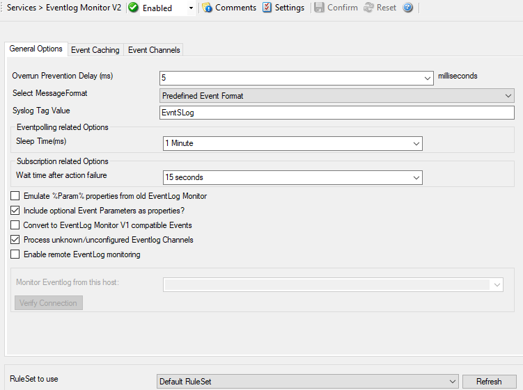

Event Log Monitor V2
====================

This dialog configures the Windows Event Log Monitor V2 service.

**Eventlog Monitor V2**

* all modern Windows versions (Windows 10, 11, Server 2016, 2019, 2022, and newer).

**Eventlog Monitor**

* Windows XP
* Windows 2003

The V2 Eventlog Monitor provides the ability to monitor so-called "log
channels". Each channel can work either in polling or subscription mode. In
subscription mode, we are automatically notified by the operating system
whenever a new event is logged. In traditional polling mode, we periodically
check the channel. In both cases, it is possible for a user to re-set the
channel reporting to an older event (parameter "Last Record").

Both of these functionalities are implemented by periodically iterating over
the configured channels. The frequency is controlled by the "Sleep Time"
parameter.

* Service - Event Log Monitor V2 - General Options*

General Options Tab
-------------------

Overrun Prevention Delay (ms)
^^^^^^^^^^^^^^^^^^^^^^^^^^^^^

**File Configuration field:**
  nPreventOverrunDelay

**Description:**
  This property allows configuring a delay after generating an event. The time
  is the delay in :doc:`milliseconds <../glossaryofterms/millisecond>`.

  If run at a value of zero, the Event Log Monitor service generates events as
  fast as the machine permits. We have seen scenarios where routers and
  receivers are not able to keep up with this rate, resulting in packet loss.
  In addition, the CPU of the reporting machine is run at 100% - which is not a
  problem because the service runs at a low priority. However, with even a
  1-millisecond delay, there is no noticeable CPU activity even when large
  bursts of events are forwarded. At one millisecond, the service can still
  generate 1000 events per second.

  The default setting is an overrun protection of five millisecond, which
  allows roughly 200 events per second. This should be sufficient for even very
  busy servers.

Select Message Format
^^^^^^^^^^^^^^^^^^^^^

**File Configuration field:**
  nFormatType

  - 0 = XML Format
  - 1 = Predefined EventFormat

**Description:**
  With this option you can choose whether the Events will be extracted in "Raw
  XML Format" or in the "Predefined Event Format".

  The XML format is the exact representation of the XML Stream returned by the
  EventLog System.
  **Please note that it only contains EventLog data and not a formatted message.**

  The "Predefined Event Format" is what the Event in the event viewer looks
  like.

Copy Format into Property
^^^^^^^^^^^^^^^^^^^^^^^^^

If enabled, a second message format can be stored into a custom property.

Select Message Format
^^^^^^^^^^^^^^^^^^^^^

**File Configuration field:**
  nCopyFormatIntoProperty

**Description**
  Select which message format should be stored into the custom property.

Store into Property
^^^^^^^^^^^^^^^^^^^

**File Configuration field:**
  szCopyFormatIntoProperty

**Description**
  The custom message property, for the "Copy Format into Property" Option.

SyslogTag Value
^^^^^^^^^^^^^^^

**File Configuration field:**
  szSyslogTagValue

**Description:**
  The SyslogTag Value determines the SyslogTag that is used when forwarding
  Events via syslog. This is useful, if you want to determine later, what kind
  of syslog message this is, perhaps because you log EventLogs and syslog into
  the same database.

Eventpolling related Option: Sleep Time(ms)
^^^^^^^^^^^^^^^^^^^^^^^^^^^^^^^^^^^^^^^^^^^

**File Configuration field:**
  nSleepTime

**Description:**
  As said in the overview, this controls iteration over the configured
  channels. The value is specified in milliseconds.

  For channels configured to use Polling Mode, the "Sleep Time" parameter
  specifies how often they are processed. Note that when multiple channels are
  set to polling mode, they are processed one after another. So there is a
  somewhat larger delay in processing than given by the "Sleep Time" parameter.
  The total frequency depends on how busy all polling channels are.

  For channels configured to subscription mode, the "Sleep Time" interval will
  only influence how often a potential reset of "Last Record" is checked. Other
  than that, it has no effect on the event delivery rate.

  We suggest a value of 60,000 milliseconds for the "Sleep Time". With that
  setting, the Event Log Monitor checks for new events every 60 seconds. Larger
  periods can be specified for occasionally connected systems or if email
  delivery with few emails per day is intended.

  Very security-aware environments might use a shorter interval. The event log
  monitor service is specifically designed to limit the burden on the monitored
  system. As such, resource usage is typically low, even with frequently run
  event log checks. However, we do NOT recommend running the Event Log Monitor
  more often than once a second.

  Note that it is almost always an error to use a "Sleep Time" value of 0. The
  main processing loop of the EventLog Monitor V2 would re-run without any
  delay and would cause a very high CPU usage, close to 100%. For these
  reasons, newer versions of the product will no longer permit to use a
  "Sleep Time" of zero and automatically change it to one

Subscription related Option: Wait time after action failure
^^^^^^^^^^^^^^^^^^^^^^^^^^^^^^^^^^^^^^^^^^^^^^^^^^^^^^^^^^^

**File Configuration field:**
  nSubscriptionSleepTime

**Description:**
  Adds some extra wait time (Delay) if an action failed to process. Without the
  delay, the subscription would immediately process the last event again. In
  some cases a reasonable delay before a retry is needed.

Emulate %Param% properties from old EventLog Monitor
^^^^^^^^^^^^^^^^^^^^^^^^^^^^^^^^^^^^^^^^^^^^^^^^^^^^

**File Configuration field:**
  nEmulateParameters

**Description:**
  This option emulates the %Param% properties, which were often used in the old
  EventLog Monitor. The new EventLog implementation does not support them in
  the same way anymore. The Event Log Monitor V2 is still able to provide
  parameters in the "old style" format, what means that log analysis scripts
  can receive a consistent stream of data for both new style and old style
  Windows events.

Include optional Event Parameters as properties?
^^^^^^^^^^^^^^^^^^^^^^^^^^^^^^^^^^^^^^^^^^^^^^^^

**File Configuration field:**
  nIncludeEventParameters

**Description:**
  If enabled, the < EventData> node from the raw XML stream (Eventlog entry)
  will be searched for variables. If variables with names are found, they will
  be set as Properties with their variable name automatically. If the variable
  does not have a name, it will be set to a common name like "Param1, Param2 ….
  ParamX".

Convert to EventLog Monitor V1
^^^^^^^^^^^^^^^^^^^^^^^^^^^^^^

**File Configuration field:**
  nConvertToEventLogMonitorV1

**Description:**
  This option maps the EventID's from the Security EventLog back to V1 (Windows
  2000/2003). The internal InforUnitID is also changed to V1. This option helps
  postprocessing EventLog V1 and V2 events equally.

Process unknown/unconfigured Eventlog Channels
^^^^^^^^^^^^^^^^^^^^^^^^^^^^^^^^^^^^^^^^^^^^^^

**File Configuration field:**
  nEnableUnknownChannels

**Description:**
  If enabled, unconfigured Eventlog Channels (Those found on the system, but
  not listed in the Eventlog Channels list) will automatically be processed.

Enable remote EventLog monitoring
^^^^^^^^^^^^^^^^^^^^^^^^^^^^^^^^^

**File Configuration field:**
   nEnabledRemote

**Description:**
  If enabled, EventLog Monitor will connect to a remote machine to process the
  EventLog. Please note that the RPC Service needs to be installed on the
  remote machine, and the Service has to be configured with a network user
  that has sufficient access rights.

Monitor Eventlog from this host
^^^^^^^^^^^^^^^^^^^^^^^^^^^^^^^

**File Configuration field:**
  szServerName

**Description:**
  The hostname of the remote server to be monitored by EventLog Monitor.

Event Caching Tab
-----------------

* Service - Event Log Monitor V2 - Event Caching*

Delay writing LastRecord
^^^^^^^^^^^^^^^^^^^^^^^^

**File Configuration field:**
  nEnableLastRecordDelay

**Description:**
  Enables the LastRecord writeback delay to the configured properties below.

Save after waittime
^^^^^^^^^^^^^^^^^^^

**File Configuration field:**
  nLastRecordDelayTime

**Description:**
  Regardless of the amount of processed event log entries, the lastrecord value
  will delayed for this waittime period.

Save after amount of entries
^^^^^^^^^^^^^^^^^^^^^^^^^^^^

**File Configuration field:**
  nLastRecordDelayCount

**Description:**
  Regardless of the configured waittime period, the LastRecord will be written
  after the amount of processed event log entries that are specified here.

Cache Event Publisher handles (Event Source)
^^^^^^^^^^^^^^^^^^^^^^^^^^^^^^^^^^^^^^^^^^^^

**File Configuration field:**
  nCacheEventPublisher

**Description:**
  All publisher sources will be kept open once loaded until the application /
  service is stopped. This increases processing speed for events from same
  sources.

Cache Event Levels (Like Warning, Information, Error)
^^^^^^^^^^^^^^^^^^^^^^^^^^^^^^^^^^^^^^^^^^^^^^^^^^^^^

**File Configuration field:**
  nCacheEventLevel

**Description:**
  If enabled the textual representations for event levels will be cached.

Cache Event Category (Task field)
^^^^^^^^^^^^^^^^^^^^^^^^^^^^^^^^^

**File Configuration field:**
  nCacheEventCategory

**Description:**
  If enabled, all textual representations for event categories will be cached.

Cache Event Keyword
^^^^^^^^^^^^^^^^^^^

**File Configuration field:**
  nCacheEventKeyword

**Description:**
  If enabled, all textual representations for event keywords will be cached.

Event Channels Tab
------------------

* Service - Event Log Monitor V2 Event Channels*

The most important part of this dialog is the treeview of available Channels.
It specifies which event logs are to be monitored. The monitor is set to all
Channels that are currently available. There happen to be custom Channels, too,
due to Applications creating them on their own. They will be added to the
treeview automatically every time you re-open this configuration window.

Here you can adjust the syslog facility and the event log types. You are also
able to overwrite all existing custom advanced channel configurations with your
new ones.

Channels which are checked in the table will be processed. Channels which are
unchecked are kept in the configuration, but are not processed.

Do NOT process existing entries
^^^^^^^^^^^^^^^^^^^^^^^^^^^^^^^

**File Configuration field:**
  nNoExistingEntries

**Description:**
  If you do not want to get a dump of an existing specific Windows Event Log
  then use this option. When MonitorWare Agent / EventReporter are restarted it
  will start processing after that last entry and do not look for the previous
  entries.

Try to convert Security IDs (SID) to Object Names
^^^^^^^^^^^^^^^^^^^^^^^^^^^^^^^^^^^^^^^^^^^^^^^^^

**File Configuration field:**
  nTryConvSIDtoObj

**Description:**
  With this option you can convert Security ID's (SIDs) to object names. You
  can enable this feature in the advanced configuration of each event log type
  in the Event Log Monitor service. Simple check the "Try to convert Security
  IDs (SID) to Object Names" option.

  **Note that only the Security event log has this feature enabled by default. For all other event log types this feature is disabled by default.**

Facility
^^^^^^^^

**File Configuration field:**
  nFacility

**Description:**
  The :doc:`syslog facility <../glossaryofterms/syslogfacility>` to map
  information units stemming from this log to. Most useful if the message is to
  forward to a Syslog daemon.

Last Record
^^^^^^^^^^^

**File Configuration field:**
  szXMLBookmark

**Description:**
  Windows Event Log records are numbered serially, starting at one. The service
  records the last record processed. This textbox allows you to override this
  value.
  **Use it with caution!**

  If you would like a complete dump of a specific Windows Event Log, reset the
  "Last Record" to zero. If you missed some events, simply reset it to some
  lower value than currently set. It is possible to set "Last Record" to a
  higher value. This suspends event reporting until that record has been
  created. We strongly discourage to use this feature unless definitely needed.

Processing Mode
^^^^^^^^^^^^^^^

**File Configuration field:**
  nApiReadMode

  * 0 = Subscription Readmode (Real-time)
  * 1 = Polling Readmode (Sleeptime)

**Description:**

  There are two processing modes available, first the default processing mode
  is "EventLog Subscription" which processes Events in real time. This means
  events are send to MonitorWare Agent by the OS as they happen, there is no
  delay at all.
  The other processing mode called "Eventlog Polling" and is similar to the
  method used in the old EventLog Monitor. The EventLog is checked and
  processed periodically controlled by the sleeptime. However using the polling
  method, you enable the "Read EventLog From File" option.

Eventpolling related Options
^^^^^^^^^^^^^^^^^^^^^^^^^^^^

Read Eventlog from File
^^^^^^^^^^^^^^^^^^^^^^^

**File Configuration field:**
  nReadFromFile
**Description:**
  When enabled, the Eventlog is read from a file instead from the system.

File Path Name
^^^^^^^^^^^^^^

**File Configuration field:**
  szLogFileName
**Description:**
  It defines which is file to be read, only available when "Read Eventlog From File" is enabled.

Event Types to Log
^^^^^^^^^^^^^^^^^^

  These checkboxes allow local filtering of the event log. Filtering is based
  on the Windows event type. There is a checkbox corresponding to each Windows
  event type. Only checked event types will be processed. Unchecked ones will
  be ignored.

  Filtering out unnecessary log types at this level enhances system performance
  because no information units will be generated and passed to the rule engine.
  Thus, Adiscon strongly recommends dropping unnecessary log types.

RuleSet to use
^^^^^^^^^^^^^^

**File Configuration field:**
  szRuleSetName

**Description:**
  Name of the ruleset to be used for this service. The RuleSet name must be a
  valid RuleSet.
