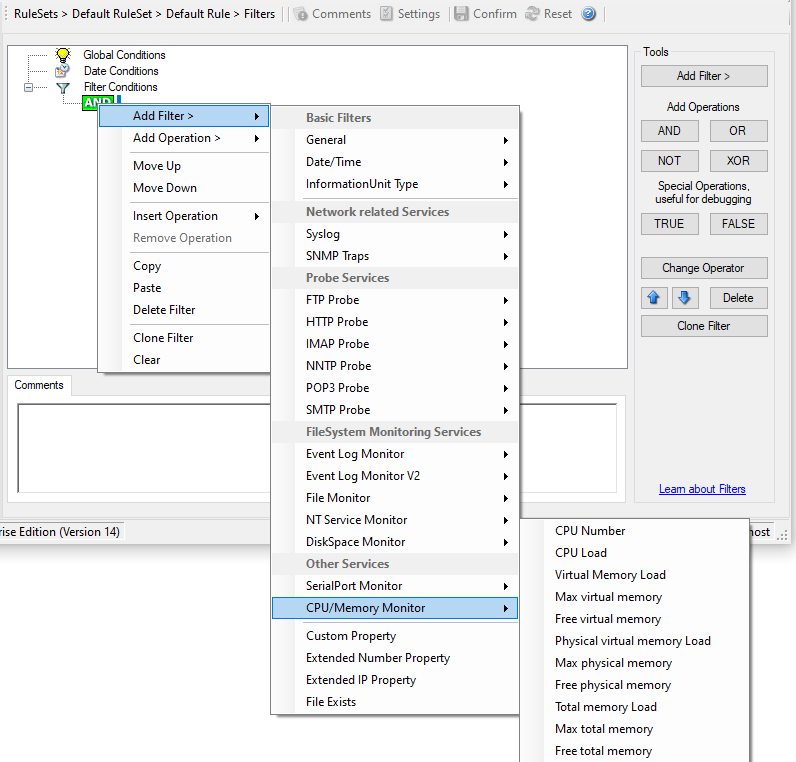

CPU / Memory Monitor
====================

CPU and Memory Monitor specific filter is described here.

* Filter Conditions - CPU/Memory Monitor*

**CPU number**
  This lets you filter for the number of the monitored CPU.

**CPU load**
  The workload of the CPU as number, can be 0 to 100

**Virtual memory load**
  How much virtual memory is used (MB)

**Max virtual memory**
  How much virtual memory is max available (MB)

**Free virtual memory**
  How much virtual memory is free (MB)

**Physical memory load**
  How much physical memory is used (MB)

**Max physical memory**
  How much physical memory is max available (MB)

**Free physical memory**
  How much physical memory is free (MB)

**Total memory load**
  How much total(Virtual+Physical) memory is used (MB)

**Max total memory**
  How much total(Virtual+Physical) memory is max available (MB)

**Free total memory**
  How much total(Virtual+Physical) memory is free (MB)
