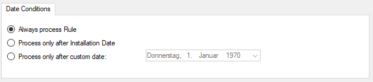

Date Conditions
===============

Rule processing can be bound to a specific or the installation date. By default a
Rule will always be processed.

* Date Conditions*

**Always process Rule**
  No date filter will be applied

**Process only after Installation Date**
  Rule will only be processed if message was generated after the application
  installation date.

**Process only after custom date**
  Rule will only be processed if message was generated after the custom
  specified date.
