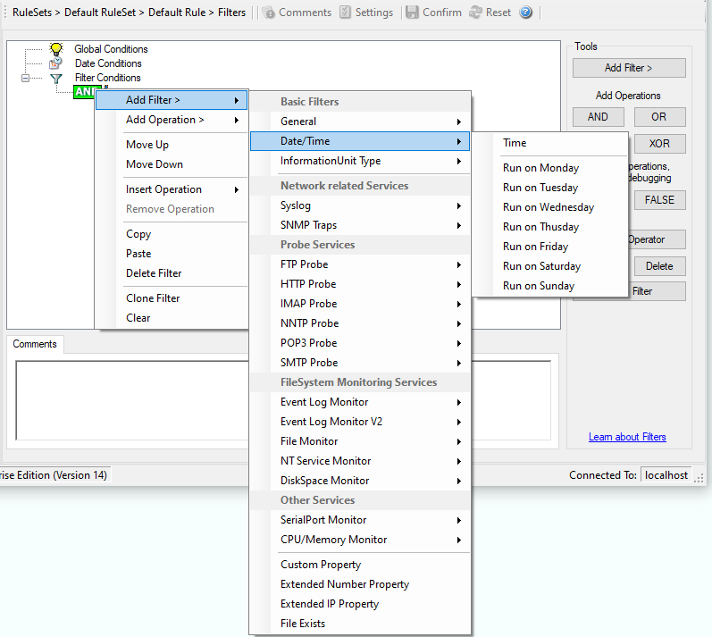

Date/Time
=========

This filter condition is used to check the time frame and / or day of week in
which an event occurred.

* Filter Conditions - Date/Time*

**Time**
  This filter condition is used to check the period in which an event occurred.
  For example, a Syslog message from a Cisco router saying that it dialed up is
  normal if it occurs during office hours. If it occurs at night, so, it is an
  alerting signal and an administrator might receive notification of this event
  (while he might otherwise decide to discard it). This can be done with the time
  setting.

  You can also set the timezone setting (DefaultTimemode, UTC or Localtime) for
  the TimeMode's (DeviceReportedTime/ReceivedTime).

**Weekdays**
  This is closely equivalent to the time filter condition, except that it is
  applied on a per-day basis. So it can be used to detect for example events
  occurring on weekends and act differently on them. The following filters are
  available:

  1. Run on Monday (Type=Boolean)
  2. Run on Tuesday (Type=Boolean)
  3. Run on Wednesday (Type=Boolean)
  4. Run on Thursday (Type=Boolean)
  5. Run on Friday (Type=Boolean)
  6. Run on Saturday (Type=Boolean)
  7. Run on Sunday (Type=Boolean)
