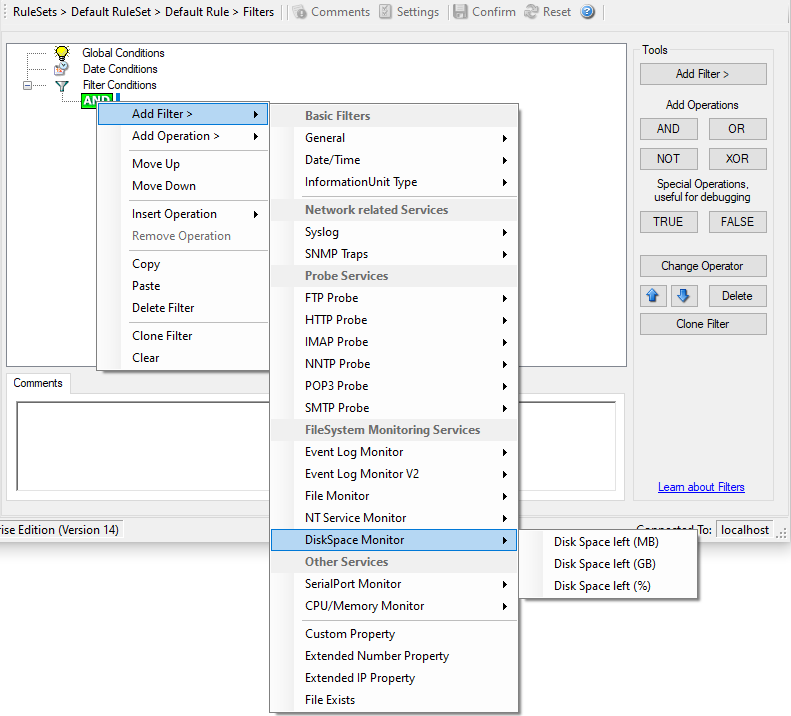

Disk Space Monitor
==================

This filter works with the disk space report, only. It can be used to trigger
actions when disk space is running low and / or becoming free again.

* Filter Conditions - Diskspace Monitor*

The following filters are available:

1. Disk Space left (MB) (Type=Number)
2. Disk Space left (GB) (Type=Number)
3. Disk Space left (%) (Type=Number)
