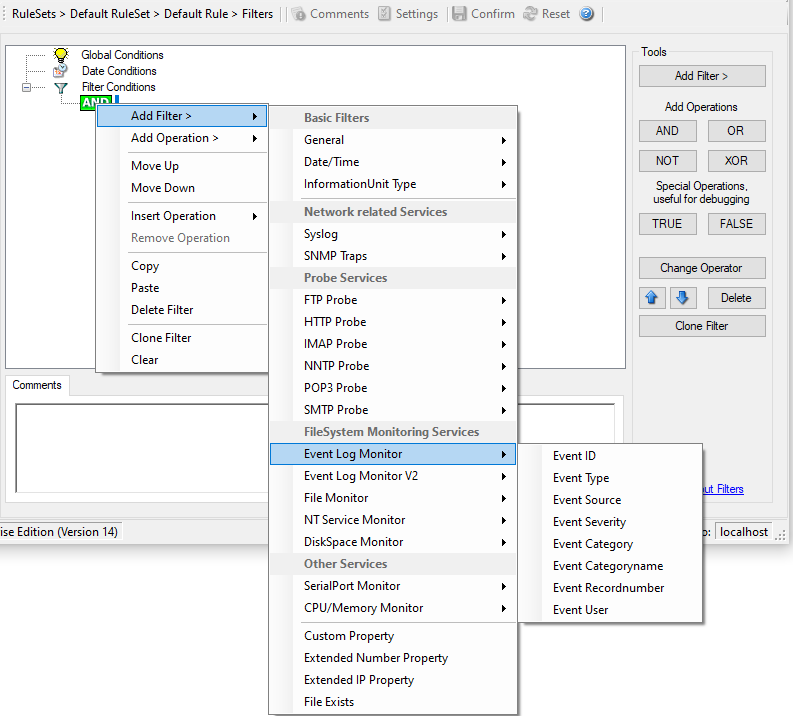

Event Log Monitor
=================

Event Log Monitor specific filters are grouped here.

* Filter Conditions - Event Log Monitor V1*

**Event ID**
  This is the event log ID as specified in the Windows Event Log. If enabled, the
  event must have the configured event ID or the rule will not match. This is an
  integer value.

  This filter condition should only be used with event log information units. If
  used with others, a mapped value is to be used which might not properly reflect
  the actual value.

  This filter is of type number.

**Event Type**
  This is the event log type as specified in the Windows Event Log. If enabled,
  the event must have the configured event type or the rule will not match. The
  supported values can be selected from the list box.

  This filter condition should only be used with event log information units. If
  used with others, a mapped value is to be used which might not properly reflect
  the actual value.

  This filter is of type string.

**Event Source**
  This is the event log source as specified in the Windows Event Log. If enabled,
  the event must have the configured event source or the rule will not match.
  This is a string value. There must be an exact match. Please note that this
  value is case-sensitive.

  This filter condition should only be used with event log information units. If
  used with others, a mapped value is to be used which might not properly reflect
  the actual value.

  This filter is of type string.

**Event Severity**
  This is the event log severity as specified in the Windows Event Log. If
  enabled, the event must have the configured severity or the rule will not
  match. The supported values can be selected from the list box.

  This filter condition should only be used with event log information units.
  If used with others, a mapped value is to be used which might not properly
  reflect the actual value.

  This filter is of type number.

**Event Category**
  This is the event log category as specified in the Windows Event Log. If
  enabled, the event must have the configured event category or the rule will not
  match.

  This filter condition should only be used with event log information units. If
  used with others, a mapped value is to be used which might not properly reflect
  the actual value.

 This filter is of type number.

**Event Categoryname**
  This value contains the Category value as string if it can be resolved.
  Otherwise it contains the category number.

  This filter condition should only be used with event log information units. If
  used with others, a mapped value is to be used which might not properly reflect
  the actual value.

  This filter is of type string.

**Event Recordnumber**
  This value contains the internal event record number. Please note that if the
  event log has been truncated before, it may not start with 0 or 1 but a higher
  number.

  This filter condition should only be used with event log information units. If
  used with others, a mapped value is to be used which might not properly reflect
  the actual value.

  This filter is of type number.

**Event User**
  This is the event log user as specified in the Windows Event Log. If enabled,
  the event must have the configured event user or the rule will not match. Since
  it is a string value there must be an exact match. Please note that this value
  is case-sensitive.

  This filter condition should only be used with event log information units. If
  used with others, a mapped value is to be used which might not properly reflect the actual value.

  This filter is of type string.
