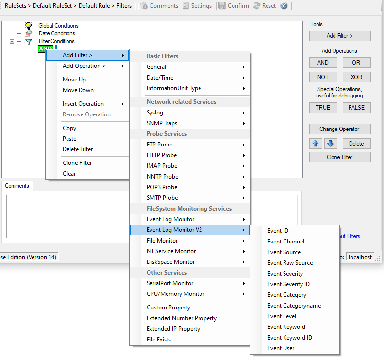

Event Log Monitor V2
====================

Event Log Monitor V2 specific filters are grouped here.

* Filter Conditions - Event Log Monitor V2*

**Event Channel**
  The channel property for event log entries, for classic Event logs they match
  the %nteventlogtype% property, for new event logs, they match the "Event
  Channel". If enabled, the event must have the configured event type or the rule
  will not match. There must be an exact match. Please note that this value is
  case-sensitive.

  This filter condition should only be used with event log information units. If
  used with others, a mapped value is to be used which might not properly reflect
  the actual value.

  This filter is of type string.

**Event Raw Source**
  This contains the full internal name of the event source for new event logs,
  for classic event logs it contains the same value as in %sourceproc%. If
  enabled, the event must have the configured event source or the rule will not
  match. This is a string value. There must be an exact match. Please note that
  this value is case-sensitive.

  This filter condition should only be used with event log information units. If
  used with others, a mapped value is to be used which might not properly reflect
  the actual value.

  This filter is of type string.

**Event SeverityID**
  This is the internal ID of the event log level as number. This is a integer
  value. There must be an exact match. Please note that this value is
  case-sensitive.

  This filter condition should only be used with event log information units. If
  used with others, a mapped value is to be used which might not properly reflect
  the actual value.

  This filter is of type number.

**Event Level**
  This is a textual representation of the event log level (which is stored as
  number in %severityid%). This property is automatically localized by the
  system. If enabled, the event must have the configured level or the rule will
  not match. There must be an exact match. Please note that this value is
  case-sensitive.

  This filter condition should only be used with event log information units. If
  used with others, a mapped value is to be used which might not properly reflect
  the actual value.

  This filter is of type string.

**Event Keyword**
  This is a textual representation of the event keyword. This property is
  automatically localized by the system. If enabled, the event must have the
  configured event keyword or the rule will not match. There must be an exact
  match. Please note that this value is case-sensitive.

  This filter condition should only be used with event log information units. If
  used with others, a mapped value is to be used which might not properly reflect
  the actual value.

  This filter is of type string.

**Event KeywordID**

  This is the internal keyword ID as string. If enabled, the event must have the
  configured event keyword ID or the rule will not match. There must be an exact
  match. Please note that this value is case-sensitive.

  This filter condition should only be used with event log information units. If
  used with others, a mapped value is to be used which might not properly reflect
  the actual value.

  This filter is of type string.
