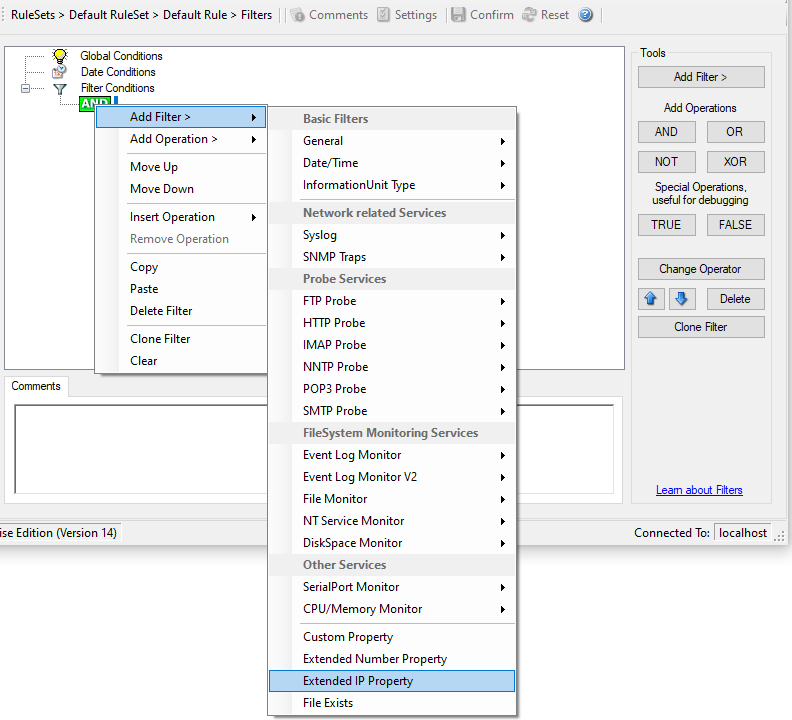
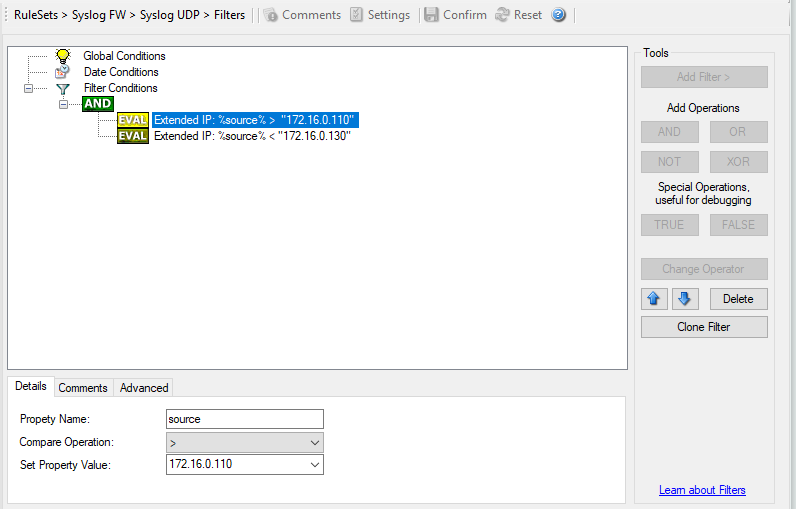

Extended IP Property
====================

* Filter Conditions - Extended IP Property*

Extended IP Property filter settings
------------------------------------

The IP Filter can basically work on any property, but we recommend to only use
it on the %source% property,  as we usually can be sure that this contains a
valid IP Address or hostname. The IP Filter can filter against hostnames and IP
Addresses, hostnames are automatically resolved using the internal DNSCache
(for obvious performance reasons). If you are going to use a different or
custom property, please make sure, that the data in the property is a valid IP
Address.

Available compare operations for the IP Filter Type are:

Equal (=): The IP Address must match the one you configured in the Property
Value field.
Not Equal (!=): The IP Address must not match the one you configured in the
Property Value field.
Higher (>): The IP Address must be higher than the one you configured in the
Property Value field. You can use IP Address Formats like:
``192.168.0.10, 192.168.0, 192.168 or even 192``. It depends on what IP Ranges you are going to filter for.
Lower (<): The IP Address must be lower than the one you configured in the
Property Value field. You can use IP Address Formats like: ``192.168.0.10, 192.168.0, 192.168 or even 192``. It depends on what IP Ranges you are going to filter for.

If you want to filter for IP Ranges, I recommend to use two filters to define
the range, one filter with the "Higher (>)" compare operation and one with the
"Lower (<)" compare operation. This could look like the following:

* Filter Conditions - Filtering for an IP Range*

The filter you can see here will accept all IPs which lie between ``172.16.0.110`` AND ``172.16.0.130``. That means, that for every IP that
matches these two conditions, the whole filter will evaluate to true and
therefore the message will be processed. If the filter does not evaluate to
true, the rule will be aborted and the message is sent to the next rule.
