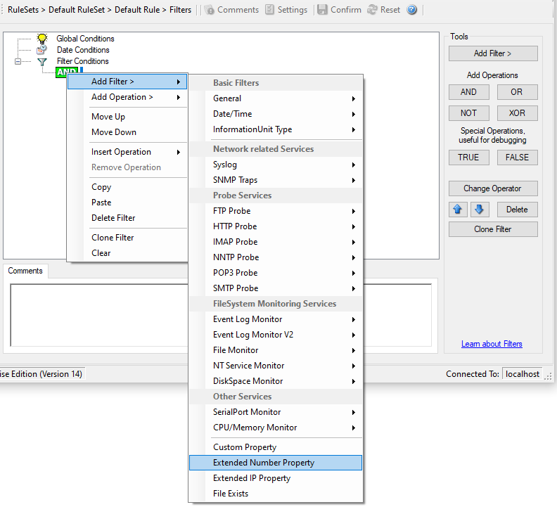

Extended Number Property
========================

Extended Number Property specific filter is described here.

* Filter Conditions - Extended Number Property*

**Extended Number Property**
  As the name suggests it is a "Extended Number Property". Internally in MonitorWare Agent
  all values are stored in properties. For example the main message is stored in
  a property called "msg". By using this dialog you can access properties which
  are dynamic (Like those from SNMP Trap Monitor when using V2 protocol).

  This filter is of type numeric.
