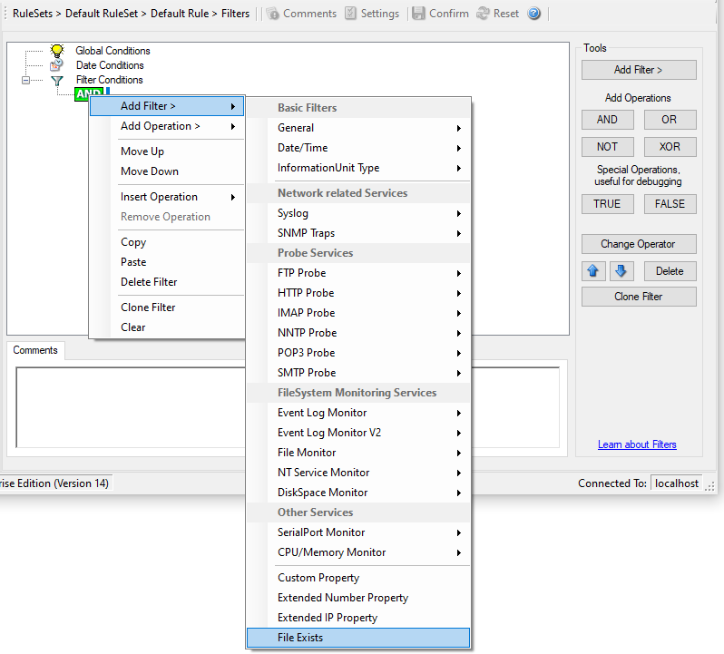

File Exists
===========

Filter setting by string.

* Filter Conditions - File Exists*

**File Exists**
  With this Filter you can simply check if a file exists or not. You can directly
  enter the file and its location or you can use the browse-button to find it.
