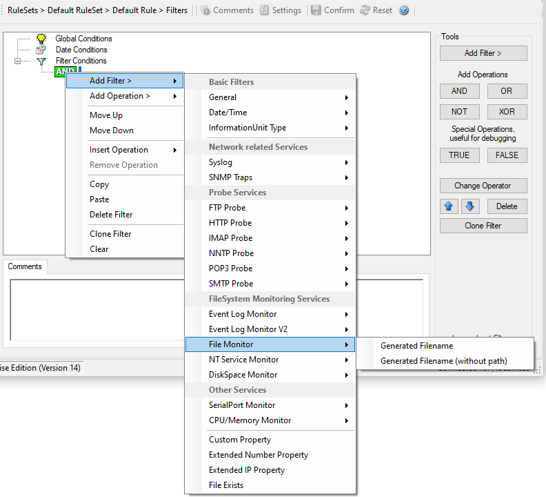

File Monitor
============

File Monitor specific filter is described here.

* Filter Conditions - File Monitor*

**Generated Filename**
  The configured generic name of the file being reported. Filter has to match
  exactly to work.
