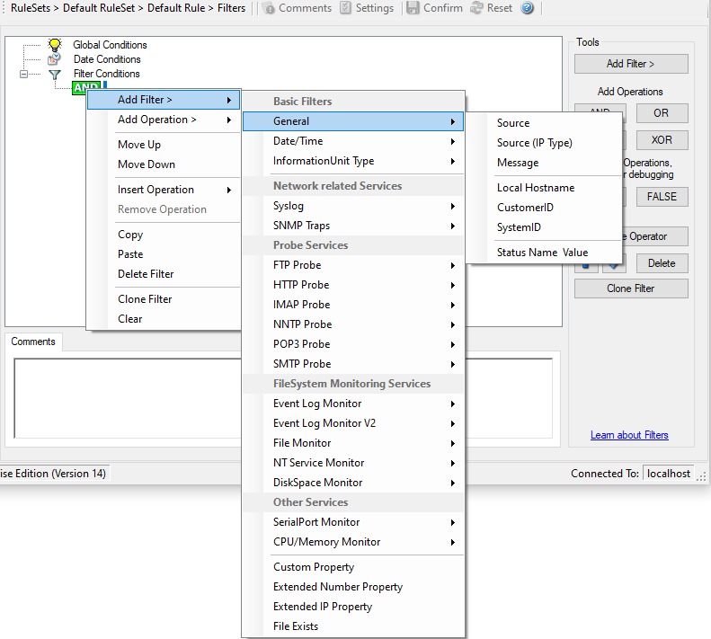

General
=======

These are non-event log specific settings.

* Filter Conditions - General*

**Source**
  This filter condition checks the system that generated the information unit.
  For example, in case of the Syslog server, this is the Syslog device sending a
  Syslog message.

  This filter is of type string and should contain the source system name or IP
  address.

**Source System (IP)**
  The IP Filter can basically work on any property, but we recommend to only use
  it on the %source% property,  as we usually can be sure that this is contains a
  valid IP Address or hostname. The IP Filter can filter against hostnames and IP
  Addresses, hostnames are automatically resolved using the internal DNSCache
  (for obvious performance reasons).

  This filter is of type string and should contain the source system name or IP
  address.

  Please see the description for :doc:`extended ip property <../mwagentspecific/f-extendedipproperty>` for more information on
  how to use this property.

**Message Content**

  The message content filter condition is very powerful. It evaluates to true if
  the specified content is found anywhere within the message. As there is
  implicit wildcarding, there is no need for extra wildcards to be specified.

  The content search can be limited to a region within the message. To do so,
  select a starting and ending position within the string by choosing the
  **"contains within range"** compare operation. This can be done by specifying the start range and end range into the respective boxes.**Please note that you can enter the character position you desire in these
  fields. The default "Start Range" and "End Range" are set to 0.**

  If you would like to search for a string just between positions 10 and 50,
  specify these values as start and end values, respectively. Similarly if you
  want to receive all logs from 192.168.0.1 then set this as:

  * Property value = 192.168.0.0
  * Range Start = 0
  * Range End = 10

  Which means 10 characters starting at zero ("192.168.0."). Please note that the
  final DOT must be included. If you just used range "9", then 192.168.010 would
  also match.

  This filter is of type string.

**CustomerID**
  CustomerID is of type integer provided for customer ease. For example if
  someone monitors his customer's server, he can put in different CustomerIDs
  into each of the agents.  Let us say someone monitors servers A and B. A has 5
  servers all of them with CustomerID = 1 and B has 2 servers all of them with
  CustomerID = 2. Both A and B happen to have a server named "SERVER". Together
  with the customerID, these machines are now uniquely identifiable. This is user
  configurable.

  CustomerID (Type=Number).

**SystemID**
  SystemID is of type integer to be used by our customer. In addition, it is user
  configurable.

  SystemID (Type=Number).

**Status Name and Value**
  These filter type corresponds to :doc:`set status action <../mwagentspecific/a-setstatus>` .

  Status Name and Value (Type=String)
