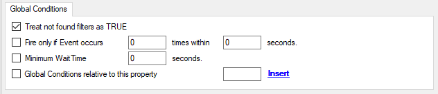

Global Conditions
=================

Global Conditions apply to the rule as whole. They are automatically combined
with a logical "AND" with the conditions in the filter tree.

* Global Conditions*

**Treat not found Filters as TRUE**
  If a property queried in a filter condition is not present in the event, the
  respective condition normally returns "FALSE". However, there might be
  situations where you would prefer if the rule engine would evaluate this to
  "TRUE" instead. With this option, you can select the intended behavior. If you
  check it, conditions with properties not found in the event evaluates to "TRUE.

**Fire only if Event occurs**
  This is kind of the opposite of the "Minimum WaitTime". Here, multiple events
  must come in before a rule fires. For example, this time we use a ping probe.
  Ping is not a very reliable protocol, so a single ping might be lost. Thus, it
  may not be the best idea to restart some processes just because a single ping
  failed. It would be much better to wait for repetitive pings to fail before
  doing so.

  Exactly this is why the "Fire only if Event Occurs" filter condition is made
  for. It waits until a configured amount of the same events occurs within a
  period. Only if the count is reached, the filter condition matches and the rule
  can fire.

  **Note: If you used  previous versions of the product, you might remember a filter called "Occurrences". This has just been renamed.**

**Minimum Wait Time**
  This filter condition can be used to prevent rules from firing too often. For
  example, a rule might be created to check the status of a port probe event. The
  port probe probes an :doc:`smtp <../glossaryofterms/smtp>` server. If the
  event is fired and the rule detects it, it spawns a process that tries to
  restart the service. This process takes some time. Maybe the SMTP gateway need
  some more time to fully start up so that the port probe might fail again while
  the problem is already taken care of. The port probe as such generates an
  additional event.

  Setting a minimum wait time prevents this second port probe event to fire again
  if it is – let's say – within 5 minutes from the original one. In this
  case, the minimum wait time is not yet reached and as such, the rule does not
  match. If, however, the same event is generated 5 hours later (with the mail
  gateway failing again), the rule once again fires and corrective actions are
  taken.

**Global Conditions relative to this property**
  This feature enables you to control the Global Conditions based on a property.

  For example take the source of a message as property. In this case, the Minimum
  WaitTime for example would be applied individual on each message source.
