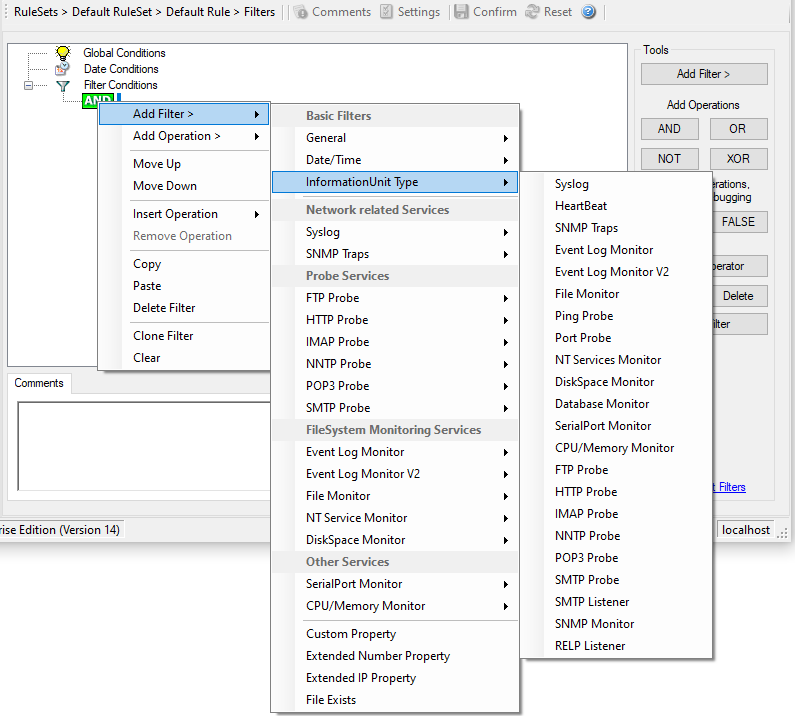

InformationUnit Type
====================

Select the specific information if a rule should just be processed for some
information unit types. This is especially useful if a specific type needs
non-standard processing. There is one pre-defined filter for each possible
InformationUnit Type available (shown below).

* Filter Conditions - InformationUnit Type*

The following filters are available:

 1. Syslog (Type=Boolean)
 2. Heartbeat (Type=Boolean)
 3. SNMP Traps (Type=Boolean)
 4. Event Log Monitor (Type=Boolean)
 5. File Monitor (Type=Boolean)
 6. Ping Probe (Type=Boolean)
 7. Port Probe (Type=Boolean)
 8. NT Services Monitor (Type=Boolean)
 9. Disk Space Monitor (Type=Boolean)
 10. Database Monitor (Type=Boolean)
 11. Serial Port Monitor (Type=Boolean)
 12. CPU/Memory Monitor (Type=Boolean)
 13. FTP Probe (Type=Boolean)
 14. HTTP Probe (Type=Boolean)
 15. IMAP Probe (Type=Boolean)
 16. NNTP Probe (Type=Boolean)
 17. POP3 Probe (Type=Boolean)
 18. SMTP Probe (Type=Boolean)
