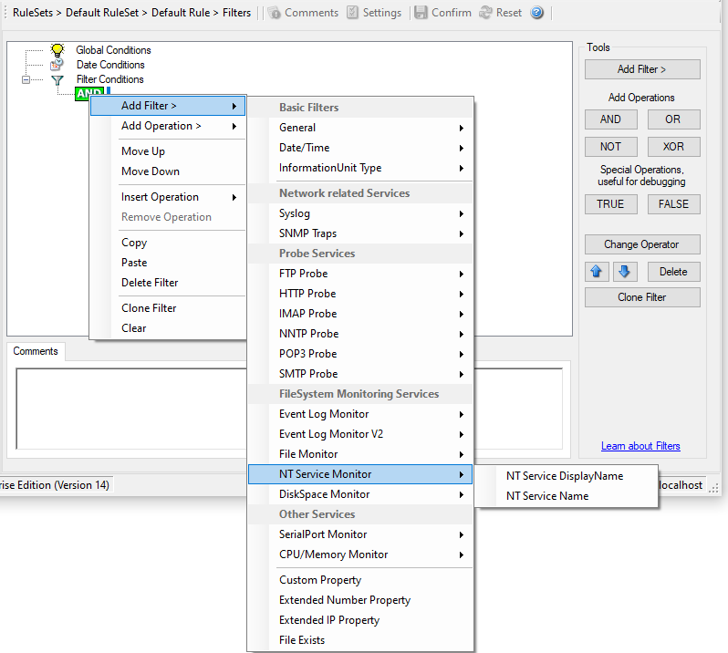

NT Service Monitor
==================

The NT Service Name is used to check if vital operating services are running
continuously. By default these services set to "automatic" startup. If the
value returned is not true then corrective measures can be taken e.g. alerts can
be generated. See :doc:`nt services monitor <ntservicemonitor>` for more details.

* Filter Conditions - NT Service Monitor*

**NT Service DisplayName**

**NT Service Name (Type=String).**
