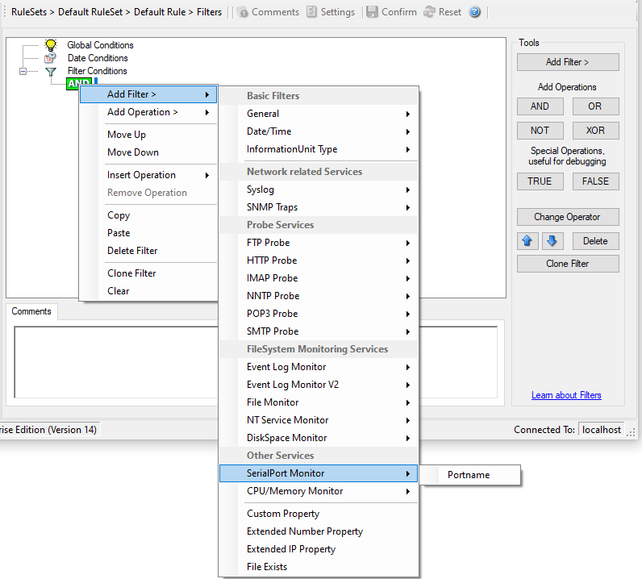

SerialPort Monitor
==================

SerialPort Monitor specific filter is described here.

* Filter Conditions - SerialPort Monitor*

**Portname**
  There can be unlimited number of ports in a system - there is no limitation
  i.e. port names are not specified. But you can use the default list from the
  "SerialPort Monitor" configuration window as sample of values, some examples
  are COM1, LPT1, FILE etc. The MonitorWare Agent Client dynamically reads the
  properties from the local machine.

  This filter is of type string.
