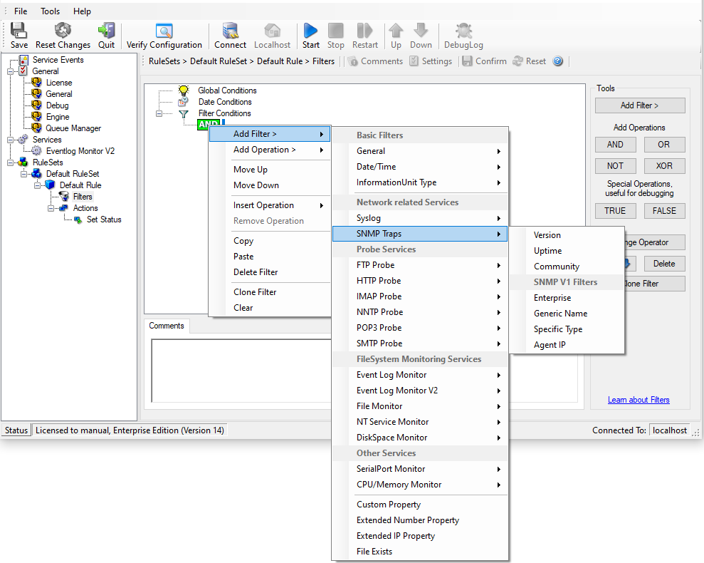

SNMP Traps
==========

Using SNMP Traps, since MonitorWare Agent 3.0 now can be used to manage and
monitor all sorts of equipment including computers, routers, wiring hubs,
toasters, and jukeboxes.

A trap is generated when the device feels it should do so and it contains the
information that the device feels should be transmitted.

* Filter Conditions - SNMP Traps*

**Community**
  It corresponds to the respective SNMP entity.

  This filter is of type string.

**Enterprise**
  It corresponds to the respective SNMP entity.

  This filter is of type string.

**Generic name**
  It corresponds to the respective SNMP entity.

  This filter is of type string.

**Version**
  It corresponds to the respective SNMP entity.

  This filter is of type number.

**Uptime**
  It corresponds to the respective SNMP entity.

 This filter is of type string.
