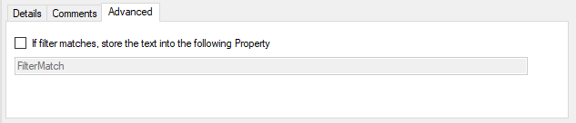

Store Filter Results
====================

How to store Filter Results is described here.

* Filter Conditions - Store Filter Results*

**Store Filter Results**
  If a filter matches, you can now store the result of the match into a custom
  property.

  This custom property can be used in Actions later.
