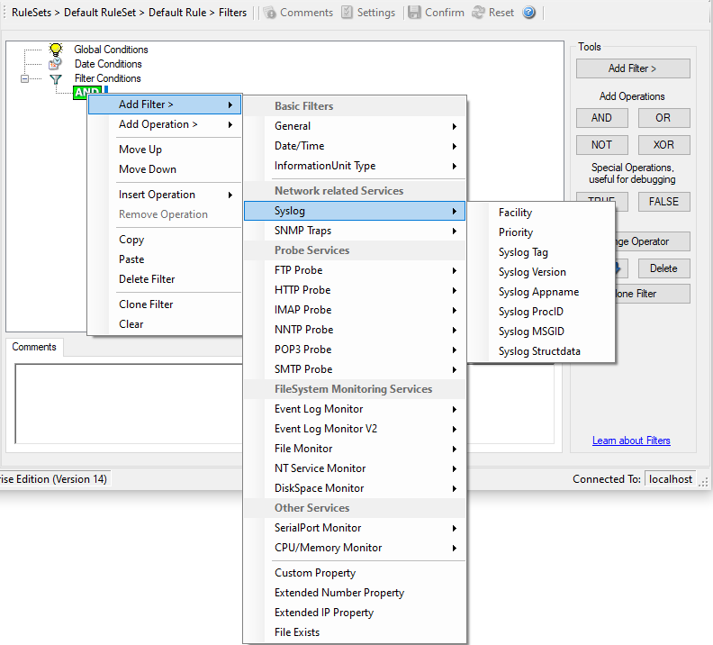

Syslog
======

Syslog related filters are grouped here. Please keep in mind that every
Information Unit has assigned a Syslog priority and facility and thus these
filters can be used with all Information Units.

* Filter Conditions - Syslog*

**Syslog Facility**
  The information unit must have the specified Syslog facility value. For Syslog
  type information units, it is the actual Syslog priority code, for all others
  it is a value mapped on a best effort basis.

  This filter is of type number.

**Syslog Priority**
  The information unit must have the specified Syslog priority value. For Syslog
  type information units, it is the actual Syslog priority code, for all others
  it is a value mapped on a best effort basis.

  The first list box allows to set a matching mode. The operations
  "less than" (<), "greater than" (>), and "equal" (=) can be selected. The match
  is made depending on these operations, so a "less than" operation means that
  all priorities below the specified priority match. Please note that the
  specified priority is not a match. If you would like to include it, be sure to
  specify the next higher one.

  This filter is of type number.

**Syslog Tag**
  This filter is of type string.
