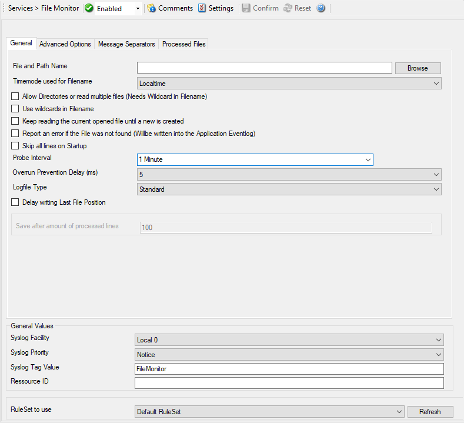
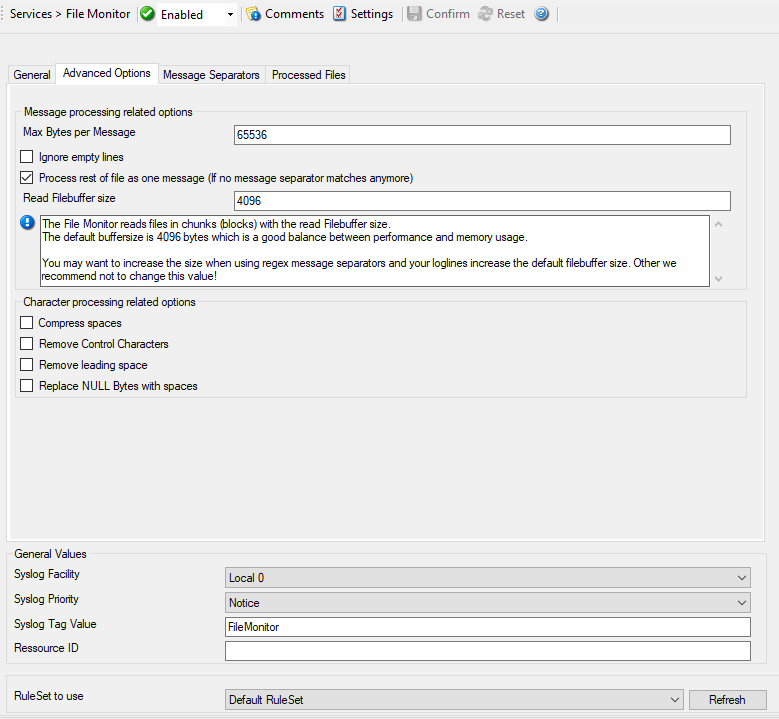
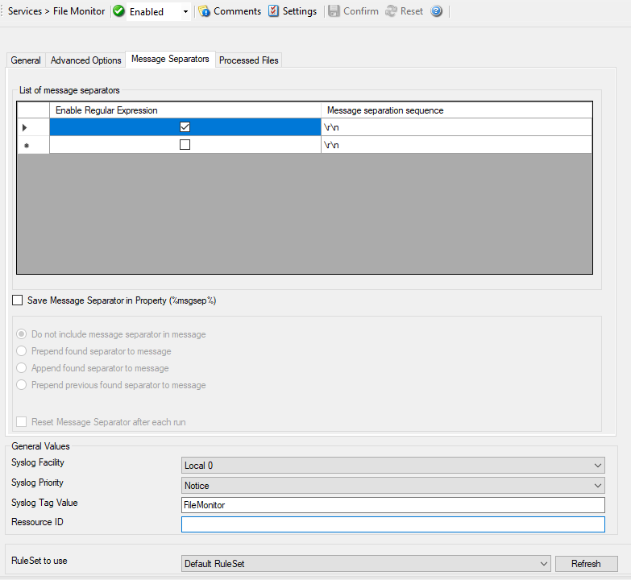
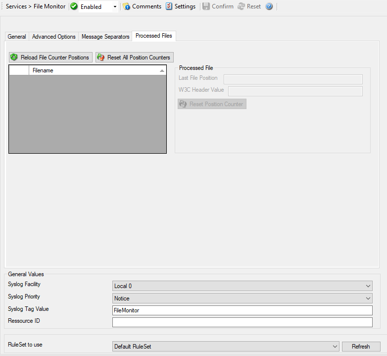

File Monitor
============

The file monitor monitors the content of a text file just as the event monitor
monitors the Windows Event Log. Its purpose is to gather vital information that
is stored in system text files. Many applications do not write events to the
event log but to a text file. This is also the case with many Microsoft
applications (for example the WINS log).

The file monitor can also gather Internet Information Server (Windows' web
server) log files. This is very useful for monitoring web activity and
detecting attacks.

General Tab
-----------

* Service - File Monitor General*

File and Path name
^^^^^^^^^^^^^^^^^^

**File Configuration field:**
  szPathAndFileName

**Description:**
  Here, you must type the name of the file to be monitored. To select a file
  from any specified location, press the browse button. Once a complete file
  name is specified, exactly that file is monitored.

  The file name is never changed automatically. However, many systems generate
  changing log files. For example, Internet Information Server (IIS) can be
  configured to change the log file every day. Therefore, each day's log file
  has a different name.

  To support changing log file names, there are replacement characters
  available within the file name. These are:

  * %y Year with two digits (e.g. 2002 becomes "02")
  * %Y Year with 4 digits
  * %m Month with two digits (e.g. March becomes "03")
  * %M Minute with two digits
  * %d Day of month with two digits (e.g. March, 1st becomes "01")
  * %h Hour as two digits
  * %S Seconds as two digits. It is hardly believed that this ever be used in
    reality.
  * %w Weekday as one digit. 0 means Sunday, 1 Monday, and so on.
  * %W Weekday as three-character string. Possible values are
    "Sun", "Mon", "Tue", "Wed", "Thu", "Fri", "Sat".
    This replacement character is most useful for DHCP log files.
  * %generatedfilename% It contains the fully generated filename (Can
    be useful for filtering).
  * %msgsep% Only available if enable in the advanced option of the File
    Monitor. This value contains the current used message separator.
    This is useful if you want to reconstruct messages where the
    separator is part of the message.
  * %msgseplast% Only available if enable in the advanced option of the File
    Monitor. This value contains the last used message separator. This is
    useful if you want to reconstruct messages where the separator is part
    of the message.

  **Please note: the replacement characters are case sensitive!**

  For example, daily Internet Information Server log files are named
  "exyymmdd.log", with yy being the 2 digit year, mm the month, and dd
  the day of month. To generate the same name with file monitor, use
  the following name "ex%y%m%d.log".

  **Please note that there is no replacement character for the monthly week number (1st week, 2nd week). As such, the weekly log file
  setting of IIS is not supported.**

  **On network paths:**
  The File Monitor can also work on network storages. There are two ways
  of monitoring files in a network path.

  1. Direct the service to a full UNC path. In this case, make sure the system
     account with which the service is running is able to access the network
     path or the service will fail to access with a permission error.
     Sample path: ``\\Hostname\folder1\folder2\``
  2. Map the UNC path to a local drive letter in Windows. In this case, the
     path will look like a regular local path, but actually points to a network
     location. This requires a workaround, which is run a scheduled task at
     system startup under Local System and perform a net use specifying the
     user and password of the share. Else, the service will not be able to
     access the mapped UNC path, because the mapping usually happens for
     interactive sessions only.

TimeMode used for Filename
^^^^^^^^^^^^^^^^^^^^^^^^^^

**File Configuration field:**
  nTimeMode

**Description:**
  Select the time mode used for the log file to be monitored with this
  drop-down list. Available options are:

  1. Local Time: log file is monitored based on local time.
  2. :doc:`utc <../glossaryofterms/utc>`: log file is monitored based on universal coordinated time. UTC was
     formerly referred to as "GMT" (Greenwich Mean Time) and is the basis of
     the international time zone system.

Allow Directories or read multiple files (Needs Wildcard in Filename)
^^^^^^^^^^^^^^^^^^^^^^^^^^^^^^^^^^^^^^^^^^^^^^^^^^^^^^^^^^^^^^^^^^^^^

**File Configuration field:**
  nMultipleFiles

**Description:**
  This is the new Multiple Files feature which means you can now read an array
  of files. This will require a wildcard in the filename. If using directories,
  the amount of subdirectories is unlimited.

Use wildcards in Filename
^^^^^^^^^^^^^^^^^^^^^^^^^

**File Configuration field:**
  nUseWildcard

**Description:**
  This option allows you use ``*`` as random character sequence in the filename.

  **Please note:** this character can only be used in Filename and not in the file path.

Keep reading the current opened file until a new is created
^^^^^^^^^^^^^^^^^^^^^^^^^^^^^^^^^^^^^^^^^^^^^^^^^^^^^^^^^^^

**File Configuration field:**
  nKeepReadingUntilNew

**Description:**
  This has been added to define if the Service shall continuously read an open
  logfile until a new file (depending on the configured filename) is available.
  This Options is helpful for such cases where you do not know when a new
  logfile is generated and the old one is closed.

Report an error if the File was not found (Will be written into the Application Eventlog)
^^^^^^^^^^^^^^^^^^^^^^^^^^^^^^^^^^^^^^^^^^^^^^^^^^^^^^^^^^^^^^^^^^^^^^^^^^^^^^^^^^^^^^^^^

**File Configuration field:**
  nReportErrorOnFNF

**Description:**
  As the name says, if this setting is enabled, an error is reported in the
  Windows Eventlog if the file was not found.

Skip all lines on Startup
^^^^^^^^^^^^^^^^^^^^^^^^^

**File Configuration field:**
  nSkipLinesEnabled

**Description:**
  If this option is enabled, the File Monitor will skip all new lines of a
  logfile during startup. This will work in single-file mode as well as multi-file
  mode.

Probe Interval
^^^^^^^^^^^^^^

**File Configuration field:**
  nSleepTime

**Description:**
  This interval is in :doc:`milliseconds <../glossaryofterms/millisecond>`. After the specified interval the file
  monitor checks the file for new records.

  We recommend a value of 60000 milliseconds for the "Check Interval". With
  that setting, the file monitor checks for new records every 60 seconds.
  Larger periods can be specified for occasionally connected systems or if
  email delivery with few emails per day is intended.

  Very security-aware environments might use a shorter interval. The
  MonitorWare Agent 3.0 is specifically designed to limit the burden on the
  monitored system. As such, resource usage is typically low, even with
  frequently run file monitor checks. However, we recommend not running the
  file monitor more often than once a second.

Overrun Prevention Delay (ms)
^^^^^^^^^^^^^^^^^^^^^^^^^^^^^

**File Configuration field:**
  nPreventOverrunDelay

**Description:**
  This property allows configuring a delay after generating an event. The time
  for the delay is in :doc:`milliseconds <../glossaryofterms/millisecond>`.

  If run at a value of zero, the Service will process events as fast as the
  machine permits. We have seen scenarios where routers and receivers are not
  able to keep up with this rate, resulting in packet loss. In addition, the
  CPU of the reporting machine may be higher which is not a problem for most
  common multi-core machines in these days. However, with even a 1-millisecond
  delay, there is no noticeable CPU activity even when large bursts of events
  are forwarded. At one millisecond, the Service can still generate about 500-
  1000 events per second.

  The default setting is an overrun protection of five millisecond, which
  allows roughly 200 events per second. This should be sufficient for even very
  busy servers.

  If you need real-time event reporting, we recommend to set the value to 0.

Logfile Type
^^^^^^^^^^^^

**File Configuration field:**
  nLogFileType

  * 0 = Standard (Default)
  * 1 = W3CLog

**Description:**
  Select the type of the log file to be monitored with this drop-down list.
  Available options are:

  * Standard - a standard text log file
  * W3C Web Server logfile - log files in the W3C web server compliant format.

Delay writing Last File Position
^^^^^^^^^^^^^^^^^^^^^^^^^^^^^^^^

**File Configuration field:**
  nEnableLastRecordDelay

**Description:**
  Enables a writeback delay for the Last File Position. When processing large
  logfiles, we would recommend to enable this feature.

Save after amount of processed lines
^^^^^^^^^^^^^^^^^^^^^^^^^^^^^^^^^^^^

**File Configuration field:**
  nLastRecordDelayCount

**Description:**
  When Delay writing Last File Position is enabled, the Last File Position will
  be written after the amount of processed lines that are specified here.

Advanced Options Tab
--------------------

* Service - File Monitor Advanced Options*

Message processing related options
^^^^^^^^^^^^^^^^^^^^^^^^^^^^^^^^^^

Max Bytes per Message
^^^^^^^^^^^^^^^^^^^^^

**File Configuration field:**
  nMaxBytesPerMessage

**Description:**
  Maximum value of bytes that the file monitor reads per line. If a message is
  larger then this value, the message splits into multiple parts.

Ignore empty lines
^^^^^^^^^^^^^^^^^^

**File Configuration field:**
  nIgnoreEmptyLines

**Description:**
  As the name already says, this option discards empty lines within the
  logfile.

Process rest of file as one message (If no message separator matches anymore)
^^^^^^^^^^^^^^^^^^^^^^^^^^^^^^^^^^^^^^^^^^^^^^^^^^^^^^^^^^^^^^^^^^^^^^^^^^^^^

**File Configuration field:**
  nProcessRestOfFile

**Description:**
  When enabled, file monitor will consider the rest of a file as single message
  if no other message separator matches anymore.

Read Filebuffer size
^^^^^^^^^^^^^^^^^^^^

**File Configuration field:**
  nReadFileBuffer

**Description:**
  File Monitor reads files in chunks (blocks) with the read Filebuffer size.
  You can define the size of these chunks here, the default buffersize is 4096
  which is a good balance between performance and memory usage.
  Please note that when using regex message separators, you may need to
  increase the Filebuffer size to the maximum possible length of a single logline.
  Other we recommend not to change this value!

Character processing related options
^^^^^^^^^^^^^^^^^^^^^^^^^^^^^^^^^^^^

Compress spaces
^^^^^^^^^^^^^^^

**File Configuration field:**
  nCompressSpaces

**Description:**
  This option compresses sequences of spaces found inside the message to a
  single one.

Remove Control Characters
^^^^^^^^^^^^^^^^^^^^^^^^^

**File Configuration field:**
  nRemoveControlChars

**Description:**
  Removes control characters like CR and LF(carriage return and line feed).

Remove leading space
^^^^^^^^^^^^^^^^^^^^

**File Configuration field:**
  nRemoveLeadingSpaces

**Description:**
  If there are any leading spaces in the file, this option removes them.

Replace NULL Bytes with spaces
^^^^^^^^^^^^^^^^^^^^^^^^^^^^^^

**File Configuration field:**
  nReplaceNullBytes

**Description:**
  If this option is enabled, the FileMonitor will replace NULL Bytes within
  files with spaces. These spaces again can be compressed with the "Compress
  spaces" options.

Message Separators Tab
----------------------

* Service - File Monitor Message Separators*

Enable Regular Expression
^^^^^^^^^^^^^^^^^^^^^^^^^

**File Configuration field:**
  bIsRegex_[n]

**Description:**
  When enabled, the Message separation sequence will be handled as regular
  expression. Everything known in the regular expression syntax can be used to
  define a matching pattern.

  Here are some regular expressions samples:

  Regular Expression:
  ``[0-9]{4,4}-[0-9]{1,2}-[0-9]{1,2} [0-9]{1,2}:[0-9]{1,2}:[0-9]{1,2}``
  Matches typical Date like ``2015-11-20 12:11:01``

  Regular Expression: ``\n[0-9]{4,4}``
  Matches Linefeed and 4-digit number.

  Regular Expression: ``(;|:)``
  Matches semicolon or a colon.

  More samples and details about the Regular Expression Syntax can be found
  here: https://msdn.microsoft.com/en-us/library/bb982727(v=vs.90).aspx

Message separation sequence
^^^^^^^^^^^^^^^^^^^^^^^^^^^

**File Configuration field:**
  szMsgSep_[n]

**Description:**
  Defines a customizable separation sequence by which the file monitor splits
  messages.

  If using multiple separation sequences, the comparison operation will be held
  as an OR operation. That means, that either this value or another value has to
  be true, so a message can be split. This is especially important for logfiles
  with different log formats.

  To date, the following control characters are available:

  * \r -> carriage return
  * \n -> line feed

Save Message Separator in Property (%msgsep%)
^^^^^^^^^^^^^^^^^^^^^^^^^^^^^^^^^^^^^^^^^^^^^

If this option is enabled, the current and last used message separator will be
saved into the properties ``%msgsep%`` and ``%msgseplast%``.

When using regular expression as message separators, it might be needed to
append or prepend the message separator to the message itself. For these
cases, we have multiple way to do this:

Do not include message separator in message
^^^^^^^^^^^^^^^^^^^^^^^^^^^^^^^^^^^^^^^^^^^

**File Configuration field:**
  nPropertyMsgSep = 0

**Description:**
  Message Separator will not be included in the message

Prepend found separator to message
^^^^^^^^^^^^^^^^^^^^^^^^^^^^^^^^^^

**File Configuration field:**
  nPropertyMsgSep = 1

**Description:**
  When enabled, the current found message separator will be prepended to the
  message.

Append found separator to message
^^^^^^^^^^^^^^^^^^^^^^^^^^^^^^^^^

**File Configuration field:**
  nPropertyMsgSep = 2

**Description:**
  When enabled, the current found message separator will be appended to the
  message.

Prepend previous found separator to message
^^^^^^^^^^^^^^^^^^^^^^^^^^^^^^^^^^^^^^^^^^^

**File Configuration field:**
  nPropertyMsgSep = 3

**Description:**
  When enabled, the previous found message separator will be prepended to the
  message.

Reset Message Separator after each run
^^^^^^^^^^^^^^^^^^^^^^^^^^^^^^^^^^^^^^

**File Configuration field:**
  nPropertyMsgSepReset

**Description:**
  If enabled, the message separator values will be reset after the File
  Monitor has finished a run (reached the end of a file).

Processed Files Tab
-------------------

On this tab you see all files in a data grid that file monitor has yet
processed. Select a file within this grid to see its data values like the last
file position.

* Service - File Monitor Processed Files*

Last File Position
^^^^^^^^^^^^^^^^^^

**File Configuration field:**
  nLastPos [Data Value]

**Description:**
This is the last file (Byte) position that the File Monitor processed. Lower
or reset the Position Counter if you want to reprocess the file partially or
even fully.

  The data values can be controlled using the Reload File Counter Positions and
  Reset All Position Counters buttons, or simply by editing the Last File
  Position field. When saving applied changes to the data values, the service
  will reload them during next check interval and reprocess files if necessary.

W3C Header Value
^^^^^^^^^^^^^^^^

**File Configuration field:**
  szW3CHeader [Data Value]

**Description:**
  If logfile type is set to "W3C Webserver Logfile", this value will be
  filled with a list of field types taken from the W3C Field header.

General Values (Common settings for most services)
^^^^^^^^^^^^^^^^^^^^^^^^^^^^^^^^^^^^^^^^^^^^^^^^^^

Syslog Facility
^^^^^^^^^^^^^^^

**File Configuration field:**
  nSyslogFacility

**Description:**
  The Syslog facility to be assigned to events created by this service. Most
  useful if the message is to forward to a Syslog server.

Syslog Priority
^^^^^^^^^^^^^^^

**File Configuration field:**
  nSyslogPriority

**Description:**
  The Syslog priority to be assigned to events created by this service. Most
  useful if the message is to forward to a Syslog server.

Syslog Tag Value
^^^^^^^^^^^^^^^^

**File Configuration field:**
  szSyslogTagValue

**Description:**
  The Syslog tag value to be assigned to events created by this service. Most
  useful if the message is to forward to a Syslog server.

Resource ID
^^^^^^^^^^^

**File Configuration field:**
  szResource

**Description:**
  The Resource ID to be assigned to events created by this service. Most useful
  if the message is to forward to a Syslog server.

RuleSet to Use
^^^^^^^^^^^^^^

**File Configuration field:**
  szRuleSetName

**Description:**
  Name of the ruleset to be used for this service. The RuleSet name must be a
  valid RuleSet.
