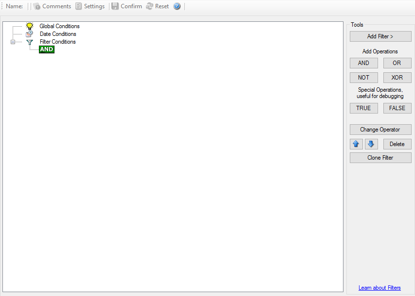
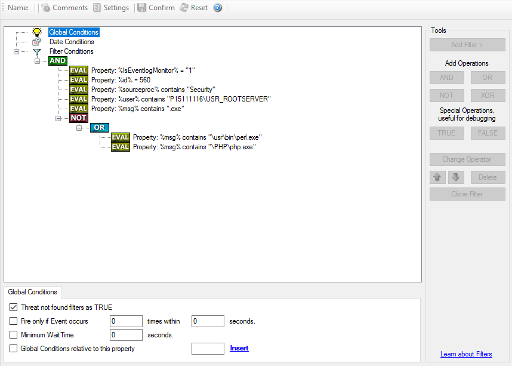

Filter Conditions
=================

Filter conditions specify **when** to apply a rule. If the filter condition
evaluates to true, the rule containing those conditions is treated as matching
and the actions specified in that rule are carried out.

Filter conditions can be as complex as needed. Full support for Boolean
operations and nesting of conditions is supported.

By default, the filter condition is empty, respective tree contains only a
single "AND" at the top level. This is to facilitate adding filters (the top
level-node is typically "AND" and thus provided by default). A filter condition
containing only the "AND" always evaluates as true. A sample screenshot can be
found below

* Filter Conditions*

The default filter condition means that the actions associated with the rule are
to be carried out for every information unit received. It is often used for
actions that should be broadly taken, for example to write all incoming
information units to a database or text file.

On the other hand, there are actions that should only be executed under very
special conditions. They may even require a complex filter condition including
multiple levels of Boolean operations. Below is a sample of such a condition:

* Filter Conditions - Complex Filter*

This filter condition is part of an intrusion detection ruleset. Here, Windows
file system auditing is used to detect a potentially successful intrusion via
Internet Information Server (IIS). This is done by enabling auditing on all
executable files. Internet Information Server accesses them under the
``IUSR_<machinename>`` account, which in our sample is
``"P15111116\IUSR_ROOTSERVER"``. If that user runs any unexpected executables, chances are good that someone was able to intrude the machine via IIS. Please
note that Perl and PHP scripts need to run the Perl and PHP engine. This is
reflected by specifically checking, if ``perl.exe`` and ``php.exe`` is executed – and if so, no alarm is triggered.

Here is how the above sample works: first, the message contents are checked if
it contains either the full path name to ``perl.exe`` or ``php.exe``. This is done in the "OR" branch at the bottom. We now need to keep in mind that when a filter
condition evaluates to "true", the actions are executed. In case of ``perl.exe``
and ``php.exe``, this is just the opposite of what we want. We need it to be executed, when other files are executed.
Consequently, we negate (Boolean "NOT") the result of the OR. The end result of
the "NOT" operation is then combined via a "AND" with some other properties
describing the event we need.

First, we check if the specific event really occurred. For this, we need to make
sure we deal with an Event Log Monitor information unit. Then, these
information units are identified by the event source as well as the Event ID.
We also check for the Event User to identify only IIS generated requests.
Lastly, we check if the message contains the string ``".exe"``.

In order to avoid too frequent alerts, we also have specified a minimum wait
time of 60 seconds. Therefore, the filter condition evaluates as "true" at most
every 60 seconds, even if all other conditions are true.

**Note:** If you want to know more about :doc:`complex filter conditions <../shared/references/complexfilterconditions>`
you can click on the "Learn about Filters" link.

**String comparison in Filter Conditions are "Case Sensitive"!** For example, if the Source System name is "ws01" and you have written "WS01" while applying the

filter, then this filter condition would**"NEVER"** evaluate to True! Please double
check before proceeding further!

If you are not still sure about what to do, you can drop a word about your
requirements to https://ticket.adiscon.com, and we look into it!

.. toctree::
   :maxdepth: 2

   f-globalconditions
   f-dateconditions
   f-operators
   f-filters

basic filters
-------------

.. toctree::
   :maxdepth: 1

   f-general
   f-datetime
   f-informationunittype

network related services filters
--------------------------------

.. toctree::
   :maxdepth: 1

   f-syslog
   f-snmptraps

probe services filters
----------------------

.. toctree::
   :maxdepth: 1

   f-ftpprobe
   f-httpprobe
   f-imapprobe
   f-nntpprobe
   f-pop3probe
   f-smtpprobe

filesystem monitoring services filters
--------------------------------------

.. toctree::
   :maxdepth: 1

   f-eventlogmonitorv1
   f-eventlogmonitorv2
   f-filemonitor
   f-ntservicemonitor
   f-diskspacemonitor

other services filters
----------------------

.. toctree::
   :maxdepth: 1

   f-serialportmonitor
   f-cpumemorymonitor

custom properties
-----------------

.. toctree::
   :maxdepth: 1

   f-customproperty
   f-extendednumberproperty
   f-extendedipproperty
   f-fileexists
   f-storefilterresults
