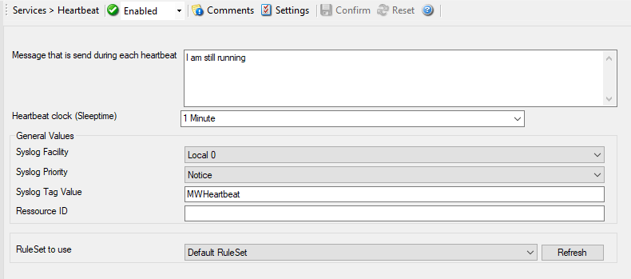

Heartbeat
=========

The heartbeat process can be used to continuously check if everything is
running well. It generates an information unit every specified time interval.
That information unit can be forward to a different system. If it does not
receive additional packets within the configured interval, it can be assumed
that the sender is either in trouble or already stopped running.

* Service - Heartbeat*

Message that is send during each heartbeat
^^^^^^^^^^^^^^^^^^^^^^^^^^^^^^^^^^^^^^^^^^

**File Configuration field:**
  szMessage

**Description:**
  This is the message that is used as text inside the information unit. Use
  whatever value is appropriate. The message text does not have any special
  meaning, so use whatever value you seem fit.

Heartbeat clock (Sleeptime)
^^^^^^^^^^^^^^^^^^^^^^^^^^^

**File Configuration field:**
  nSleepTime

**Description:**
  This is the interval, in :doc:`milliseconds <../glossaryofterms/millisecond>`, that the heartbeat service generates
  information units in. Please note that the receiving side should be tolerant.
  The interval specified here is the minimum time between packets. Under heavy
  load, the interval might be slightly longer. It is good practice to allow
  twice this interval before the service is considered suspect by the system
  monitoring the services health.

General Values (Common settings for most services)
^^^^^^^^^^^^^^^^^^^^^^^^^^^^^^^^^^^^^^^^^^^^^^^^^^

Syslog Facility
^^^^^^^^^^^^^^^

**File Configuration field:**
  nSyslogFacility

**Description:**
  The :doc:`syslog facility <../glossaryofterms/syslogfacility>` to be assigned to events created by this service. Most
  useful if the message is to forward to a Syslog server.

Syslog Priority
^^^^^^^^^^^^^^^

**File Configuration field:**
  nSyslogPriority

**Description:**
  The Syslog priority to be assigned to events created by this service. Most
  useful if the message is to forward to a Syslog server.

Syslog Tag Value
^^^^^^^^^^^^^^^^

**File Configuration field:**
  szSyslogTagValue

**Description:**
  The Syslog tag value to be assigned to events created by this service. Most
  useful if the message is to forward to a Syslog server.

Resource ID
^^^^^^^^^^^

**File Configuration field:**
  szResource

**Description:**
  The :doc:`resource id <../glossaryofterms/resourceid>` to be assigned to events created by this service. Most useful
  if the message is to forward to a Syslog server.

RuleSet to Use
^^^^^^^^^^^^^^

**File Configuration field:**
  szRuleSetName

**Description:**
  Name of the ruleset to be used for this service. The RuleSet name must be a
  valid RuleSet.
