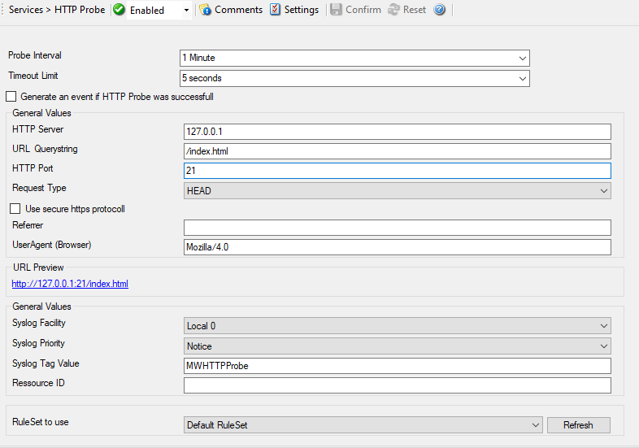

HTTP Probe
==========

The HTTP Probe connects to a HTTP Server, and sends a valid HTTP request as
configured. It then either receives the header, or header and content of a
website, depending on how the service is configured (See Request Type).

* Service - HTTp Probe*

Probe Interval
^^^^^^^^^^^^^^

**File Configuration field:**
  nSleepTime

**Description:**
  This is the interval of the probe. After each probe, the Service will sleep
  for the configured probe interval. This period is specified in milliseconds.

Timeout Limit
^^^^^^^^^^^^^

**File Configuration field:**
  nTimeOutLimit

**Description:**
  The amount of time (in :doc:`milliseconds <../glossaryofterms/millisecond>`)
  the remote system is expected to answer in. If no response is received within
  this period, the probe fails and an event is generated. The default value of
  1000 milliseconds is a proper value for most well connected networks. If the
  probe runs against a heavily loaded system and/or slow network link, the
  amount must be adjusted accordingly.

Generate an event if HTTP Probe was successful
^^^^^^^^^^^^^^^^^^^^^^^^^^^^^^^^^^^^^^^^^^^^^^

**File Configuration field:**
  nGenerateOnSuccess

**Description:**
  When checked, an event is generated every time. If unchecked, it is generated
  only when the HTTP probe fails. The most common option is to leave it
  unchecked to catch events upon a failed HTTP probe.

General Values
^^^^^^^^^^^^^^

HTTP Server
^^^^^^^^^^^

**File Configuration field:**
  szHTTPServer

**Description:**
  Either the IP address or resolvable host name of the HTTP server, the HTTP
  probe is to be run against. You can either use an IPv4, an IPv6 Address, or a
  Hostname that resolves to an IPv4 or IPv6 Address. Please note that
  specifying a host name can cause the HTTP probe to fail if DNS name
  resolution fails (for example due to a failing DNS server). To avoid this,
  specify an IP address.

URL Querystring
^^^^^^^^^^^^^^^

**File Configuration field:**
  szUrl

**Description:**
  By default this is ``/index.html``. This value is used to construct an URL
  which is previewed in a rectangular field under Use secure https Protocol
  option.

HTTP Port
^^^^^^^^^

**File Configuration field:**
  nHTTPPort

**Description:**
  This port is to be probed. Please see your server's reference for the actual
  value to use. For example, mail servers typically listen to port 25 and web
  servers to 80.

Request Type
^^^^^^^^^^^^

**File Configuration field:**
  szRequestType

**Description:**
  The Request Type can be HEAD or GET. HEAD just receives the header of a
  website where GET receives the whole website content. When probing a web
  server, you should use HEAD in order to reduce network and processing
  overhead.

Use secure https Protocol
^^^^^^^^^^^^^^^^^^^^^^^^^

**File Configuration field:**
  nUseSSL

**Description:**
  You can enable this option, if you want to query a web server using SSL
  (Secure Socket Layer). Note that the default port is changed from 80 to 443
  here.

Referrer
^^^^^^^^

**File Configuration field:**
  szReferer

**Description:**
  An optional configuration option where you can specify a Referrer that is
  send in the HTTP header.

UserAgent (Browser)
^^^^^^^^^^^^^^^^^^^

**File Configuration field:**
  szUserAgent

**Description:**
  It is also an optional value which can be used to specify an UserAgent that
  is send in the HTTP header.

URL Preview
^^^^^^^^^^^

Here you find a preview for the URL

General Values (Common settings for most services)
^^^^^^^^^^^^^^^^^^^^^^^^^^^^^^^^^^^^^^^^^^^^^^^^^^

Syslog Facility
^^^^^^^^^^^^^^^

**File Configuration field:**
  nSyslogFacility

**Description:**
  The :doc:`syslog facility <../glossaryofterms/syslogfacility>` to be assigned
  to events created by this service. Most useful if the message is to forward
  to a Syslog server.

Syslog Priority
^^^^^^^^^^^^^^^

**File Configuration field:**
  nSyslogPriority

**Description:**
  The Syslog priority to be assigned to events created by this service. Most
  useful if the message is to forward to a Syslog server.

Syslog Tag Value
^^^^^^^^^^^^^^^^

**File Configuration field:**
  szSyslogTagValue

**Description:**
  The Syslog tag value to be assigned to events created by this service. Most
  useful if the message is to forward to a Syslog server.

Resource ID
^^^^^^^^^^^

**File Configuration field:**
  szResource

**Description:**
  The :doc:`resource id <../glossaryofterms/resourceid>` to be assigned to
  events created by this service. Most useful if the message is to forward to a
  Syslog server.

RuleSet to Use
^^^^^^^^^^^^^^

**File Configuration field:**
  szRuleSetName

**Description:**
  Name of the ruleset to be used for this service. The RuleSet name must be a
  valid RuleSet.
