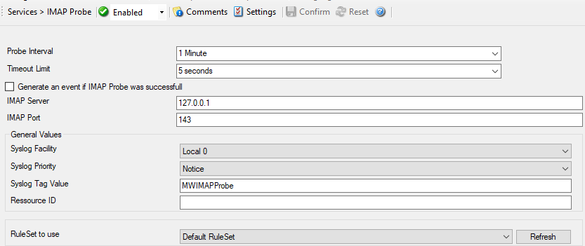

IMAP Probe
==========

IMAP probe does connection to IMAP server. After receiving the response from
IMAP server it sends the QUIT command to terminate the connection.

The connection status is saved in in the property **imapstatus** and the response in the property **imaprespmsg**.

* Service - IMAP Probe*

Probe Interval
^^^^^^^^^^^^^^

**File Configuration field:**
  nSleepTime

**Description:**
  This is the interval of the probe. After each probe, the Service will sleep
  for the configured probe interval. This period is specified in milliseconds.

Timeout Limit
^^^^^^^^^^^^^

**File Configuration field:**
  nTimeOutLimit

**Description:**
  The amount of time (in :doc:`milliseconds <../glossaryofterms/millisecond>`)
  the remote system is expected to answer in. If no response is received within
  this period, the probe fails and an event is generated. The default value of
  1000 milliseconds is a proper value for most well connected networks. If the
  probe runs against a heavily loaded system and/or slow network link, the
  amount must be adjusted accordingly.

Generate an event if IMAP Probe was successful
^^^^^^^^^^^^^^^^^^^^^^^^^^^^^^^^^^^^^^^^^^^^^^

**File Configuration field:**
  nGenerateOnSuccess

**Description:**
  When checked, an event is generated every time. If unchecked, it is generated
  only when the IMAP probe fails. The most common option is to leave it
  unchecked to catch events upon a failed IMAP probe.

IMAP Server
^^^^^^^^^^^

**File Configuration field:**
  szIMAPServer

**Description:**
  Either the IP address or resolvable host name of the IMAP server, the IMAP
  probe is to be run against. You can either use an IPv4, an IPv6 Address, or a
  Hostname that resolves to an IPv4 or IPv6 Address. Please note that
  specifying a host name can cause the IMAP probe to fail if DNS name
  resolution fails (for example due to a failing DNS server). To avoid this,
  specify an IP address.

IMAP Port
^^^^^^^^^

**File Configuration field:**
  nIMAPPort

**Description:**

  This port is to be probed. Please see your server's reference for the actual
  value to use. For example, mail servers typically listen to port 25 and web
  servers to 80.

General Values (Common settings for most services)
^^^^^^^^^^^^^^^^^^^^^^^^^^^^^^^^^^^^^^^^^^^^^^^^^^

Syslog Facility
^^^^^^^^^^^^^^^

**File Configuration field:**
  nSyslogFacility

**Description:**
  The `Syslog facility :doc:<../glossaryofterms/syslogfacility>` to be assigned
  to events created by this service. Most useful if the message is to forward
  to a Syslog server.

Syslog Priority
^^^^^^^^^^^^^^^

**File Configuration field:**
  nSyslogPriority

**Description:**
  The Syslog priority to be assigned to events created by this service. Most
  useful if the message is to forward to a Syslog server.

Syslog Tag Value
^^^^^^^^^^^^^^^^

**File Configuration field:**
  szSyslogTagValue

**Description:**
  The Syslog tag value to be assigned to events created by this service. Most
  useful if the message is to forward to a Syslog server.

Resource ID
^^^^^^^^^^^

**File Configuration field:**
  szResource

**Description:**
  The :doc:`resource id <../glossaryofterms/resourceid>` to be assigned to
  events created by this service. Most useful if the message is to forward to a
  Syslog server.

RuleSet to Use
^^^^^^^^^^^^^^

**File Configuration field:**
  szRuleSetName

**Description:**
  Name of the ruleset to be used for this service. The RuleSet name must be a
  valid RuleSet.
