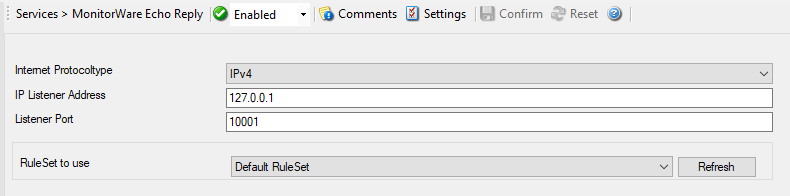

MonitorWare Echo Reply
======================

The Echo Reply service is used on each of the installed EventReporter/
MonitorWare Agent. A central agent running the MonitorWare Agent is using the
echo request and instructs to poll each of the other EventReporter/MonitorWare
Agent services. When the request is not carried out successfully, an alert is
generated. The MonitorWare echo protocol ensures that always a fresh probe of
the remote EventReporter/MonitorWare Agent Service is done.

* Service - MonitorWare Echo Reply*

Internet Protocoltype
^^^^^^^^^^^^^^^^^^^^^

**File Configuration field:**
  nInetType

**Description:**
  Select the desired protocol type. IPv4 and IPv6 are available. The IPv6
  protocol needs to be properly installed in order to be used. Note that one
  Service can only handle IPv4 or IPv6, so if you want to use both protocols,
  you will need to create two separate services.

IP Listener Address
^^^^^^^^^^^^^^^^^^^

**File Configuration field:**
  szMyIPAddress

**Description:**
  The MonitorWare Echo Reply service can be bound to a specific IP Address. You
  can either use an IPv4, an IPv6 Address, or a Hostname that resolves to an
  IPv4 or IPv6 Address. This feature is useful for multihome environments where
  you want to run different Syslog Servers on different IP Addresses. Please
  note that the default IP Address ``0.0.0.0`` means ANY IP Address.

Listener Port
^^^^^^^^^^^^^

**File Configuration field:**
  nListenPort

**Description:**
  Specify the listener port here.

RuleSet to Use
^^^^^^^^^^^^^^

**File Configuration field:**
  szRuleSetName

**Description:**
  Name of the ruleset to be used for this service. The RuleSet name must be a
  valid RuleSet.
