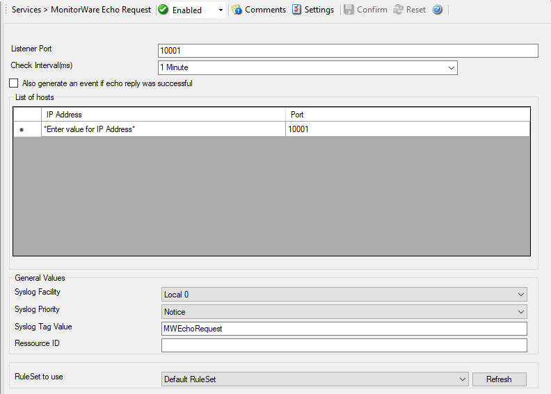

MonitorWare Echo Request
========================

The MonitorWare Echo Request service is used to check the availability of
MonitorWare Agents (either MonitorWare Agent, WinSyslog or EventReporter). It
works in conjunction with the MonitorWare Echo Reply service, which needs to be
running on the agents which are to be monitored.

Echo Request service tries to connect to the reply service on remote agents. If
it can connect, it checks if the remote agent is alive. If either the connect
fails or the remote response is not satisfactory, an event is generated (which
could be used for alerting as well as corrective action). Optionally, an event
can also be generated when the remote agent can be contacted successfully.

A single MonitorWare Echo Request service can check an unlimited number of
remote agents. Please note, however, that all checks are done in sequence. So
with a large number of systems to be checked, there may be a longer delay
between the checks than you expect. This is especially the case over slow
network links (like found in wide area networks). If this is not acceptable,
multiple Echo Request services can be configured. They then run independent of
each other.

* Service - Echo Request*

Listener Port
^^^^^^^^^^^^^

**File Configuration field:**
  nListenPort

**Description:**
  The current port on which the service MonitorWare Echo Request is running.

Check Interval(ms)
^^^^^^^^^^^^^^^^^^

**File Configuration field:**
  nSleepTime

**Description:**
  The Echo Request service runs periodically. This specifies how often it
  should run. Please note that the Echo Request service waits for the
  configured amount of time after the current run is finished. The time is the
  delay in milliseconds.

Also generate an event if echo reply was successful
^^^^^^^^^^^^^^^^^^^^^^^^^^^^^^^^^^^^^^^^^^^^^^^^^^^

**File Configuration field:**
  nGenerateOnSuccess

**Description:**
  If checked, an event is to be created each time the probe runs, even when it
  is successful. If unchecked, events are only created when the remote system
  fails.

List of hosts
^^^^^^^^^^^^^

This table contains the systems that are to be checked in each interval. Once
in each run, each remote system is checked. The checks are carried out in the
exact same order that the systems appear in the table - from top to bottom.
Kindly insert new entries by editing the last entry (asterisk at the beginning).
To delete entries, select a row and hit the delete key on your keyboard.

IP Address
^^^^^^^^^^

**File Configuration field:**
  szIP_[n]

**Description:**
  Enter an Hostname or IP-Address if a remote MonitorWare Agent with a
  configured Echo Reply Service.

Port
^^^^

**File Configuration field:**
  nPort_[n]

**Description:**
  Enter the configured Port you have configured in remote Echo Reply Service.

General Values (Common settings for most services)
^^^^^^^^^^^^^^^^^^^^^^^^^^^^^^^^^^^^^^^^^^^^^^^^^^

Syslog Facility
^^^^^^^^^^^^^^^

**File Configuration field:**
  nSyslogFacility

**Description:**
  The Syslog facility to be assigned to events created by this service. Most
  useful if the message is to forward to a Syslog server.

Syslog Priority
^^^^^^^^^^^^^^^

**File Configuration field:**
  nSyslogPriority

**Description:**
  The Syslog priority to be assigned to events created by this service. Most
  useful if the message is to forward to a Syslog server.

Syslog Tag Value
^^^^^^^^^^^^^^^^

**File Configuration field:**
  szSyslogTagValue

**Description:**
  The Syslog tag value to be assigned to events created by this service. Most
  useful if the message is to forward to a Syslog server.

Resource ID
^^^^^^^^^^^

**File Configuration field:**
  szResource

**Description:**
  The Resource ID to be assigned to events created by this service. Most useful
  if the message is to forward to a Syslog server.

RuleSet to Use
^^^^^^^^^^^^^^

**File Configuration field:**
  szRuleSetName

**Description:**
  Name of the ruleset to be used for this service. The RuleSet name must be a
  valid RuleSet.
