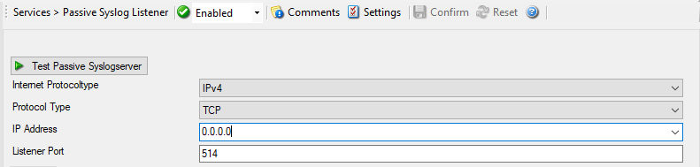
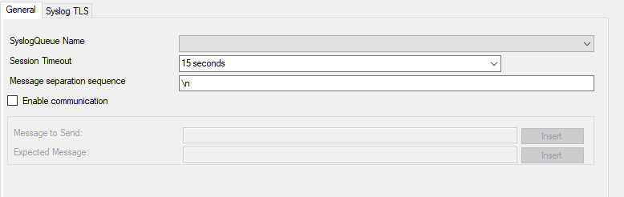
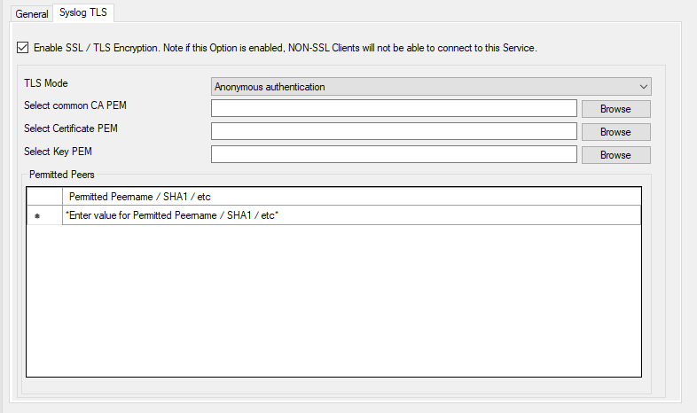

Passive Syslog Listener
=======================

The Passive Syslog Listener Service is a :doc:`tcp <../glossaryofterms/tcp>` based Listener Service that sends
messages from a Syslog Queue to any remote host, that connects to it.
Connections can be secured with TLS including certificate based authentication.
Additionally, a greeting and response message can be configured as well.

In order to use the Passive Syslog Listener, you have to configure at least one
:doc:`syslog queue action <../mwagentspecific/a-syslogqueueaction>` within your configuration first!

When configured and running, you can click the Test Passive Syslog server button
in order to open a new window that will help you testing the Passive Syslog
Listener. Make sure the Service is started (or restarted) after you finished the
configuration of the Passive Syslog Listener. The test window will automatically
be filled with correct properties and is ready to go. If the test succeeds, the
data grid should rapidly fill with queued syslog messages.

* Service - Passive Syslog Listener*

Internet Protocoltype
^^^^^^^^^^^^^^^^^^^^^

**File Configuration field:**
  nInetType

**Description:**
  Select the desired protocol type. IPv4 and IPv6 are available. The IPv6
  protocol needs to be properly installed in order to be used. Note that one
  Service can only handle IPv4 or IPv6, so if you want to use both protocols,
  you will need to create two separate services.

Protocol Type
^^^^^^^^^^^^^

**File Configuration field:**
  nProtocolType

**Description:**
  Currently only TCP is supported for the Passive Syslog Listener.

IP Address
^^^^^^^^^^

**File Configuration field:**
  nProtocolType

**Description:**
  The Syslog server can now be bound to a specific IP address. You can either
  use an IPv4, an IPv6 Address, or a Hostname that resolves to an IPv4 or IPv6
  Address. This feature is useful for multihome environments where you want to
  run different Syslog Servers on different IP Addresses. Please note that the
  default IP Address ``0.0.0.0`` means ANY IPv4 Address and ``"::"`` means all available IPV6 Addresses.

Listener Port
^^^^^^^^^^^^^

**File Configuration field:**
  nListenPort

**Description:**
  The port the Syslog server listens on. The typical (standard) value is 514.
  This should be changed only if there is a definite need for it. Such a need
  typically arises from security concerns. If the port is changed, all
  reporting devices (routers, printers …) must also be configured to use the
  non-standard port.

General Options
^^^^^^^^^^^^^^^

* Service - Passive Syslog Listener General Tab*

SyslogQueue Name
^^^^^^^^^^^^^^^^

**File Configuration field:**
  szSyslogQueue

**Description:**
  Selects the SyslogQueue to be used by this Service. Must be set to a valid
  SyslogQueue. See SyslogQueue Action for more about Syslog Queues.

Session Timeout
^^^^^^^^^^^^^^^

**File Configuration field:**
  nTimeOutSession

**Description:**
  One of the TCP-specific options is the session timeout. This value declares,
  how long a TCP session may be kept open, after the last package of data has
  been sent. You can by default set values between 1 second and 1 day or you
  can use a custom value with a maximum of 2147483646 milliseconds. If you wish
  to disable the session timeout, you can use a custom value of 0 milliseconds
  to disable it.

Message separation sequence
^^^^^^^^^^^^^^^^^^^^^^^^^^^

**File Configuration field:**
  szTCPMsgSep

**Description:**
  This determines how you want to separate the messages. By default ``\n`` is the value for this, as most times a message ends with a carriage return
  and/or a line feed. But, you can choose your own separation sequence here as well.

Enabled communication
^^^^^^^^^^^^^^^^^^^^^

**File Configuration field:**
  nEnableCommunicate

**Description:**
  Activate this setting when you want to Send and Receive an expected
  message after the connection is established.

Message to Send
^^^^^^^^^^^^^^^

**File Configuration field:**
  szMessageToSend

**Description:**
  Defines the message send to the Client after the connection is
  established. The Passive Syslog Listener will close the connection if the
  message does not match.

Expected Message
^^^^^^^^^^^^^^^^

**File Configuration field:**
  szMessageExpected

**Description:**
  Defines the message to be expected from the Client after our message was
  send. The Passive Syslog Listener will close the connection if the message
  does not match.

Syslog TLS
^^^^^^^^^^

* Service - Passive Syslog Listener TLS Tab*

Enable SSL/TLS Encryption
^^^^^^^^^^^^^^^^^^^^^^^^^

**Note: if this Option is enabled, NON-SSL Clients will be able to connect to this Service.**

**File Configuration field:**
  nUseSSL

**Description:**
  This option enables SSL/TLS encryption for your Syslog server. Please note,
  that with this option enabled, the server only accepts SSL/TLS enabled
  senders.

TLS Mode
^^^^^^^^

**File Configuration field:**
  nTLSMode

**Description:**
  The TLS mode can be set to the following:

  **Anonymous authentication**
  Default option, which means any client certificate will be accepted, or even
  none.

  **x509/name (certificate validation and name authentication)**
  When this mode is selected, the subject within the client certificate will be
  checked against the permitted peers list. This means the Syslog server will
  only accept the secured connection if it finds the permitted peer in the
  subject.

  **x509/fingerprint (certificate fingerprint authentication)**
  This mode creates a SHA1 Fingerprint from the client certificate it receives,
  and compares it to fingerprints from the permitted peers list. You can use the
  debuglog to see fingerprints of client certificates which were not permitted.

  **x509/certvalid (certificate validation only)**
  A Syslog Sender is accepted when the client certificate is valid. No further
  checks are done.

Select common CA PEM
^^^^^^^^^^^^^^^^^^^^

**File Configuration field:**
  szTLSCAFile

**Description:**
  Select the certificate from the common Certificate Authority (CA), the syslog
  receiver should use the same CA.

Select Certificate PEM
^^^^^^^^^^^^^^^^^^^^^^

**File Configuration field:**
  szTLSCertFile

**Description:**
  Select the client certificate (PEM Format).

Select Key PEM
^^^^^^^^^^^^^^

**File Configuration field:**
  szTLSKeyFile

**Description:**
  Select the keyfile for the client certificate (PEM Format).

Permitted Peers
^^^^^^^^^^^^^^^

Permitted Peername/SHA1/etc.
^^^^^^^^^^^^^^^^^^^^^^^^^^^^

**File Configuration field:**
  szIP_[n]

**Description:**

  This list contains all permitted peers. If x509/name is used, this can
  contain parts of the client certificate subject.

  For example if you have ``CN = secure.syslog.msg`` in the certificate subject, you can add ``"secure.syslog.msg"`` as permitted peer. When ``using x509/fingerprint``, this list holds a list of permitted SHA1 fingerprints. The fingerprints can either be generated with OpenSSL Tools, or
  grabbed from the debug logfile.

  The format is like described in RFC 5425, for example: ``"SHA1:2C:CA:F9:19:B8:F5:6C:37:BF:30:59:64:D5:9A:8A:B2:79:9D:77:A0"``.
