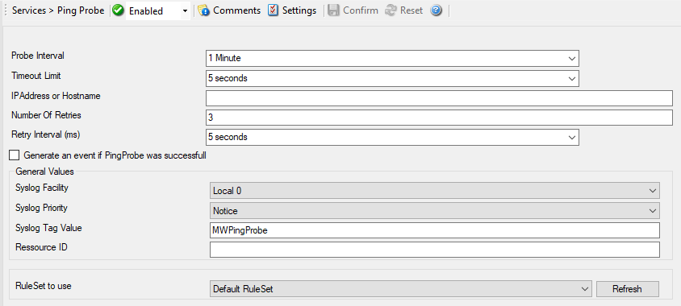

Ping Probe
==========

The ping probe can be used to check the health of a remote system. The ping
probe process sends ping messages (more precisely: ICMP Echo Requests) to a
configured system. If configured properly, the remote system sends a response.
If this response is received, the machine and its IP stack are operating. This
does not indicate, however, that all services on this machine are alive.

If no response is received, the remote system or its IP stack is most probably
not operating properly. However, the ping message might have been lost in
transit or the round-trip time might have been too long so that a timeout
occurred. Therefore, a single failing ping makes a system suspect, but it alone
cannot be used to confirm problems at the remote system. If multiple successive
pings fail, it is relatively safe to assume that the remote system has failed

Please note that most firewall setups do not allow ping messages. As such, a
system behind a firewall typically cannot be pinged and the ping probe cannot
be used in this configuration. If in doubt, please check with your firewall
administrator.

The ping probe is typically used to check the availability of a remote system.
The ping probe periodically sends the ping messages. As long as responses are
received, nothing happens. If no response is received, it generates an event
and passes it to the rule engine. As ping messages can get lost, the ping probe
retries failed probes before it reports an error. Both the number of retries
and the retry interval can be specified.

* Service - Ping Probe*

Probe Interval
^^^^^^^^^^^^^^

**File Configuration field:**
  nSleepTime

**Description:**
  This is the interval of the probe. After each probe, the Service will sleep
  for the configured probe interval. This period is specified in milliseconds.

Timeout Limit
^^^^^^^^^^^^^

**File Configuration field:**
  nTimeOutLimit

**Description:**
  The amount of time (in :doc:`milliseconds <../glossaryofterms/millisecond>`)
  the remote system is expected to answer in. If no response is received within
  this period, the ping fails and an event is generated. The default value of
  1000 milliseconds is a proper value for most well connected networks. If the
  ping probe runs against a heavily loaded system and/or slow network link, the
  amount must be adjusted accordingly.

IP Address or Hostname
^^^^^^^^^^^^^^^^^^^^^^

**File Configuration field:**
  szIPAddress

**Description:**
  Either the IP address or resolvable host name of the system, the ping probe
  is to be run against. You can either use an IPv4, an IPv6 Address or a
  Hostname that resolves to an IPv4 or IPv6 Address. This system has been
  called "remote host" in the description above. Please note that specifying a
  host name can cause the ping probe to fail if DNS name resolution fails (for
  example due to a failing DNS server). To avoid this, specify an IP address.

  **Please provide the IP address or the hostname according to your environment. We have left it empty by intention.**

Number Of Retries
^^^^^^^^^^^^^^^^^

**File Configuration field:**
  nNbrOfRetries

**Description:**
  If a ping fails, it is first retried to see if it is a persistent problem.
  The "Number of Retries" controls how many retries to be made. If this is set
  to zero, no retries are made and a ping probe fail event is immediately
  generated.

  For typical systems, we recommend a setting of three retries. This is also
  the default value.

Retry Interval
^^^^^^^^^^^^^^

**File Configuration field:**
  nRetryInterval

**Description:**
  If there is a temporary network issue like network congestion, it most
  probably takes some seconds to resolve it. As such, an immediate retry might
  not be appropriate. To delay it, configure a retry interval. This value is in
  :doc:`milliseconds <../glossaryofterms/millisecond>` If a ping fails, the next
  retry is after a pause specified in this property.

  The default and recommended value is 5 seconds (5000 milliseconds).

Generate an event if Ping Probe was successful
^^^^^^^^^^^^^^^^^^^^^^^^^^^^^^^^^^^^^^^^^^^^^^

**File Configuration field:**
  nGenerateOnSuccess

**Description:**
  When checked, an event is generated every time. If unchecked, it is generated
  only when the ping fails. The most common option is to leave it unchecked to
  catch events upon a failed ping.

General Values (Common settings for most services)
^^^^^^^^^^^^^^^^^^^^^^^^^^^^^^^^^^^^^^^^^^^^^^^^^^

Syslog Facility
^^^^^^^^^^^^^^^

**File Configuration field:**
  nSyslogFacility

**Description:**
  The Syslog facility to be assigned to events created by this service. Most
  useful if the message is to forward to a Syslog server.

Syslog Priority
^^^^^^^^^^^^^^^

**File Configuration field:**
  nSyslogPriority

**Description:**
  The Syslog priority to be assigned to events created by this service. Most
  useful if the message is to forward to a Syslog server.

Syslog Tag Value
^^^^^^^^^^^^^^^^

**File Configuration field:**
  szSyslogTagValue

**Description:**
  The Syslog tag value to be assigned to events created by this service. Most
  useful if the message is to forward to a Syslog server.

Resource ID
^^^^^^^^^^^

**File Configuration field:**
  szResource

**Description:**
  The :doc:`resource id <../glossaryofterms/resourceid>` to be assigned to
  events created by this service. Most useful if the message is to forward to a
  Syslog server.

RuleSet to Use
^^^^^^^^^^^^^^

**File Configuration field:**
  szRuleSetName

**Description:**
  Name of the ruleset to be used for this service. The RuleSet name must be a
  valid RuleSet.
