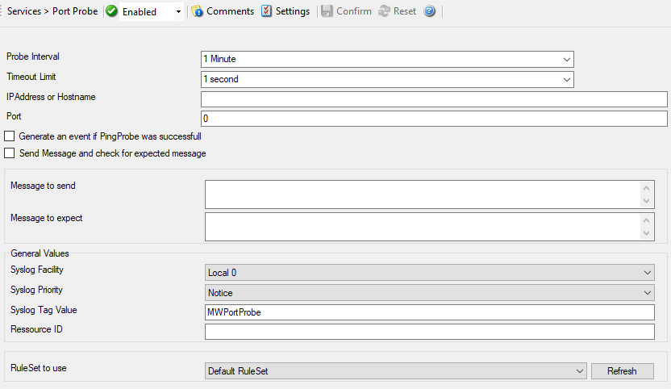

Port Probe
==========

The port probe is very similar to the ping probe described above. The main
difference is that it does not check the IP stack availability but rather a
specific :doc:`tcp <../glossaryofterms/tcp>` port.

The difference here is that using this method a specific service on the remote
machine is monitored, for example a mail
(:doc:`smtp <../glossaryofterms/smtp>`) server. The port probe tries to connect
to the service port (25 in our example). If that fails, the service is
definitely not running. In this case, an event is generated. A single event is
a definite indication of problems, as such there is no need for repetitive
failures before initiating action on this (although this can be configured in
the rule engine).

Being able to connect to the remote machine and service, :doc:`tcp <../glossaryofterms/tcp>`
port most probably means that the remote service is running. However, more
certainty can be gained by actually initiating some communication with the
service. The exact application protocol needs to be known to try this test.
Thus, this step is optional. If turned on, a single command can be sent to the
remote service and a single response is expected back and can be compared to a
pre-defined response. This does not take care of all possible application
protocols, but provides an additional layer of confidence for important
services like SMTP. It is up to the user to know the command sequences that a
given service can understand and reply with.

As a rule of thumb, the port probe provides superior protection against service
failure even without checking the message exchange. So if in doubt, use it
without this advanced feature.

Please note that the port probe can probe TCP based services only. Most
application services are TCP based, but there are some – mostly system –
services out there, that are not. One of the most notable exceptions is DNS,
which is operated primarily over UDP. In :doc:`udp <../glossaryofterms/udp>`,
there is no notion of a session and as such, it is not possible to probe the
session setup, which essentially is what the port probe does. As such, a port
probe can unfortunately not be used to check the status of those services.
However, the majority of services like application server, databases, mail, web
and a large number of others can be used with the port probe.

* Service - Port Probe*

Probe Interval
^^^^^^^^^^^^^^

**File Configuration field:**
  nSleepTime

**Description:**
  This is the interval of the probe. After each probe, the Service will sleep
  for the configured probe interval. This period is specified in milliseconds.

Timeout Limit
^^^^^^^^^^^^^

**File Configuration field:**
  nTimeOutLimit

**Description:**
  The amount of time (in :doc:`milliseconds <../glossaryofterms/millisecond>`)
  the remote system is expected to answer in. If no response is received within
  this period, the ping fails and an event is generated. The default value of
  1000 milliseconds is a proper value for most well connected networks. If the
  ping probe runs against a heavily loaded system and/or slow network link, the
  amount must be adjusted accordingly.

IP Address or Hostname
^^^^^^^^^^^^^^^^^^^^^^

**File Configuration field:**
  szIPAddress

**Description:**
  Either the IP address or resolvable host name of the system, the ping probe
  is to be run against. You can either use an IPv4, an IPv6 Address, or a
  Hostname that resolves to an IPv4 or IPv6 Address. This system has been
  called "remote host" in the description above. Please note that specifying a
  host name can cause the port probe to fail if DNS name resolution fails (for
  example due to a failing DNS server). To avoid this, specify an IP address.

  Please provide the IP address or the hostname according to your environment.
  We have left it empty by intention.

Port
^^^^

**File Configuration field:**
  nPortNumber

**Description:**
  This port is to be probed. Please see your server's reference for the actual
  value to use. For example, mail servers typically listen to port 25 and web
  servers to 80.

Generate an event if Port Probe was successful
^^^^^^^^^^^^^^^^^^^^^^^^^^^^^^^^^^^^^^^^^^^^^^

**File Configuration field:**
  nGenerateOnSuccess

**Description:**
  When checked, an event is generated every time. If unchecked, it is generated
  only when the port probe fails. The most common option is to leave it
  unchecked to catch events upon a failed port probe.

Send Message and check for expected message
^^^^^^^^^^^^^^^^^^^^^^^^^^^^^^^^^^^^^^^^^^^

**File Configuration field:**
  nSendExpect

**Description:**
  If left unchecked, the port probe checks the TCP session setup to the remote
  service only. As stated above , a successfully completed session setup most
  probably means the service is healthy. As an extra measure, some actual
  message exchange can be enabled. This is done by checking this box.

Message to send
^^^^^^^^^^^^^^^

**File Configuration field:**
  szMessageToSend

**Description:**
  This message text is sent to the service after the :doc:`tcp <../glossaryofterms/tcp>` session has been established.

Message to expect
^^^^^^^^^^^^^^^^^

**File Configuration field:**
  szMessageExpected

**Description:**
  This is the message expected to be received from the service. Reception
  starts after sending the "Message to Send". Please note that the "Message
  Expected" is compared against the first message sent from the service on the
  :doc:`tcp <../glossaryofterms/tcp>` session. With some protocols, this means
  the message compared is an initial greeting message and not a response to the
  "Message to Send".

General Values (Common settings for most services)
^^^^^^^^^^^^^^^^^^^^^^^^^^^^^^^^^^^^^^^^^^^^^^^^^^

Syslog Facility
^^^^^^^^^^^^^^^

**File Configuration field:**
  nSyslogFacility

**Description:**
  The :doc:`syslog facility <../glossaryofterms/tcp>` to be assigned to events
  created by this service. Most useful if the message is to forward to a Syslog
  server.

Syslog Priority
^^^^^^^^^^^^^^^

**File Configuration field:**
  nSyslogPriority

**Description:**
  The Syslog priority to be assigned to events created by this service. Most
  useful if the message is to forward to a Syslog server.

Syslog Tag Value
^^^^^^^^^^^^^^^^

**File Configuration field:**
  szSyslogTagValue

**Description:**
  The Syslog tag value to be assigned to events created by this service. Most
  useful if the message is to forward to a Syslog server.

Resource ID
^^^^^^^^^^^

**File Configuration field:**
  szResource

**Description:**
  The :doc:`resource id <../glossaryofterms/resourceid>` to be assigned to
  events created by this service. Most useful if the message is to forward to a
  Syslog server.

RuleSet to Use
^^^^^^^^^^^^^^

**File Configuration field:**
  szRuleSetName

**Description:**
  Name of the ruleset to be used for this service. The RuleSet name must be a
  valid RuleSet.
