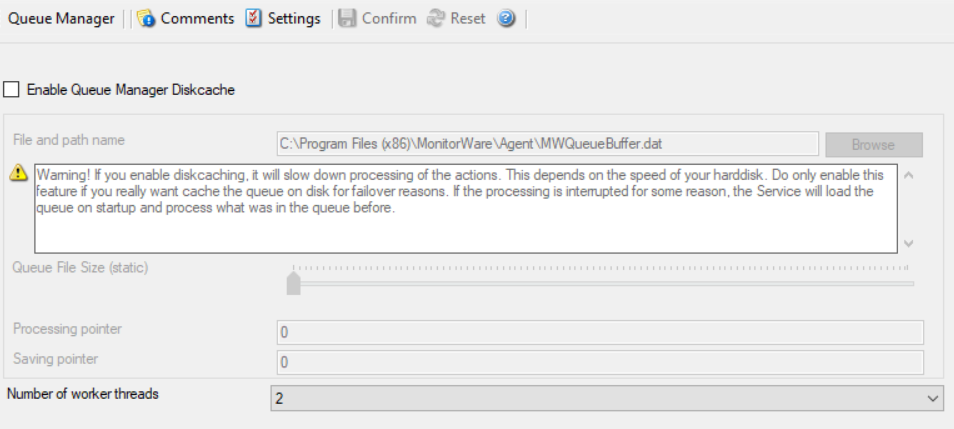

Queue Manager
=============

* Queue Manager*

Enable Queue Manager DiskCache
------------------------------

This feature enables the Agent to cache items in its internal queue on disk
using a fixed data file.

.. warning::
   Only use this feature if you really need to!

Depending on the speed of your hard disks, it will slow down processing of the
actions, in worst case if the machine cannot handle the IO load, the Queue will
become full sooner or later. The DiskCache is an additional feature for
customers, who for example want to secure received Syslog messages which have
not been processed yet.

The diskcache will not cache infounits from services like EventLog Monitor, as
this kind of Service only continues if the actions were successfully. All
other information sources like the Syslog server will cache its messages in
this file. If the Service or Server crashes for some reason, the queue will be
loaded automatically during next startup of the Agent. So messages which were
in the queue will not be lost. Only the messages which was currently processed
during the crash will be lost.

Enable Queue Manager Diskcache
^^^^^^^^^^^^^^^^^^^^^^^^^^^^^^

**File Configuration field:**
    nEnableRingBuffer

**Description**
    Enable the disk based queue manager. Please read the description about the
    Queue Manager DiskCache first!

File and Pathname
^^^^^^^^^^^^^^^^^

**File Configuration field:**
    szRingBufferFile

**Description**
    As everywhere else, you can define here, where the queue file should be
    stored.

Queue File Size
^^^^^^^^^^^^^^^

**File Configuration field:**
    nRingBufferSize

**Description**
    With this slider, the queue size can be set from 1 MB to 2048 MB.

Processing pointer
^^^^^^^^^^^^^^^^^^

**File Configuration field:**
    nProcessingLow

**Description**
    Points to the current processing position within the queue file.

Saving pointer
^^^^^^^^^^^^^^

**File Configuration field:**
    nSavingLow

**Description**
    Points to the last processed position within the queue file.

Queue Manager specific
----------------------

Number of worker threads
^^^^^^^^^^^^^^^^^^^^^^^^

**File Configuration field:**
    nWorkerThreads

**Description**
    Defines the number of worker background threads that the core engine uses
    to process its queue.
