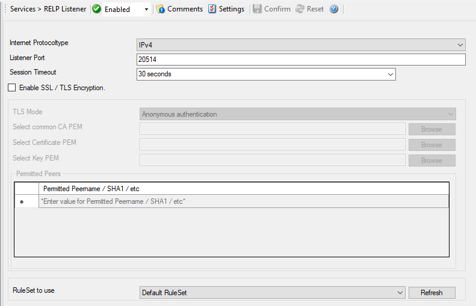

RELP Listener
=============

The :doc:`relp <../glossaryofterms/relp>` listener support the new reliable
event logging protocol (RELP), which enables a more reliable transmission of
messages than plain tcp syslog protocol. The service permits to accept messages
from senders who themselves support RELP.

Other than that it is using a different communications protocol, the RELP
listener is functionally equivalent to the syslog listener. The RELP Listener
will automatically listen on all available IP Addresses which includes IPv4 and
IPv6. This is due the librelp implementation method.

* Service - RELP Listener*

Internet Protocoltype
^^^^^^^^^^^^^^^^^^^^^

**File Configuration field:**
  nInetType

**Description:**
  Select the desired protocol type. IPv4 and IPv6 are available. The IPv6
  protocol needs to be properly installed in order to be used. Note that one
  Service can only handle IPv4 or IPv6, so if you want to use both protocols,
  you will need to create two separate services.

Listener Port
^^^^^^^^^^^^^

**File Configuration field:**
  nListenPort

**Description:**
  The port the RELP Listener listens on. The typical (standard) value is 20514.
  This should be changed only if there is a definite need for it. Such a need
  typically arises from security concerns. If the port is changed, all
  reporting devices must also be configured to use the non-standard port.

Session Timeout
^^^^^^^^^^^^^^^

**File Configuration field:**
  nTimeOutSession

**Description:**
  It controls how long a session is to be opened from the server side.

Enable SSL / TLS Encryption
^^^^^^^^^^^^^^^^^^^^^^^^^^^

**File Configuration field:**
  nUseSSL

**Description:**
  This option enables SSL / TLS encryption for your RELP Server. Please note,
  that with this option enabled, the server only accepts SSL / TLS enabled
  senders.

TLS Mode
^^^^^^^^

**File Configuration field:**
  nTLSMode

**Description:**
  The TLS mode can be set to the following:

  **Anonymous authentication**
  Default option, which means any client certificate will be accepted, or even
  none.

  **x509/name (certificate validation and name authentication)**
  When this mode is selected, the subject within the client certificate will be
  checked against the permitted peers list. This means the RELP Server will
  only accept the secured connection if it finds the permitted peer in the
  subject.

  **509/fingerprint (certificate fingerprint authentication)**
  This mode creates a SHA1 Fingerprint from the client certificate it receives,
  and compares it to fingerprints from the permitted peers list. You can use
  the debuglog to see fingerprints of client certificates which were not
  permitted.

Select common CA PEM
^^^^^^^^^^^^^^^^^^^^

**File Configuration field:**
  szTLSCAFile

**Description:**
  Select the certificate from the common Certificate Authority (CA), the RELP
  receiver should use the same CA.

Select Certificate PEM
^^^^^^^^^^^^^^^^^^^^^^

**File Configuration field:**
  szTLSCertFile

**Description:**
  Select the client certificate (PEM Format).

Select Key PEM
^^^^^^^^^^^^^^

**File Configuration field:**
  szTLSKeyFile

**Description:**
  Select the keyfile for the client certificate (PEM Format).

Permitted Peers
^^^^^^^^^^^^^^^

Permitted Peername / SHA1 / etc
^^^^^^^^^^^^^^^^^^^^^^^^^^^^^^^

**File Configuration field:**
  szIP_[n]

**Description:**
  This list contains all permitted peers. If x509/name is used, this can
  contain parts of the client certificate subject. For example if you have
  CN = secure.syslog.msg in the certificate subject, you can add
  "secure.syslog.msg" as permitted peer. When using x509/fingerprint, this list
  holds a list of permitted SHA1 fingerprints. The fingerprints can either be
  generated with OpenSSL Tools, or grabbed from the debug logfile. The format
  is like described in RFC 5425, for example:
  ``SHA1:2C:CA:F9:19:B8:F5:6C:37:BF:30:59:64:D5:9A:8A:B2:79:9D:77:A0``.

RuleSet to Use
^^^^^^^^^^^^^^

**File Configuration field:**
  szRuleSetName

**Description:**
  Name of the ruleset to be used for this service. The RuleSet name must be a
  valid RuleSet.
