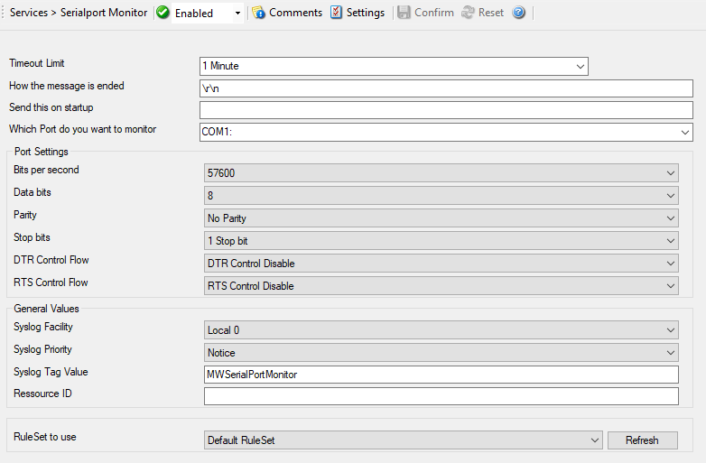

Serialport Monitor
==================

The serial port monitor allows you to monitor devices attached to local
communication ports. Actually, this is not limited to serial (RS232) devices -
devices connected via e.g. LPT ports can also be monitored as long as the
device provides a proper interface to the port device.

For example - uses for the serial port monitor may be interfacing to data
loggers, "strange" log sources (e.g. PBX call logs) or out-of-band log
retrieval (e.g. setting a router to log to the serial port instead to the
network and then picking the data from that serial line). Out-of-band log
retrieval can also be used to hide the fact that logging is actually taking
place.

The serial port monitor works as follows: it listens to the configured port.
With each received character, it checks if a configured "message end sequence"
is received. If it is not it continues listening until either another character
is received or a timeout occurs.

If either the "message end sequence" is received or the timeout occurred, the
message is considered to be complete. In this case, an event is generated and
that event is scheduled for processing.

* Service - Serialport Monitor*

Timeout Limit
^^^^^^^^^^^^^

**File Configuration field:**
  nTimeOutLimit

**Description:**
  This is the maximum amount of time the service waits to receive the "message
  end characters" from the attached device.

How the message is ended
^^^^^^^^^^^^^^^^^^^^^^^^

**File Configuration field:**
  szMessageEnd

**Description:**
  This is the sequence that, when received, denotes the end of the message.
  Most often, this is either

  .. code-block:: text

    "\r\n" or "\n" ("\r" represents a CR characters,
    "\n" represents a LF character).

Which Port do you want to monitor
^^^^^^^^^^^^^^^^^^^^^^^^^^^^^^^^^

**File Configuration field:**
  szPortName

**Description:**
  This is the port that the device is attached to. Most often, this is either
  COM1: or COM2:. All locally-existing ports can be used. When working locally,
  the configuration program enumerates the locally available ports. This can be
  one of the following values:

  .. code-block:: text

     1. MSFAX
     2. COM1
     3. COM2
     4. COM3
     5. COM4
     6. FILE
     7. LPT1
     8. LPT2
     9. LPT3
    10. AVMISDN1
    11. AVMISDN2
    12. AVMISDN3
    13. AVMISDN4
    14. AVMISDN5
    15. AVMISDN6
    16. AVMISDN7
    17. AVMISDN8
    18. AVMISDN9

Port Settings
^^^^^^^^^^^^^

Bits per Seconds
^^^^^^^^^^^^^^^^

**File Configuration field:**
  nBps

**Description:**
  Bits per second can be 110 and go up to 256000, by default 57600 is selected.

Data bits
^^^^^^^^^

**File Configuration field:**
  nDatabits

**Description:**
  Databits define the number of bits in the bytes transmitted and received.

Parity
^^^^^^

**File Configuration field:**
  nParity

**Description:**
  With Parity you can configure the Parity scheme to be used. This can be one
  of the following values:

  .. code-block:: text

    1. Even
    2. Mark
    3. No parity
    4. Odd
    5. Space

Stop bits
^^^^^^^^^

**File Configuration field:**
  nStopbits

**Description:**
  You can configure the Number of stop bits to be used. This member can be one
  of the following values:

  .. code-block:: text

    1. 1 stop bit
    2. 1.5 stop bits
    3. 2 stop bits

DTR Control Flow
^^^^^^^^^^^^^^^^

**File Configuration field:**
  nDtsControl

**Description:**
  DTR (data-terminal-ready) flow control. This member can be one of the
  following values:

  .. code-block:: text

    1. DTR_CONTROL_DISABLE - Disables the DTR line when the device
       is opened and leaves it disabled.
    2. DTR_CONTROL_ENABLE - Enables the DTR line when the device
       is opened and leaves it on
    3. DTR_CONTROL_HANDSHAKE - Enables DTR handshaking.

RTS Control Flow
^^^^^^^^^^^^^^^^

**File Configuration field:**
  nRtsControl

**Description:**
  RTS (request-to-send) flow control. This member can be one of the following
  values:

  .. code-block:: text

    1. RTS_CONTROL_DISABLE - Disables the RTS line when the device
       is opened and leaves it disabled.
    2. RTS_CONTROL_ENABLE - Enables the RTS line when the device
       is opened and leaves it on.
    3. RTS_CONTROL_HANDSHAKE - Enables RTS handshaking. The driver
       raises the RTS line when the "type-ahead" (input) buffer is
       less than one-half full and lowers the RTS line when the
       buffer is more than three-quarters full.
    4. RTS_CONTROL_TOGGLE - Specifies that the RTS line will be high
       if bytes are available for transmission. After all buffered
       bytes have been sent, the RTS line will be low.

General Values (Common settings for most services)
^^^^^^^^^^^^^^^^^^^^^^^^^^^^^^^^^^^^^^^^^^^^^^^^^^

Syslog Facility
^^^^^^^^^^^^^^^

**File Configuration field:**
  nSyslogFacility

**Description:**
  The :doc:`syslog facility <../glossaryofterms/syslogfacility>` to be
  assigned to events created by this service. Most useful if the message is to
  forward to a Syslog server.

Syslog Priority
^^^^^^^^^^^^^^^

**File Configuration field:**
  nSyslogPriority

**Description:**
  The Syslog priority to be assigned to events created by this service. Most
  useful if the message is to forward to a Syslog server.

Syslog Tag Value
^^^^^^^^^^^^^^^^

**File Configuration field:**
  szSyslogTagValue

**Description:**
  The Syslog tag value to be assigned to events created by this service. Most
  useful if the message is to forward to a Syslog server.

Resource ID
^^^^^^^^^^^

**File Configuration field:**
  szResource

**Description:**
  The :doc:`resource id <../glossaryofterms/resourceid>` to be assigned to
  events created by this service. Most useful if the message is to forward to a
  Syslog server.

RuleSet to Use
^^^^^^^^^^^^^^

**File Configuration field:**
  szRuleSetName

**Description:**
  Name of the ruleset to be used for this service. The RuleSet name must be a
  valid RuleSet.
