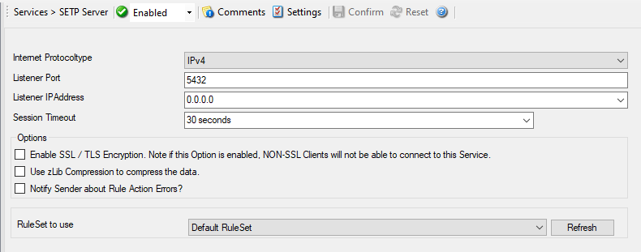

SETP Server
===========

Configures a SETP server service. A :doc:`setp <../glossaryofterms/setp>`
server is used inside the :doc:`monitorware line of products <../glossaryofterms/mwlineofproducts>` to ensure reliable receiving of
events from other systems. There are only few configuration options, as SETP
takes the original message from the sender and uses the exact settings that the
sender was configured for. No alteration occurs at the SETP server side; as
such, no values need to be configured for the message format.

* Service - SETP Server*

Internet Protocoltype
^^^^^^^^^^^^^^^^^^^^^

**File Configuration field:**
  nInetType

**Description:**
  Select the desired protocol type. IPv4 and IPv6 are available. The IPv6
  protocol needs to be properly installed in order to be used. Note that one
  Service can only handle IPv4 or IPv6, so if you want to use both protocols,
  you will need to create two separate services.

Listener Port
^^^^^^^^^^^^^

**File Configuration field:**
  nListenPort

**Description:**
  The port the :doc:`setp <../glossaryofterms/setp>` server listens on. The
  default value is 5432. This should be changed only if there is a definite need
  for it. Such a need typically arises from security concerns. If the port is
  changed, all reporting devices must also be configured to use the non-standard
  port. SETP operates over :doc:`tcp <../glossaryofterms/tcp>`.

Listener IP Address
^^^^^^^^^^^^^^^^^^^

**File Configuration field:**
  szMyIPAddress

**Description:**
  The SETP server service can be bound to a specific IP Address. You can either
  use an IPv4, an IPv6 Address, or a Hostname that resolves to an IPv4 or IPv6
  Address. This feature is useful for multihome environments where you want to
  run different Syslog Servers on different IP Addresses. Please note that the
  default IP Address 0.0.0.0 means ANY IP Address.

Session Timeout
^^^^^^^^^^^^^^^

**File Configuration field:**
  nTimeOutSession

**Description:**
  This controls how long a session is to be opened from the server side.

Options
^^^^^^^

Enable SSL/TLS
^^^^^^^^^^^^^^

**Note: if this Option is enabled, NON-SSL Clients will not be able to connect to this Service.**

**File Configuration field:**
  nUseSSL

**Description:**
  If this option is enabled then this action connects to SSL / TLS :doc:`setp <../glossaryofterms/setp>` servers. Please make sure that you want this
  option to be enabled.

  Please note: If this option is enabled, this action will not be able to
  connect to NON-SSL SETP Servers.

Use zLib Compression to compress the data
^^^^^^^^^^^^^^^^^^^^^^^^^^^^^^^^^^^^^^^^^

**File Configuration field:**
  nZlibComp

**Description:**
  When enabled, MonitorWare Agent decompresses the zLib compressed data sent by
  the SETP senders. It is still be able to receive normal data. zLib compression
  is useful to reduce traffic in WAN environments.

Notify Sender about Rule Action Errors?
^^^^^^^^^^^^^^^^^^^^^^^^^^^^^^^^^^^^^^^

**File Configuration field:**
  bIndicateErrorToOrigin

**Description:**
  Enable this option to communicate the outcome of an action back to the
  sender of the SETP message.

  This communicates back the status of actions carried out on the receiver to
  the sender of the event. In essence, the sender system will know if the
  action failed or succeeded on the remote machine. It can then act exactly
  like the action was carried out on the local machine. The exact handling of
  failure states is depending on the event source.

  An example: you have a machine running an EventLog Monitor and sending these
  events via SETP, and on the other side have all incoming events written into
  a database. If the database would be offline and the events not being written
  into it, the SETP server would return as the last message that the action
  failed (as long as this option is enabled) and generate an error event with
  ID 1005 (and generate a Success Event with ID 1012 if successful again). The
  sender would then halt and retry sending the event. This is because SETP is
  built somehow like TCP which ensures data transfer, but additionally can
  return a status to the sender if the following action was successful.

  This happens because the Event Log Monitor (as well as the file monitor and
  others) is a restartable event source. It uses the outcome of actions to
  decide if the action is to be retried in another run of the same source.
  Other event sources have different behavior. The Syslog server, for example,
  does not retry failed actions. This is due to the lossy nature of syslog, in
  which losing syslog messages is explicitly permitted (and favorable over
  taking up too many system resources by trying to buffer them).

  Please Note: If you enable this feature, older MonitorWare Agent Versions
  (4.2.x and below, as well as WinSyslog 7.2.x and EventReporter 8.2.x and
  below) may have trouble sending data over SETP once a Rule Exception occurs!
  If you intend to use this feature, make sure all MonitorWare Agent
  Installations are at least Version 4.3.x (This applies for WinSyslog 7.3.x
  and EventReporter 8.3.x as well).

RuleSet to use
^^^^^^^^^^^^^^

**File Configuration field:**
  szRuleSetName

**Description:**
  Name of the ruleset to be used for this service. The RuleSet name can be
  chosen from a drop-down list where you find your RuleSets.
