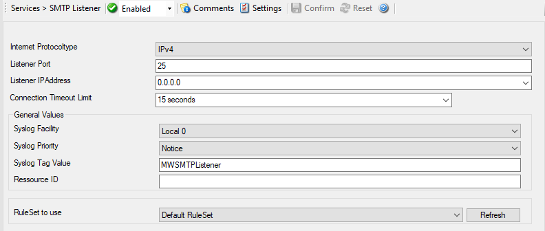

SMTP Listener
=============

The SMTP Listener is a service, that allows you to receive emails and convert
them into syslog messages for example. It acts as a real SMTP Server would
like, just with a reduced command set that is necessary to receive Emails.

* Service - SMTP Listener*

Internet Protocoltype
^^^^^^^^^^^^^^^^^^^^^

**File Configuration field:**
  nInetType

**Description:**
  Select the desired protocol type. IPv4 and IPv6 are available. The IPv6
  protocol needs to be properly installed in order to be used. Note that one
  Service can only handle IPv4 or IPv6, so if you want to use both protocols,
  you will need to create two separate services.

Listener Port
^^^^^^^^^^^^^

**File Configuration field:**
  nSMTPPort

**Description:**
  This port is to be probed. Please see your server's reference for the actual
  value to use. For example, mail servers typically listen to port 25.

Listener IP Address
^^^^^^^^^^^^^^^^^^^

**File Configuration field:**
  szMyIPAddress

**Description:**
  Either the IP address or resolvable host name of the SMTP server, the SMTP
  probe is to be run against. You can either use an IPv4, an IPv6 Address, or a
  Hostname that resolves to an IPv4 or IPv6 Address. This system has been
  called "remote host" in the description above. Please note that specifying a
  host name can cause the SMTP probe to fail if DNS name resolution fails (for
  example due to a failing DNS server). To avoid this, specify an IP address.

Connection Timeout Limit
^^^^^^^^^^^^^^^^^^^^^^^^

**File Configuration field:**
  nTimeOutLimit

**Description:**
  The Timeout limit specifies the time the listener waits for the sender.

General Values (Common settings for most services)
^^^^^^^^^^^^^^^^^^^^^^^^^^^^^^^^^^^^^^^^^^^^^^^^^^

Syslog Facility
^^^^^^^^^^^^^^^

**File Configuration field:**
  nSyslogFacility

**Description:**
  The :doc:`syslog facility <../glossaryofterms/syslogfacility>` to be assigned to events created by this service. Most
  useful if the message is to forward to a Syslog server.

Syslog Priority
^^^^^^^^^^^^^^^

**File Configuration fields:**
  nSyslogPriority

**Description:**
  The Syslog Priority to be assigned to events created by this service. Most
  useful if the message is to forward to a Syslog server.

Syslog Tag Value
^^^^^^^^^^^^^^^^

**File Configuration field:**
  szSyslogTagValue

**Description:**
  The Syslog Tag Value to be assigned to events created by this service. Most
  useful if the message is to forward to a Syslog server.

Resource ID
^^^^^^^^^^^

**File Configuration field:**
  szResource

**Description:**
  The :doc:`resource id <../glossaryofterms/resourceid>` to be assigned to events created by this service. Most useful

RuleSet to Use
^^^^^^^^^^^^^^

**File Configuration field:**
  szRuleSetName

**Description:**
  Name of the ruleset to be used for this service. The RuleSet name must be a
  valid RuleSet.
