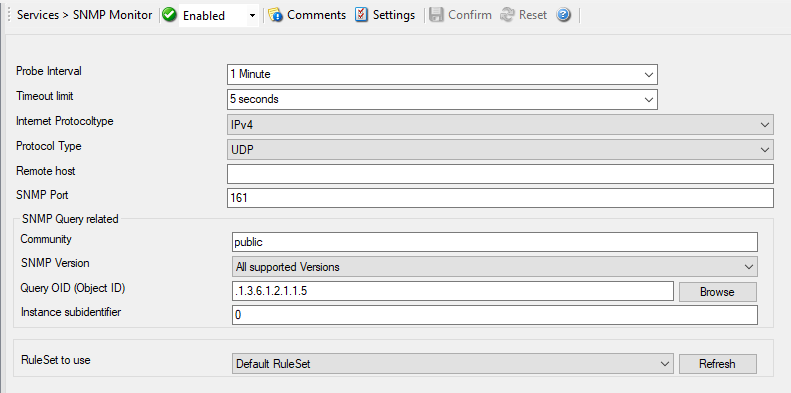

SNMP Monitor
============

SNMP Monitor can be used to query and monitor SNMP enabled devices. There are
many devices that support SNMP and which can be queried for information by SNMP
GET. This can be printers, router, managed switches, Linux / Windows servers
and so on.

The SNMP Monitor Service runs continuously based on the configuration mentioned
below.

* Service - SNMP Monitor*

Probe Interval
^^^^^^^^^^^^^^

**File Configuration field:**
  nSleepTime

**Description:**
  This is the interval of the queries. After each probe, the MonitorWare Agent
  SNMP Monitor process goes "to sleep". This period is specified in
  milliseconds.

Timeout limit
^^^^^^^^^^^^^

**File Configuration field:**
  nTimeOutLimit

**Description:**
  The amount of time (in :doc:`milliseconds <../glossaryofterms/millisecond>`)
  the remote system is expected to answer in. If no response is received within
  this period, the ping fails and an event is generated. The  default value of
  1000 milliseconds is a proper value for most well connected networks. If the
  ping probe runs against a heavily loaded system and/or slow network link,
  the amount must be adjusted accordingly.

Internet Protocoltype
^^^^^^^^^^^^^^^^^^^^^

**File Configuration field:**
  nInetType

**Description:**
  Select the desired protocol type. IPv4 and IPv6 are available. The IPv6
  protocol needs to be properly installed in order to be used. Note that one
  Service can only handle IPv4 or IPv6, so if you want to use both protocols,
  you will need to create two separate services.

Protocol Type
^^^^^^^^^^^^^

**File Configuration field:**
  nProtocolType

**Description:**
  SNMP Monitor can be query other devices by UDP and TCP.

Remote host
^^^^^^^^^^^

**File Configuration field:**
  szRemoteHost

**Description:**
  Either the IP address or resolvable host name of the system you want to
  monitor. You can either use an IPv4, an IPv6 Address, or a Hostname that
  resolves to an IPv4 or IPv6 Address. Please note that specifying a host name
  can cause the SNMP monitor to fail if DNS name resolution fails (for example
  due to a failing DNS server). To avoid this, specify an IP address.

SNMP Port
^^^^^^^^^

**File Configuration fields:**
  nCheckPort

**Description:**
  The port the SNMP listener is listening to. If in doubt, leave it at the
  default of 161.

SNMP Query related
^^^^^^^^^^^^^^^^^^

Community
^^^^^^^^^

**File Configuration field:**
  szCommunity

**Description:**
  Specify the SNMP community to which the messages belong too.

SNMP Version
^^^^^^^^^^^^

**File Configuration field:**
  nSnmpVersion

**Description:**
  Configures the SNMP protocol version, that should be used for communication:

  1. All supported Versions
  2. SNMP Version 1 Only
  3. SNMP Version 2c Only

Query OID (Object ID)
^^^^^^^^^^^^^^^^^^^^^

**File Configuration field:**
  szSnmpCheckOid

**Description:**
  This is the Object ID you will query the device for. You can use Browse
  option to select your OID. When you click the Browse button, you will see a
  screen similar to the one shown below:

  .. image:: ../images/mibbrowser-snmpmonitor.png
     :width: 80%

  MIB Browser. You can select your OID here.

Instance Subidentifier
^^^^^^^^^^^^^^^^^^^^^^

**File Configuration field:**
  nInstanceID

**Description:**

  Which Instance Subidentifier do you want to query, if the selected OID has
  multiple data entries.

RuleSet to Use
^^^^^^^^^^^^^^

**File Configuration field:**
  szRuleSetName

**Description:**
  Name of the ruleset to be used for this service. The RuleSet name must be a
  valid RuleSet.
