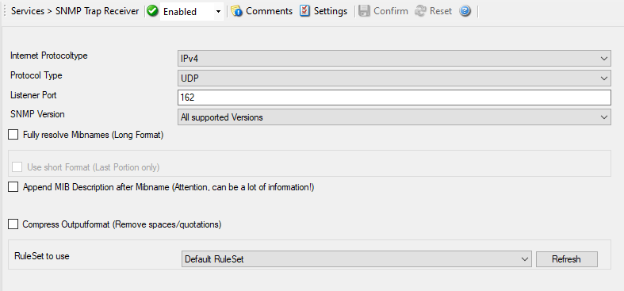

SNMP Trap Receiver
==================

SNMP Trap Receiver allows you to receive SNMP messages. A rough description of
a Trap is that it is somewhat like a Syslog message, just over another protocol
(SNMP). A trap is generated when the device feels it should do so and it
contains the information that the device feels should be transmitted. It also
contains some (few) standard items, as the version, community etc.

The SNMP Trap Receiver Service runs continuously based on the configuration
mentioned below:

* Service - SNMP Trap Receiver*

Internet Protocoltype
^^^^^^^^^^^^^^^^^^^^^

**File Configuration field:**
  nInetType

**Description:**
  Select the desired protocol type. IPv4 and IPv6 are available. The IPv6
  protocol needs to be properly installed in order to be used. Note that one
  Service can only handle IPv4 or IPv6, so if you want to use both protocols,
  you will need to create two separate services.

Protocol Type
^^^^^^^^^^^^^

**File Configuration field:**
  nProtocolType

**Description:**
  You can select to listen on UDP or TCP protocol for SNMP Traps.

Listener Port
^^^^^^^^^^^^^

**File Configuration field:**
  nPort

**Description:**
  The port the SNMP listener is listening to. If in doubt, leave it at the
  default of 162, which is the standard port for this.

SNMP Version
^^^^^^^^^^^^

**File Configuration field:**
  nSnmpVersion

  * -1 = All Supported Versions

  *  0 = SNMP Version 1 only

  *  1 = SNMP Version 2c only

**Description:**
  Can be used to restrict the SNMP versions. The available values are:

  * All Supported Versions (i.e. SNMP Version 1 and SNMP Version 2c only)

  * SNMP Version 1 only

  * SNMP Version 2c only

Fully resolve MIB names (long format)
^^^^^^^^^^^^^^^^^^^^^^^^^^^^^^^^^^^^^

**File Configuration field:**
  nResolveLongMibNames

**Description:**
  This option fully resolves the MIB names like in the client MIB browser
  application.

Use short format (last portion only)
^^^^^^^^^^^^^^^^^^^^^^^^^^^^^^^^^^^^

**File Configuration field:**
  nResolveMibNamesShort

**Description:**
  Fully resolved MIB names including their tree can become very long and
  unreadable. Use this option to shorten them to the last portion of the full
  MIB name.

Append MIB description after MIB name
^^^^^^^^^^^^^^^^^^^^^^^^^^^^^^^^^^^^^

**File Configuration field:**
  nAddMibDescriptionToMsg

**Description:**
  Append the MIB description after the MIB name. **Attention, this can be a lot
  of information.**

Compress output format (remove spaces/quotations)
^^^^^^^^^^^^^^^^^^^^^^^^^^^^^^^^^^^^^^^^^^^^^^^^^

**File Configuration field:**
  nCompressOutputFormat

**Description:**
  When enabled the output format will be reduced to a minimum and comma
  separated. Here is a sample output:

  ``source=127.0.0.1, community=public, version=Ver2,``
  ``iso.3.6.1.2.1.1.3.0=Timeticks: (3493305159) 404 days, 7:37:31.59,``
  ``iso.3.6.1.6.3.1.1.4.1.0=OID: iso.3.6.1.4.1.19406.1.2.2,``
  ``iso.3.6.1.4.1.19406.1.1.1.7=This is a SyslogTest``

General Values (Common settings for most services)
^^^^^^^^^^^^^^^^^^^^^^^^^^^^^^^^^^^^^^^^^^^^^^^^^^

RuleSet to Use
^^^^^^^^^^^^^^

**File Configuration field:**
  szRuleSetName

**Description:**
  Name of the ruleset to be used for this service. The RuleSet name must be a
  valid RuleSet.

**Please Note:**

**Managing incoming Traps works the same way as with a Syslog server for example.**

Incoming Traps will be forwarded to the corresponding Ruleset and pass by rule
after rule. There it can be filtered for general information like the
"Community", the "Version" or "Value" for example. Finally it will be processed
by an action, which you can select to your needs. The SNMP Agent service will
co-exist peacefully next to the Windows SNMP Agent and will not hinder it in
its functionality. The Windows SNMP Agent listens to port 161, while
MonitorWare Agent and WinSyslog listen to port 162.**

**For internal processing, the variables of incoming SNMP messages will be added to a new property. Those properties will be named %snmp_var_x% with the x being a number starting with 1. You can use these custom properties for filtering and
everywhere where you can use or print properties. For example, you can create a
"send mail"-action. Here you can specify complete freely how the message will
look like. You can use a introductory text and then let it show the error
message in some context. This could look like this:**

.. code-block:: text

   Hello Admin,
   the following error occurred
   %snmp_var_5%
   Please take care at once.
   Very urgent!

**The result will be, that the 5th property of the snmp trap will be inserted into the message text.**
