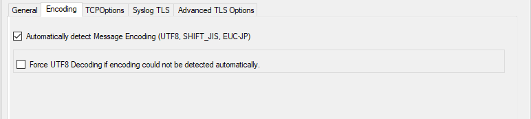
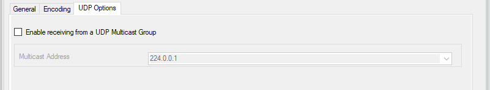

Syslog server
=============

Configures a Syslog server service. Multiple protocols (IPv4/IPv6
and UDP/TCP) can be configured and are supported.

When configuring Syslog Services, the functionality can be checked
using the Test Syslog server button. It will open the Syslog Test
Message function from the configuration client.

* Service - Syslog server Global Properties*

Internet Protocoltype
^^^^^^^^^^^^^^^^^^^^^

**File Configuration field:**
 nInetType

**Description:**
 Select the desired protocol type. IPv4 and :doc:`ipv6 <../glossaryofterms/ipv6>` are available. The
 IPv6 protocol needs to be properly installed in order to be used.
 **Note that one Service can only handle IPv4 or IPv6, so if you want**
 **to use both protocols, you will need to create two separate services.**

Protocol Type
^^^^^^^^^^^^^

**File Configuration field:**
  nProtocolType

**Description:**
  Syslog messages can be received via :doc:`udp <../glossaryofterms/udp>`, :doc:`tcp <../glossaryofterms/tcp>` or
  :doc:`rfc 3195 <../glossaryofterms/rfc3195>` RAW. One
  listener can only listen to one of the protocols. Typically, Syslog
  messages are received via UDP protocol, which is the default. The
  Syslog server also can receive Syslog messages via TCP and reliable
  Syslog messages via TCP using the RFC 3195 RAW standard.
  Depending on which protocol type you choose, you get different option
  tabs. General and encoding are the same for everyone.

IP Address
^^^^^^^^^^

**File Configuration field:**
  szMyIPAddress

**Description:**
  The Syslog server can now be bound to a specific IP address. You can
  either use an IPv4, an IPv6 Address, or a Hostname that resolves to an
  IPv4 or IPv6 Address. This feature is useful for multihome environments
  where you want to run different Syslog Servers on different IP Addresses.
  Please note that the default IP ``address 0.0.0.0`` means ANY IP Address.

Listener Port
^^^^^^^^^^^^^

**File Configuration field:**
  nListenPort

**Description:**
  The port the Syslog server listens on. The typical (standard) value
  is 514. This should be changed only if there is a definite need for
  it. Such a need typically arises from security concerns. If the port
  is changed, all reporting devices (routers, printers …) must also be
  configured to use the non-standard port.

RuleSet to use
^^^^^^^^^^^^^^

**File Configuration field:**
  szRuleSetName

**Description:**
  Name of the ruleset to be used for this service. The RuleSet name
  must be a valid RuleSet.

General Options
^^^^^^^^^^^^^^^

* Service - Syslog server General Tab*

Resolve Hostnames
^^^^^^^^^^^^^^^^^

**File Configuration field:**
  nResolveNames

**Description:**
  If this box is checked, the name of the source system is retrieved
  via DNS reserve name resolution. If unchecked, the IP address itself
  is used as the name.

  **Please note that this setting does have any effect if the "Take source system from Syslog message" setting is checked. In this case,
  the message is always
  taken from the Syslog message itself.**

Take source system from Syslog message
^^^^^^^^^^^^^^^^^^^^^^^^^^^^^^^^^^^^^^

**File Configuration field:**
  nTakeSourceSysFromSyslogMsg

**Description:**
  If this box is checked, the name or IP address of the source system is
  retrieved from the Syslog message itself (according to :doc:`rfc 3164 <../glossaryofterms/rfc3164>`).
  If left unchecked, it is generated based on the address, the message was
  received from.

  **Please note that there are many devices, which do NOT generate RFC 3164 compliant messages. If you check this option here, you might
  see a very strange value as the event source!**

Save original source into property
^^^^^^^^^^^^^^^^^^^^^^^^^^^^^^^^^^

**File Configuration field:**
  nSaveSourceIntoProperty

**Descriptions:**
  When this options is enabled, the original network source will be
  stored into the custom defined property (%sourceorig% by default). In
  case the original network source is needed for filtering for example.

Escape Control Characters
^^^^^^^^^^^^^^^^^^^^^^^^^

**File Configuration field:**
  nEscapeControlCharacters

**Description:**
  Control characters are special characters. They are used e.g. for
  tabulation, generating beeps and other non-printable uses. Typically,
  syslog messages should not contain control characters. If they do,
  control characters could  eventually affect your logging. However, it
  might also be that control characters are needed.

  With this setting, you can specify how control characters received
  should be handled. When checked, control characters are replaced by a
  5-byte sequence with the ASCII character ID. For example, a beep is the
  ASCII BEL character. BEL is assigned the numerical code 7. So if a BEL
  is received, it would be converted to "<007>" inside your syslog message.
  When the box is left unchecked, no conversion takes place.

  In any case, ASCII NULs are converted to "<000>" to prevent
  security issues in the log files.

  **Please note: if you used double-byte character sets, control character escaping can cause your message to become clobbered. So be
  sure to leave it unchecked in that case.**

Enable RFC3164 Parsing
^^^^^^^^^^^^^^^^^^^^^^

**File Configuration field:**
  nRFC3164Parsing

**Description:**
  If this box is checked, :doc:`rfc 3164 <../glossaryofterms/rfc3164>` compliant message parsing is enabled.
  If unchecked, "traditional" Adiscon message parsing is selected. If you
  experience trouble with the sender host name or the timestamp, we suggest
  that you turn off RFC 3164 compliant message parsing. Many existing devices do
  not fully comply with RFC 3164 and this can cause those issues.

Use Original Message Timestamp
^^^^^^^^^^^^^^^^^^^^^^^^^^^^^^

**File Configuration field:**
  nParseSyslogDate

**Description:**
  If this box is checked, the timestamp is retrieved from the Syslog
  message itself (according to :doc:`rfc 3164 <../glossaryofterms/rfc3164>`). If left unchecked, the
  timestamp is generated based on the local system time. The Syslog
  message timestamp does not contain time zone information. Thus, we
  strongly recommend unchecking this box if messages from devices in
  multiple time zones are to be received

Try to parse year from message timestamp (RFC3164)
^^^^^^^^^^^^^^^^^^^^^^^^^^^^^^^^^^^^^^^^^^^^^^^^^^

**File Configuration field:**
  nRFC3164DetectYear

**Description:**
  If enabled, the service will try to detect a Year after the usual RFC3164 Date Header.

Enable RFC5424 Parsing
^^^^^^^^^^^^^^^^^^^^^^

**File Configuration field:**
  nRFC5424Parsing

**Description:**
  If this box is checked, :doc:`rfc 5424 <../glossaryofterms/rfc5424>` compliant message parsing is enabled for
  Syslog RFC5424 Header detection and decoding. This also involves new usable
  Syslog properties.
  If unchecked, "traditional" Adiscon message parsing is selected. If you
  experience trouble with the sender host name or the timestamp, we suggest
  that you turn off RFC 5424 compliant message parsing. Many existing devices
  do not fully comply with RFC 5424 and this can cause those issues.

Append ProcessID to SyslogTag if available
^^^^^^^^^^^^^^^^^^^^^^^^^^^^^^^^^^^^^^^^^^

**File Configuration field:**
  nRFC5424AddProcID2SyslogTag

**Description:**
  This option is related to RFC5424 header parsing and was default in previous
  versions. However the default now is off in order to separate the Syslogtag
  from the ProcessID.

Encoding Options
^^^^^^^^^^^^^^^^

* Service - Syslog server Encoding Tab*

Automatically detect Message Encoding (UTF8, SHIFT_JIS, EUCJP)
^^^^^^^^^^^^^^^^^^^^^^^^^^^^^^^^^^^^^^^^^^^^^^^^^^^^^^^^^^^^^^

**File Configuration field:**
  nTryDetectMessageEncoding

**Description:**
  If enabled, the message will be checked for different encodings.
  This is important if you have syslog messages with multibyte characters.
  Once an encoding is detected, it will automatically be converted into UTF16
  internally.

Force UTF8 Decoding
^^^^^^^^^^^^^^^^^^^

**File Configuration field:**
  nForceUTF8Decoding

**Description:**
  This option forces UTF8 Decoding of all incoming messages. This is also
  useful for syslog messages encoded in UTF8 but missing the BOM within the
  Syslog message.

UDP Options
^^^^^^^^^^^

* Service - Syslog server UDP Options Tab*

Enable receiving from a UDP Multicast Group
^^^^^^^^^^^^^^^^^^^^^^^^^^^^^^^^^^^^^^^^^^^

**File Configuration field:**
  nEnableMultiCastGroup

**Description:**
  This option supports receiving Syslog messages via multicast IP Addresses
  like ``224.0.0.1`` for example.

TCP Specific Options
^^^^^^^^^^^^^^^^^^^^

* Service - Syslog server TCP Options Tab*

Session Timeout
^^^^^^^^^^^^^^^

**File Configuration field:**
  nTimeOutSession

**Description:**
  One of the TCP-specific options is the session timeout. This value declares,
  how long a TCP session may be kept open, after the last package of data has
  been sent. You can by default set values between 1 second and 1 day or you
  can use a custom value with a maximum of 2147483646 milliseconds.
  If you wish to disable the session timeout, you can use a custom value of 0
  milliseconds to disable it.

Messages are separated by the following sequence
^^^^^^^^^^^^^^^^^^^^^^^^^^^^^^^^^^^^^^^^^^^^^^^^

**File Configuration field:**
  szMsgSep_[n]

**Description:**
  If this option is checked, you can use multiple messages in the same
  transmission and the following options are enabled: Message separation
  sequence and Message Completion Timeout.

Message separation sequence
^^^^^^^^^^^^^^^^^^^^^^^^^^^

**File Configuration field:**
  nEnableTCPMsgSep

**Description:**
  Determines, how you want to separate the messages. By default "\r\n" is the
  value for this, as most times a message ends with a carriage return and/or a
  line feed. But, you can choose your own separation sequence here as well.

Enable multiple message separators
^^^^^^^^^^^^^^^^^^^^^^^^^^^^^^^^^^

**File Configuration field:**
  nEnableMultiTCPMsgSep

**Description:**
  If you choose the checkbox you can use more than one message separator.

Message Completion Timeout
^^^^^^^^^^^^^^^^^^^^^^^^^^

**File Configuration field:**
  nTimeOutMsg

**Description:**
  Here you can set the time that is allowed to complete a message. Is the time
  exceeded, but the message not yet completed, the rest will be treated as a
  new message. The counter is reset each time a new message begins.
  You can choose from multiple values between 1 second and 1 day, or choose a
  custom value in milliseconds (0 = disable, maximum = 2147483646)

Syslog TLS
^^^^^^^^^^

* Service - Syslog server Syslog TLS Tab*

Enable SSL / TLS Encryption
^^^^^^^^^^^^^^^^^^^^^^^^^^^

**File Configuration field:**
  nUseSSL

**Description:**
  This option enables SSL / TLS encryption for your Syslog server.
  Please note, that with this option enabled, the server only accepts SSL / TLS
  enabled senders.

TLS Mode
^^^^^^^^

**File Configuration field:**
  nTLSMode

**Description:**
  The TLS mode can be set to the following:

  **Anonymous authentication**
  Default option, which means any client certificate will be accepted, or even
  none.

  **x509/name (certificate validation and name authentication)**
  When this mode is selected, the subject within the client certificate will be
  checked against the permitted peers list. This means the Syslog server will
  only accept the secured connection if it finds the permitted peer in the
  subject.

  **509/fingerprint (certificate fingerprint authentication)**
  This mode creates a SHA1 Fingerprint from the client certificate it receives,
  and compares it to fingerprints from the permitted peers list. You can use
  the debuglog to see fingerprints of client certificates which were not
  permitted.

  **x509/certvalid (certificate validation only)**
  A Syslog Sender is accepted when the client certificate is valid.
  No further checks are done.

Select common CA PEM
^^^^^^^^^^^^^^^^^^^^

**File Configuration field:**
  szTLSCAFile

**Description:**
  Select the certificate from the common Certificate Authority (CA), the syslog
  receiver should use the same CA.

Select Certificate PEM
^^^^^^^^^^^^^^^^^^^^^^

**File Configuration field:**
  szTLSCertFile

**Description:**
  Select the client certificate (PEM Format).

Select Key PEM
^^^^^^^^^^^^^^

**File Configuration field:**
  szTLSKeyFile

**Description:**
  Select the keyfile for the client certificate (PEM Format).

Permitted Peers
^^^^^^^^^^^^^^^

Permitted Peername / SHA1 / etc.
^^^^^^^^^^^^^^^^^^^^^^^^^^^^^^^^

**File Configuration field:**
  szIP_[n]

**Description:**
  This list contains all permitted peers. If x509/name is used, this can
  contain parts of the client certificate subject. For example if you have
  CN = secure.syslog.msg in the certificate subject, you can add
  "secure.syslog.msg" as permitted peer. When using x509/fingerprint, this
  list holds a list of permitted SHA1 fingerprints. The fingerprints can
  either be generated with OpenSSL Tools or grabbed from the debug logfile.
  The format is like described in RFC 5425, for example: ``SHA1:2C:CA:F9:19:B8:F5:6C:37:BF:30:59:64:D5:9A:8A:B2:79:9D:77:A0``.

Advanced TLS
^^^^^^^^^^^^

* Service - Syslog server Advanced TLS Options Tab*

Allow SSL v3
^^^^^^^^^^^^

**File Configuration field:**
  nTLSAllowSSLv3

**Description:**
  This option enables insecure protocol method SSLv3. We recommend NOT enabling
  this option as SSLv3 is considered broken.

Allow SSL v1.0
^^^^^^^^^^^^^^

**File Configuration field:**
  nTLSAllowTLS10

**Description:**
  This option enables insecure protocol method TLSv1. We recommend NOT enabling
  this option as TLSv1 is considered broken.

Allow SSL v1.1
^^^^^^^^^^^^^^

**File Configuration field:**
  nTLSAllowTLS11

**Description:**
  This option enables protocol method TLS1.1 which is enabled by default.

Allow SSL v1.2
^^^^^^^^^^^^^^

**File Configuration field:**
  nTLSAllowTLS12

**Description:**
 This option enables protocol method TLS1.2 which is enabled by default.

Use OpenSSL configuration commands
^^^^^^^^^^^^^^^^^^^^^^^^^^^^^^^^^^

**File Configuration field:**
  nTLSUseConfigurationCommands

**Description:**
  By enabling this option, you can set OpenSSL configuration commands
  directly. For more information's on available configuration parameters
  for each command type, visit this page:
  https://www.openssl.org/docs/man1.0.2/ssl/SSL_CONF_cmd.html

  We allow to the set the following OpenSSL configuration commands in the
  configuration commands list.

  * CipherSuite: This sets the available ciphers for TLS >= v1.3. For TLS < v1.3
    use Ciphers instead. Note: setting this option will OVERWRITE the internal
    default CipherSuite.
  * Ciphers: This sets the available ciphers for TLS < v1.3. For TLS >= v1.3
    use CipherSuite instead. Setting this option will OVERWRITE the internal
    default cipher list.
  * CipherString: Sets the allowed/disallowed used Ciphers. Setting this
    value will OVERWRITE the internal default ciphers.
  * SignatureAlgorithms: This sets the supported signature algorithms
    for TLS v1.2.
  * Curves: This sets the supported elliptic curves.
  * Protocol: Sets the supported versions of the SSL or TLS protocol. This
    will OVERWRITE the Allow SSL options from above!
  * Options: The value argument is a comma separated list of various
    flags to set.

Allow TLS v1.3
^^^^^^^^^^^^^^

**File Configuration field:**
  nTLSAllowTLS13

**Description:**
  This option enables protocol method TLS1.3 which provides enhanced security and performance.

When setting advanced configuration commands, we highly recommend to enable
 debug logging and review it after changes have been made. An error will be
 logged in the debug logfile if a configuration command cannot be processed
 successfully.
