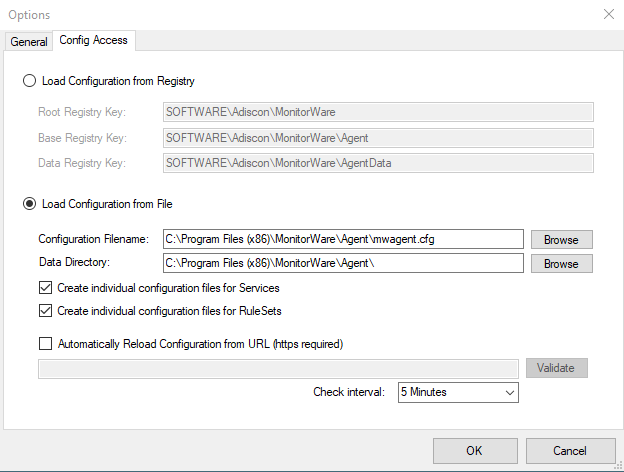

Using File based configuration
==============================

**Working with File based Configurations**
  Support for running the Service from file based configuration may be
  interesting for environments where you want to minimize registry access to a
  minimum or you want to manually edit the configuration without using the
  configuration client every time.

  The Adiscon Configuration format is quiet simple. In the following description,
  all the configuration options will be explained in detail.

**Adiscon Configuration format explained**
  Our configuration format is something between JSON and XML but hold at a very
  simple level.

**Variables**
  All variables start with a dollar ($). Name and Value of a variable are
  separated by the FIRST space character. Everything else behind the first space
  will be considered as the Value. A line feed terminates the value. If your
  configuration value contains line feeds, you have to replace them with
  "\\n" or "\\r\\n". A single backslash can be used to escape brackets
  ( { and } ).

**Comments**
  All lines starting with a sharp (#) at the beginning will be ignored.

**File Includes**
  Sample

  .. code-block:: text

    includeconfig my-subconfigfiles-*.cfg*

  The includeconfig statement will include either a single file or many files
  based on a filename pattern. In this sample all Files starting with
  "my-subconfigfiles-" and ending with ".cfg" will be included into the
  configuration. It is possible to create your own custom file structure with
  includes. The configuration client will be able to load and show your custom
  file structure, however it will not be able to maintain (save) it.  We support
  a maximum include depth of up to 10 levels when using the includeconfig
  statement.

**General Options**
  Sample

  .. code-block:: text

    general(name="[name]") {
     $nOption 1
     ...
    }

  All options between the brackets will be loaded as variables into the general
  configuration object. The name attribute field specifies the general
  configuration block name. The brackets start and end an object block.

**Services**
  All possible configuration parameters are named within the detailed services
  documentation.

  Sample Service configuration:

  .. code-block:: text

    input(type="[ID]" name="[name]") {
     $var1 Value1
     $var2 Value2
     ...
    }

  The brackets start and end a service block. All variables between the brackets
  will be loaded into the service configuration. The name attribute specifies the
  service display name. The type attribute contains the service type ID. It can
  be one of the following types:

  .. code-block:: text

   1       = Syslog
   2       = Heartbeat
   3       = EventLog Monitor V1 (Win 2000 / XP / 2003 )
   4       = SNMP Trap Listener
   5       = File Monitor
   8       = Ping Probe
   9       = Port Probe
   10      = NTService Monitor
   11      = Diskspace Monitor
   12      = Database Monitor
   13      = Serialport Monitor
   14      = CPU Monitor
   16      = MonitorWare Echo Request
   17      = SMTP Probe
   18      = FTP Probe
   19      = POP3 Probe
   20      = IMAP Probe
   21      = IMAP Probe
   22      = NNTP Probe
   23      = EventLog Monitor V2 (Win VISTA/7/2008 or higher)
   24      = SMTP Listener
   25      = SNMP Monitor
   26      = RELP Listener
   27      = Passive Syslog Listener
   1999998 = MonitorWare Echo Reply
   1999999 = SETP Listener

**RuleSets**
  All possible configuration parameters are named within the detailed actions
  documentation.

  Sample

  .. code-block:: text

   ruleset(name="[name]" expanded="[on/off]") {
    rule(name="[name]" expanded="[on/off]" actionexpanded="[on/off]"
    ThreatNotFoundFilters="[on/off]" GlobalCondProperty="[on/off]"
    GlobalCondPropertyString="" ProcessRuleMode="[0/1/2]"
   ProcessRuleDate="[uxtimestamp") {
          action(type="[ID]" name="[name]") {
                  $var1 Value1
                  $var2 Value2
                  ...
          }
          filter(nTabSelection="0") {
                  $nOperationType AND
                  $PropertyType NOTNEEDED
                  $PropertyValueType NOTNEEDED
                  $CompareOperation EQUAL
                  $nOptionalValue 0
                  $nSaveIntoProperty 0
                  $szSaveIntoPropertyName FilterMatch
          }
       }
   }

  The brackets start and end a ruleset block. The attributes of a Ruleset are
  self-explainable. Within a RuleSet, you can have Rules. The attributes of Rules
  are also self-explainable and partially Global Conditions that are equal to the
  options found in the Filter dialog. Within a Rule you can one Basefilter. This
  Basefilter again can have child filters it and these child filters can have
  child filters again. All "expanded" settings are optional and only important
  for the client treeview.

  Within a Rule you can have Actions. The brackets start and end an action block.
  All variables in an action block between the brackets will be loaded into the
  action configuration. The name attribute specifies the service display name.
  The type attribute contains the action type ID. It can be one of the following
  types:

  .. code-block:: text

   1000 = ODBC Database
   1001 = Send Syslog
   1008 = Net Send
   1009 = Start Program
   1011 = Send SETP
   1012 = Set Property
   1013 = Set Status
   1014 = Call RuleSet
   1015 = Post Process
   1016 = Play Sound
   1017 = Send to Communication Port
   1021 = Send SNMP
   1022 = Control NT Service
   1023 = Compute Status Variable
   1024 = HTTP Request
   1025 = OleDB Database
   1026 = Resolve Hostname
   1027 = Send RELP
   1028 = Send MS Queue
   1029 = Normalize Event
   1030 = Syslog Queue

**How to enable file based configuration?**
  To switch from registry to file configuration mode, all you need to do is to go
  the "Config Access" tab in the Configuration "Client Options" and switch from
  "Load Configuration from Registry" to "Load Configuration from File" mode. Once
  you accept the change, the Client will ask you if you want to export the
  current loaded configuration into the file. Hit YES if you want to do so and
  NO if already have an existing configuration file. The configuration client
  will reload itself automatically after this.

* Client Options Configure File Based Configuration*

**Create individual configuration files for Services**
  When enabled, the configuration client will create separated configuration
  files for each configured service. The main configuration file will then use
  the includeconfig statement to include all these configuration files by using a
  pattern. When deleting a service, its configuration file will be deleted as
  well.

**Create individual configuration files for RuleSets**
  When enabled, the configuration client will create separated configuration
  files for each configured ruleset. The main configuration file will then use
  the includeconfig statement to include all these configuration files by using a
  pattern. When deleting a ruleset, its configuration file will be deleted as well
