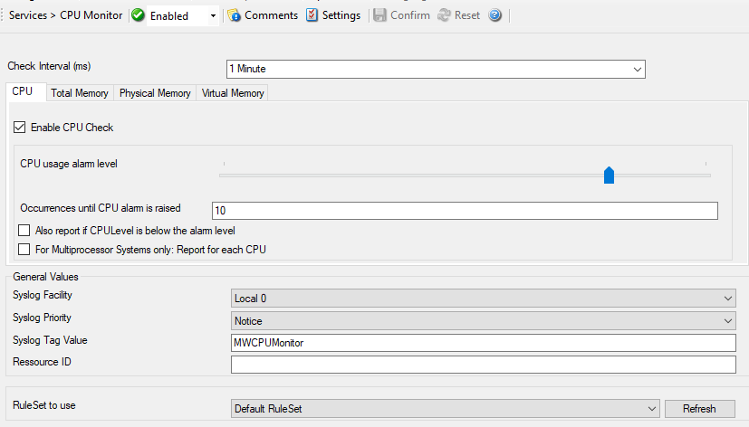

CPU/Memory Monitor
==================

The Windows CPU/Memory Monitor checks the load of both CPU and Memory. You can
check the total, physical, and virtual Memory. A high load can be quickly
detected and can be used to trigger notifications or even corrective actions
before problems arise.

* CPU/Memory Monitor*

Further details can be found here: :doc:`cpu/memory monitor <../mwagentspecific/cpumonitor>`.
