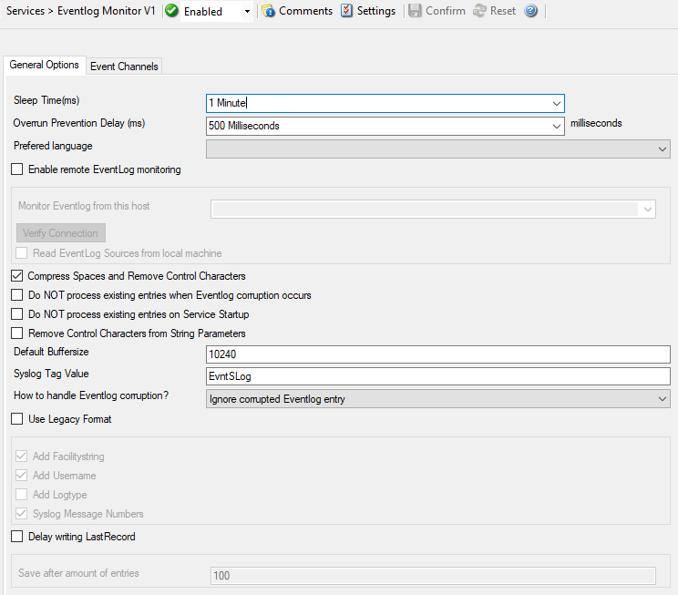
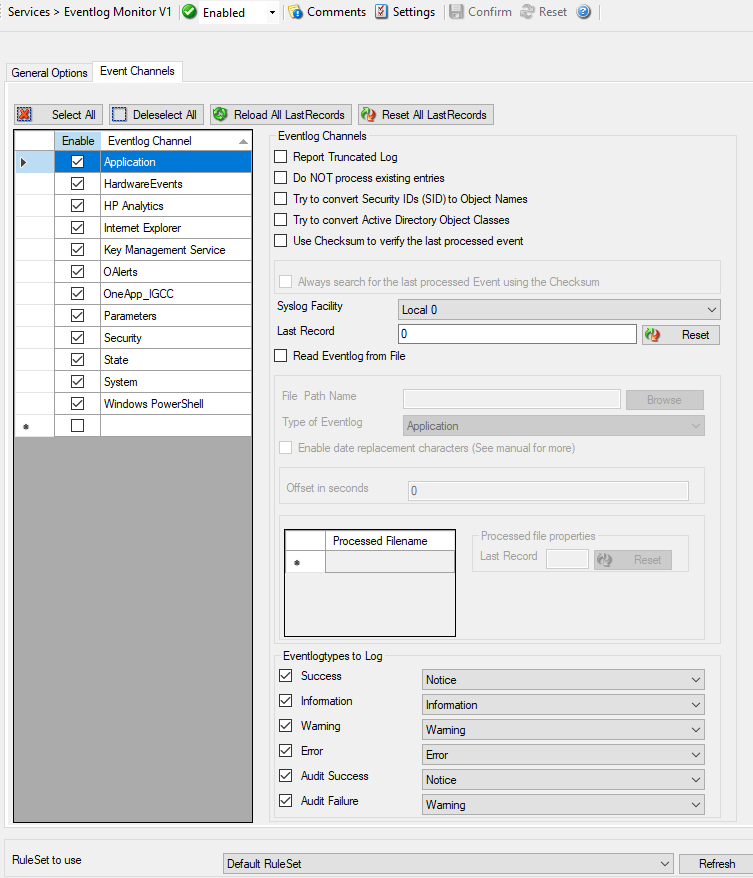

Event Log Monitor V1
====================

Complete Windows Event Log Monitoring
-------------------------------------

All currently-existing logs are fully supported: the standard Windows Event
Logs, additional logs introduced by modern Windows as well as custom event logs
and the Window Vista event logging system. Also supported are Windows Event Log
files. That feature supports NAS-devices, which often offer log information in
Windows Event Log file format (.evt). By monitoring these files, SAN devices,
too, can be monitored in near-real-time.

The Windows Event Log Monitor service processes Windows Event Logs. These are
the native Windows event repositories. All "well-behaved" applications log
messages into them. With the Event Log Monitor, they can automatically be
parsed, filtered, processed, and forwarded. The full set of log sources in
supported, including modern Windows specific logs, custom event logs
and event log files (e.g. from SAN devices).

General Options
---------------

General Options available on this form are "Sleep Time" and "Overrun
Prevention Delay". Sleep time specifies the time after which event log
monitor should check for new events whereas overrun prevention delay allows
configuring a delay after generating an event.

* Event Log Monitor V1 - General Options*

Event Log Channels Tab
----------------------

The "Event Log Channels" configures per-event-log settings. The
corresponding log will only be processed if the respective "Enable"
checkbox is checked. The parameters are common to all logs and each dialog
looks similar:

* Event Log Monitor V1 Event Channels*

Further details can be found here :doc:`event log monitor v1 <../mwagentspecific/eventlogmonitorv1>`.
