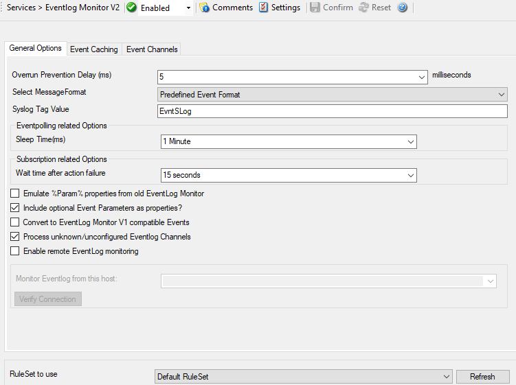

Event Log Monitor V2
====================

The Windows Event Log Monitor V2 service processes Windows Event Logs. All
currently-existing logs are fully supported: the EventLog Monitor V2 is
especially designed for the use with Windows Vista, Windows 7, and higher.
This makes you capable of using the all-new and advanced Event Log
structure of the most recent version of Windows.

This is the key feature of MonitorWare Agent, when used with Windows Vista,
2008, or higher. It is necessary to use this service, because of the vast
changes that came along with this new operating system. The old EventLog
Monitor wasn't capable of reading all the new Logs. Therefore it was necessary
to create a separate tool for Vista, 2008, or higher. With all Logs being
stored in one place, this should give you more power over them, than before.

* Event Log Monitor V2*

Further details can be found here: :doc:`event log monitor v2 <../mwagentspecific/eventlogmonitorv2>`.
