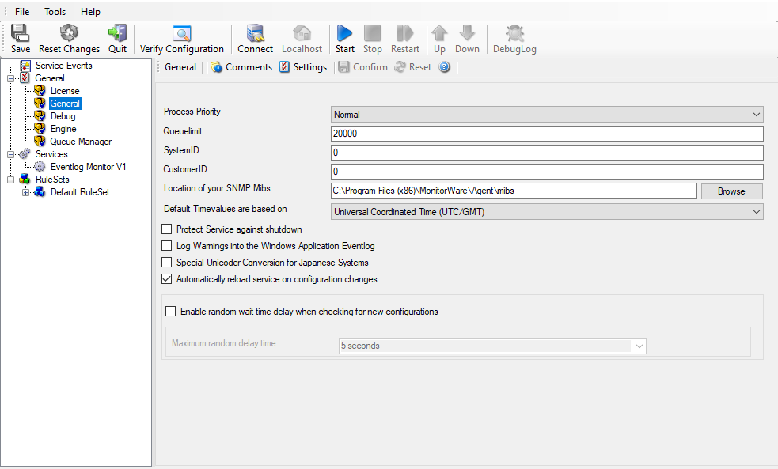

Friendly and Customizable User Interface
========================================

The Cloning feature helps to clone a Ruleset, a Rule, an Action, or a Service
with one mouse click. It includes a Move up and Move down function for Actions
in the Client.

With the MonitorWare Agent as many RuleSets, Rules and Actions as necessary can
be defined.

* Friendly and Customizable User Interface*
