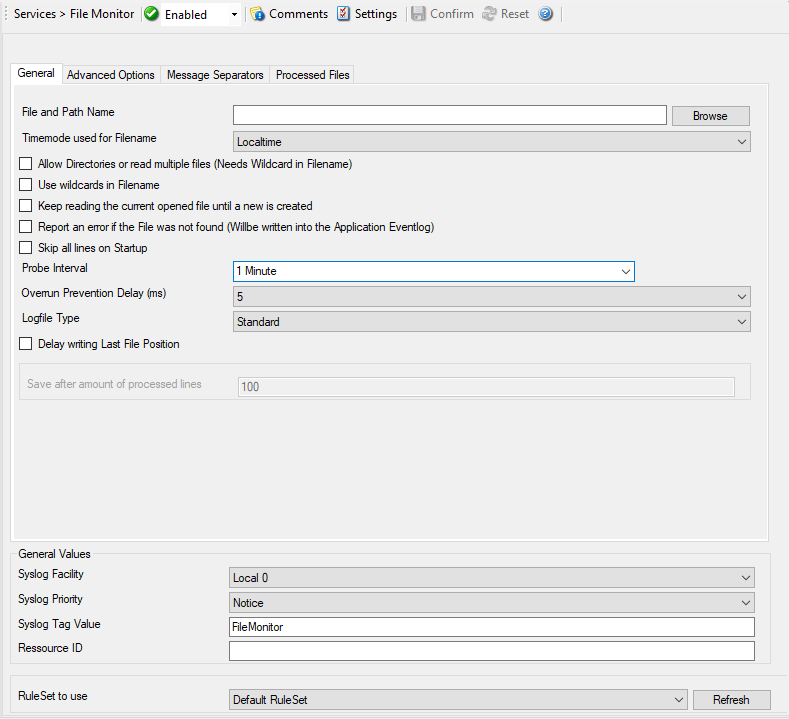

File Monitor
============

The File Monitor monitors the content of a text file just as the Event Monitor
monitors the Event Log. Its purpose is to gather vital information that is
stored in system text files. Many applications do not write events to the event
log but to a text file. This is also the case with many Microsoft applications
(for example the WINS log). The file monitor can also gather Internet
Information Server (Windows' web server) log files. This is very useful for
monitoring web activity and detecting attacks.

* File Monitor*

Further details can be found here: :doc:`file monitor <../mwagentspecific/filemonitor>`.
