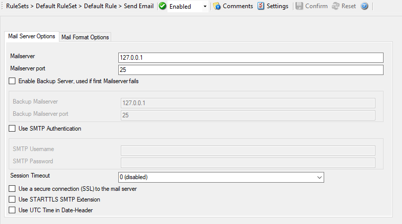

Forward via eMail
=================

Events of any kind can be forwarded via eMail. This is most often used for
alerting. Together with your cell phone's provider eMail to messaging
functionality, you can often send events directly to your cell phone.
You can use this feature to receive eMail messages in your mail boxes.

* Forward via eMail*

Here is an example how to receive :doc:`email notifications <../shared/gettingstarted/emailnotifications>` when certain events happen.

Further details can be found here: :doc:`action send email <../mwagentspecific/a-mailoptions>`.
