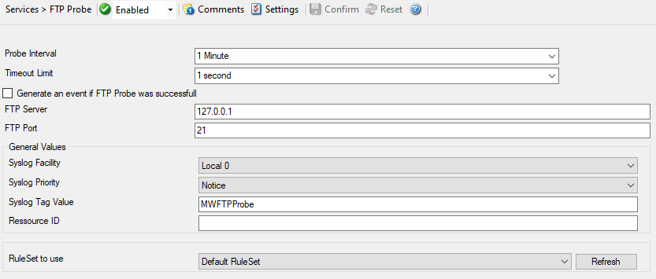

FTP Probe
=========

FTP probe checks if a FTP Server is actually alive. FTP probe does a connection
to FTP Server. After receiving the response from FTP server it sends the QUIT
command to terminate the connection.

* FTP Probe*

Here is an example how to monitor :doc:`ftp server via ftp probe <../shared/gettingstarted/monitoringftpserver>`.

Further details can be found here: :doc:`ftp probe <../mwagentspecific/ftpprobe>`.
