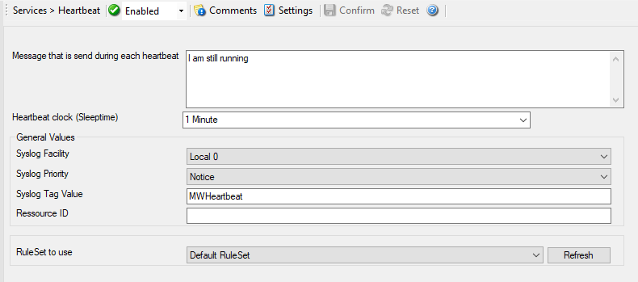

Heartbeat
=========

The Heartbeat Process can be used to continuously check if everything is
running well. It generates an :doc:`information unit <../glossaryofterms/mwconcepts-informationunit>` every specified time interval.
That information unit can be forward to a different system. If it does not
receive additional packets within the configured interval, it can doubt that
the sender is either in trouble or already stopped running.

* Heartbeat*

Further details can be found here: :doc:`heartbeat <../mwagentspecific/heartbeat>`.
