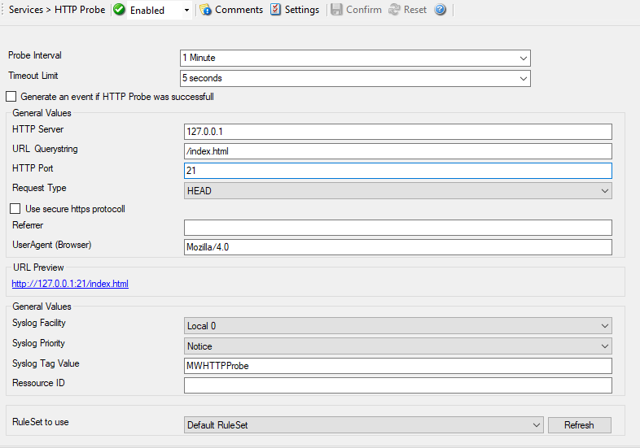

HTTP Probe
==========

The HTTP Probe connects to a HTTP Server, and sends a valid HTTP request as
configured. It then either receives the header or header and content of a
website, depending on how the service is configured. This can be used to check
the alive status of web servers.

* HTTP Probe*

Further details can be found here: :doc:`http probe <../mwagentspecific/httpprobe>`.
