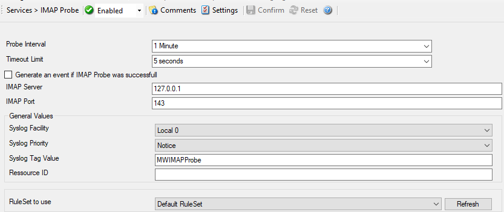

IMAP Probe
==========

IMAP Probe checks if a  IMAP server is actually alive. IMAP Probe does a
connection to the IMAP server. It receives the response and sends the QUIT
command to terminate the connection.

* IMAP Probe*

Here is an example how to monitor :doc:`imap server via imap probe <../shared/gettingstarted/monitoringimapserver>`.

Further details can be found here: :doc:`imap probe <../mwagentspecific/imapprobe>`.
